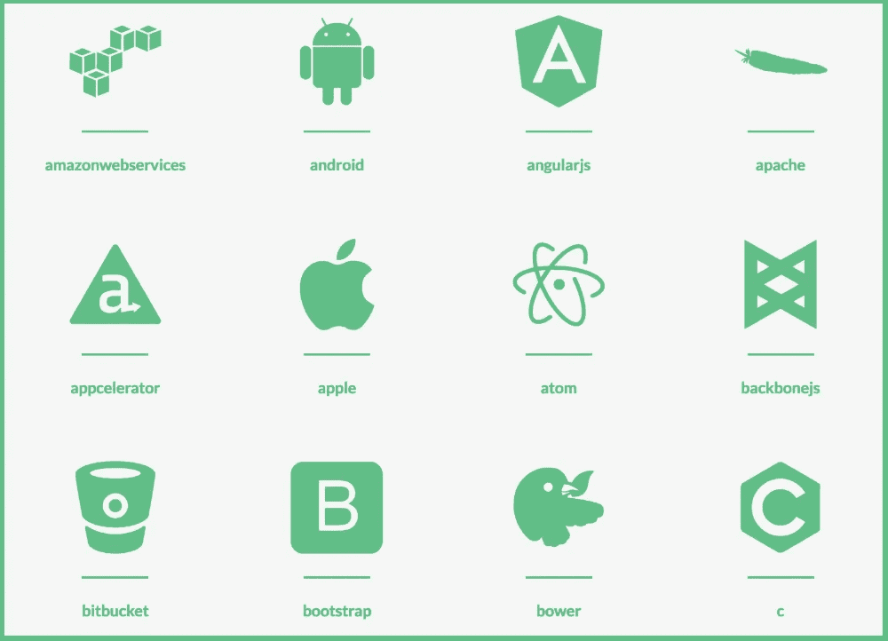

# 一种新的 API 编程语言 SDK 图标集

> 原文：<https://medium.com/hackernoon/a-new-api-programming-language-sdk-icon-set-ab4afac449ff>

我正在为我的 API 门户做一个[可分叉的定义，我想改进我通常用来作为我的 API 故事的一部分的图标。我主要使用](http://portal.minimum.apievangelist.com/)[名词项目 API](http://api.thenounproject.com/) ，将简单的黑白图标联系起来，这些图标代表我讲述的故事、我展示的公司和我报道的主题。我发现名词项目的一个不足之处是当涉及到特定技术的图标时，所以在我的项目工作中，我想找到一个新的来源。我启动谷歌，开始工作。

我很快发现了 [Devicon，这是一组代表编程语言](http://devicon.fr/)的图标，设计了&开发工具，你可以将其用作字体或 SVG 代码。在项目的 Github repo 上，据说他们有 78 个图标，总共超过 200 个版本。我在我的 API 门户原型上使用了一组图标来显示 API SDKs，允许任何使用 fork 的人打开和关闭他们为哪些[编程语言提供 SDK。](https://hackernoon.com/tagged/programming)

正如你可以从我的标志看出的那样，我非常喜欢像 [Devicon](http://devicon.fr/) 这样的项目——尤其是当他们同时让它变得如此简单、如此好看的时候。如果你的 API 门户需要图标，我建议你看看他们在做什么。他们有这些天酷孩子正在使用的所有技术的图片，而且如果你发现少了什么，他们似乎愿意制作更多。

> [黑客中午](http://bit.ly/Hackernoon)是黑客如何开始他们的下午。我们是 AMI 家庭的一员。我们现在[接受投稿](http://bit.ly/hackernoonsubmission)并乐意[讨论广告&赞助](mailto:partners@amipublications.com)机会。
> 
> 如果你喜欢这个故事，我们推荐你阅读我们的[最新科技故事](http://bit.ly/hackernoonlatestt)和[趋势科技故事](https://hackernoon.com/trending)。直到下一次，不要把世界的现实想当然！

