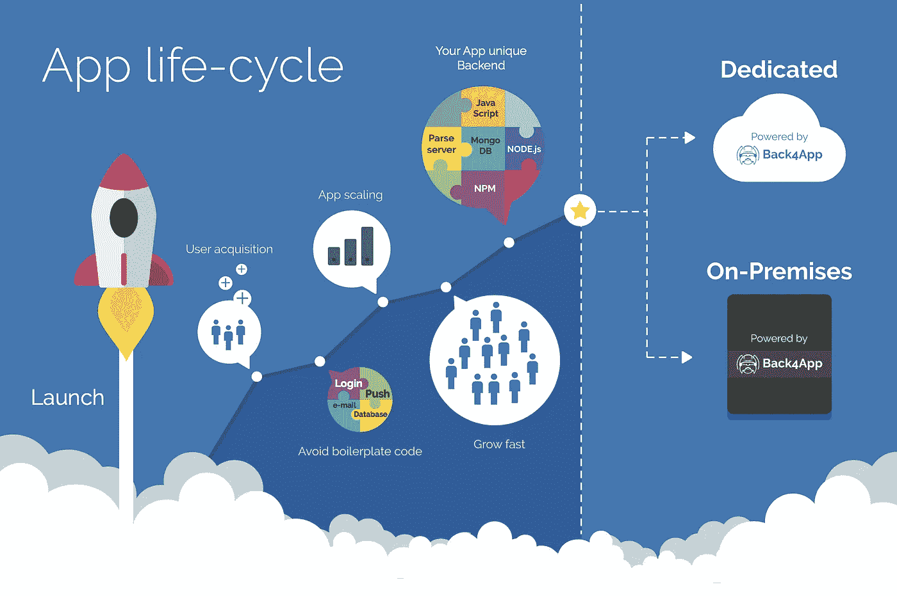
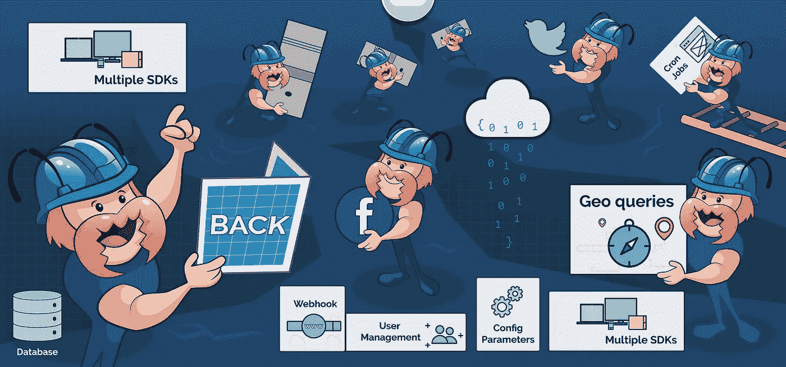

# 后端即服务市场的新方法

> 原文：<https://medium.com/hackernoon/a-new-approach-to-the-backend-as-a-service-market-b441e5ab9e38>

让我们面对现实吧，如果你决定使用第三方解决方案，选择一个可靠的后端服务是必不可少的。去年，无数的新公司和提供商进入了这个市场，这很棒，可能是因为它给了你更多的选择。此外，它提高了竞争水平，从而推动提供商提高服务质量，提供更好的条件，以扩大客户群。

另一方面，这也可能让你感到困惑，因为每个人都承诺良好的条件和服务。因此，有太多的代码破解者和企业仍在考虑选择哪种替代应用程序开发和后端托管解决方案。

好吧，这里有一些好消息:应用程序开发人员现在可以使用一个名为 [Back4App](https://www.back4app.com/) 的牵强的 NodeJS 框架，无限制地构建、托管、定制和扩展他们的应用程序后端。

*我们来详细谈谈吧！*

## **洞察 Back4App**

[Back4App](https://www.back4app.com/) 是一个开源后端，它使用 [Parse framework](http://parseplatform.org/) ，帮助开发人员以更快的速度构建可伸缩和可扩展的应用。这是一个完全托管的后端平台，包括自动配置和扩展解析服务器应用程序、应用程序迁移、基于 Web 的管理工具、可靠性、备份和恢复、24*7 监控和警报、专家支持以及许多其他有价值的功能。 [Back4App](https://www.back4app.com/) 的一个关键优点是，它允许您对每个应用进行不同的定制和优化，这一与众不同的方面使其成为开发人员的首选。

选择 [Back4App](https://www.back4app.com/) 作为您的后端平台会让您忘记**样板代码**和**基础设施的麻烦**，并主要关注对您的应用程序真正重要的东西。它使您能够通过以您选择的任何技术或语言添加定制模块来为您的用户提供正确的功能。无论你的应用程序需要一个执行性的地理查询，一个高内存算法，任何特定的监管安全措施，或者任何特定的 *npm 模块，* Back4App 都能满足你。

使用 [Back4App](https://www.back4app.com/) 享受创建应用程序所需的速度，并在扩展时保持控制，这是为您的不同应用程序需求量身定制的最佳后端平台。

*除了这些属性，还有几个最先进的特性使* [Back4App](https://www.back4app.com/) *有别于其他后端平台，这些特性包括:*

**推送通知工具:**允许您轻松设置推送通知机制。

**解析服务器仪表板:**帮助您管理您的应用程序实体和推送通知活动。允许您创建、发送和分段推送通知消息。

**自动电子邮件:**使您能够创建、发送和分段推送通知消息。

**CLPs(类级权限):**使用类级权限保护您的应用免受数据浏览器的影响。

**系统邮件:**允许您设置自动邮件给用户订阅并重置密码。

**云代码工具:**让你可以用 Back4App 上传、调试、运行定制的 JavaScript 代码。

**后台作业:**帮助你安排特定的例程在你的应用后台运行(Chron Jobs)。

**社交登录:**协助你用脸书和推特配置你的应用。

**全局配置:**使您能够为您的应用程序设置特定的变量。

## **使用 Back4App 作为后端平台的优势**

**支持前端代码**

曾经有一段时间 [Back4App](https://www.back4app.com/) 的 web 托管服务仅限于后端进程，但由于该平台最近的改进，开发人员现在可以在 [Back4App](https://www.back4app.com/) 上托管他们前端的 NodeJS 代码。通过这一资源，他们可以构建包含标准化结构、最佳实践和现代技术的综合 NodeJS web 应用程序。

**账户上有多个用户**

早先， [Back4App](https://www.back4app.com/) 账户被限制为单个用户，但是在该平台的一些增强之后，已经可以向一个账户添加多个用户。使用这一功能，开发团队成员现在可以使用他们特定的用户标识访问单个帐户，从而使他们能够更容易地共同高效地工作，同时产生高质量的结果。

**管理解析服务器版本**

使用 [Back4App](https://www.back4app.com/) 作为您的 BaaS(后端即服务)平台的最大好处是，它可以让您保持最新的解析服务器版本，并确保您的应用程序和服务器版本之间的完全兼容性。您只需点击“更改版本”选项来升级或降级您的服务器版本。

除了这些优点， [Back4App](https://www.back4app.com/) 还有其他几个丰富的功能，包括*特色解析服务器、提升的服务器性能、易于部署、实时数据库和分析、优秀的技术支持团队*等等。

**最后的话**

总之， [Back4App](https://www.back4app.com/) 适合每一个人——从从事私人项目的代码破解者到在大型开发工作室工作的移动开发人员，让复杂的客户想法成为现实。

[Back4App](https://www.back4app.com/) 的理念是确保应用开发尽可能快速高效地进行，同时帮助开发者走得更远、更快，并完成以前似乎难以实现的事情。

那么，你还在等什么？无论你想开发什么样的产品，无论你想解决什么样的问题，Back4App 一定会帮你摆脱开发后端的负担。如果你到目前为止还没有机会使用 [Back4App](https://www.back4app.com/) ，但是你现在已经准备好投入使用了，请在这里免费注册[！](https://www.back4app.com/)