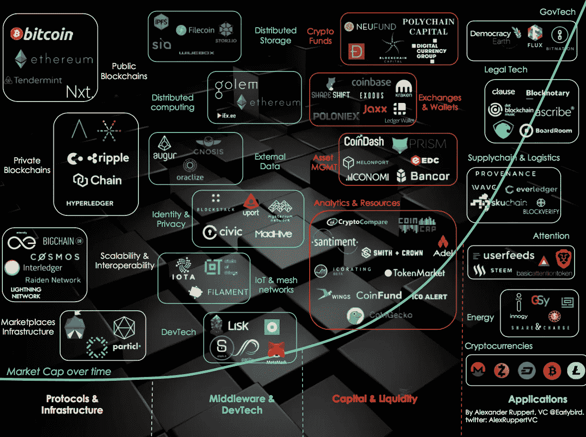
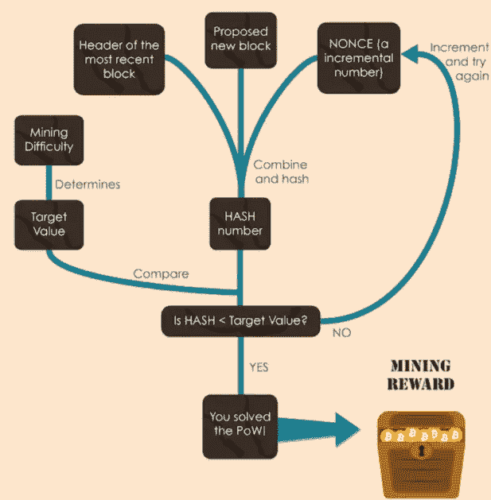
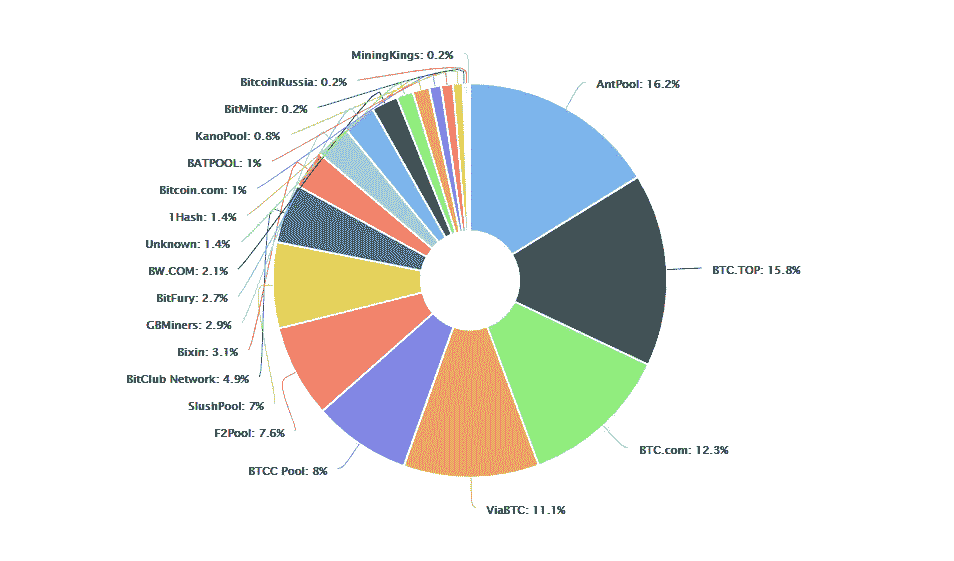
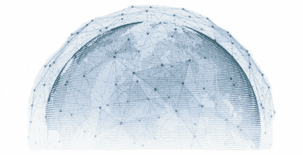
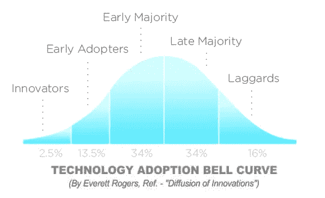

# 比特币的安全模型:比特币挖矿是如何进行的？

> 原文：<https://medium.com/hackernoon/a-new-asset-class-blockchain-technology-cryptocurrency-73abd75f8109>

[比特币](/@KeratiChop/introduction-to-bitcoin-money-our-debt-based-society-2b74ec0f56c7)是一种投机资产，已经成功度过了实验阶段，现在已经势不可挡。

对比特币的研究是当今最令人兴奋和创新的领域之一，其安全模型是一项有趣的跨学科研究，包括计算机编程、博弈论、数学、物理和能源等。没有第三方的点对点连接当然降低了成本，钱只是第一应用。提高土地登记的效率，并立即得出有效的初步产权报告将是激动人心的。当你集中敏感信息时，你得到了 1 . 43 亿个社会安全号码的 [Equifax 黑客](https://gizmodo.com/equifax-investigation-clears-execs-who-dumped-stock-bef-1820127634)。当您分散敏感信息的存储时，您明确地否定了单点故障。信息集中化、资金集中化和权力集中化绝非易事。一个潜在的新的资产类别已经作为代码和对第三方需求的非中介化的副产品出现。范式转变正在进行，比特币和加密货币将会继续存在。你越早意识到这一点，你就能越早面对即将发生的事情。解释比特币就像向生活在 20 世纪初的人描述互联网是如何工作的，以及为什么人们几乎每顿饭都要拍照。

Image via Twitter: @AlexRuppertVC

为了理解比特币的工作原理，我们必须首先考察 BTC 采矿是如何发生的，因为它是该协议的安全模型和共识算法的一种实现。无人绝对控制的革命性技术的实质性改变需要开发者、用户、矿商、交易所和商家服务之间的共识。与社会的所有部分一样，比特币社区中的每个群体都有不同的意图。一些目标一致，而另一些目标不一致。社区内长达 24 个月的意识形态分歧随着比特币协议隔离见证人(SegWit)的管理而结束。**中本聪关于无人控制比特币的愿景在升级到 SegWit 的过程中得到了完美展现。**比特币的共识算法正在发挥作用，而且效果相当不错。

## 创世纪板块:泰晤士报 03/1/2009 财政大臣处于第二次银行救助的边缘

自从伦敦主要的全国性报纸发表了他们的救助标题以来，比特币区块链每十分钟就像心脏一样跳动一次。同一天，小姐，先生，或者一群中本聪用同样的信息伪造了比特币创世纪块。

Satoshi 创造了一个令牌，人们在其中竞争，以赚取块奖励，这是 BTC。当更多或更少的人玩时，游戏的结构会自动调整难度——玩家越多，游戏越难。游戏持续大约 10 分钟，在此期间会宣布获胜者并发放奖励。为了成为赢家，参与者必须通过计算能力来解决高度复杂的数学问题。处理能力更强的矿商获得大宗奖励(和交易费)的可能性更大。玩家、参与者或矿工在同时接受未确认池中的交易并将其放入区块中时进行散列。费用较高的交易优先于费用较低的交易。当参与者首先解决难题时，他们的*工作证明*(战俘)立即在公共区块链上与其他矿工共享，以验证它确实得到了确认。在其他矿工成功通过 PoW 验证后，区块奖励和交易费将交付给获胜者。失败的矿工愤怒并扔掉他们的工作，在此期间，所有矿工通过更新他们自己的分类帐将新的有效区块链接到现有的链，然后游戏重新开始。**工作证明是一种基于自由市场的设计，在这种设计中，矿商在验证交易和维护不可改变的区块链方面发挥着至关重要的作用，这是他们追逐利润行为的直接结果。**中本聪优雅地将这些方面编织在一起，故意激励矿工参与游戏并获得金钱奖励，以换取他们在保护比特币区块链方面的工作。

Work By: [Patrícia Estevão](https://twitter.com/patestevao)

比特币的安全模型是一个精心制定的系统，它利用了人性的贪婪，并从中产生了一种安全机制。为了盈利，比特币矿工必须 1)拥有足够的处理能力来参加比赛，2)获得足够的奖励来支付电费。有了足够的计算能力，一群不诚实的矿工可以通过合谋控制全球 51%的采矿能力来超越网络。攻击的范围从恢复旧的事务到确定哪些事务需要确认，哪些不需要发送。这些矿工面临着财务困境，要么攻击网络并不诚实地赚取 BTC，要么执行 PoW 并诚实地赚取 BTC。[维持一天 51%的攻击需要花费近 200 万美元](https://digiconomist.net/bitcoin-energy-consumption)，而另外 49%的市场份额和盈利能力则翻倍。只要 2%的人食言，就能瓦解这个串通集团。机会成本太大，因为不遵守规则变得越来越不可持续和无利可图。**当面临矿工的困境时，潜在的恶意矿工很快发现，他们在经济上更适合玩 Satoshi 的激励游戏，承诺他们的哈希能力来保护网络，并以诚实的方式赚取 BTC。**出于经济动机的理性矿工正是这种攻击自比特币诞生以来从未浮出水面的原因。这就是比特币博弈论的妙处。

Mining Pools | Source: [https://blockchain.info/pools](https://blockchain.info/pools)

比特币没有总裁，没有首席执行官，没有 SEC 可以罚款的实体，没有人可以带到国会面前，没有中央服务器可以入侵，也没有任何单点故障。现在让我们来讨论一个精心策划、非理性的政府攻击比特币的场景。在物理上，同步对所有比特币设备进行真正的攻击是不可能的。对比特币的物理攻击将涉及同时摧毁遍布全球的所有运行的采矿机器和用户节点，包括太空中的卫星 T2。一次虚拟攻击将需要不可思议的跨国努力，并花费[超过 300 亿美元](https://www.quora.com/How-much-does-it-cost-to-make-a-supercomputer)的启动资金。最初的区块链网络背后有令人难以置信的巨大的全球计算能力，比所有谷歌服务器都多，比世界 500 强超级计算机加起来还多。[采矿总能耗相当于圣何塞家庭日常用电需求的三分之一](https://securitygladiators.com/bitcoin-uses-energy-a-lot/)。这是游戏中的皮肤，也是地球上最 100%去中心化和计算安全的网络的价值所在。我们现在假设政府有无限的资源，因为他们毕竟可以无限量地印钞票。鉴于对整个比特币的攻击也假设五个共识成分联合起来:开发者、用户、矿工、交易所和商家服务。一群政府攻击比特币网络只会持续十分钟，虚拟攻击就会卷土重来。就剧情而言，同样的坏演员可以很容易地利用他们的资源来赚取 BTC 并偿还他们的债务。比特币已经成为密码学、博弈论、网络安全、软件和网络架构的完美结合。比特币没有企业级的安全性，比特币有世界级和行星级的安全性。

Source: [https://www.mojix.com/wp-content/uploads/2017/08/blockchain08.jpg](https://www.mojix.com/wp-content/uploads/2017/08/blockchain08.jpg)

## 数字化和去中心化时代

参与挖矿游戏的公司和民族国家越多，比特币就变得越强大、越分散。最近，一家日本公司旨在开发新的[比特币硬件芯片和采矿设施](https://bitcoinmagazine.com/articles/japanese-company-will-launch-new-bitcoin-mining-operation-7-nm-chips/)。俄罗斯总统弗拉基米尔·普京和他的政府正在寻求投资[1 亿美元到比特币开采](https://www.bloomberg.com/news/articles/2017-08-08/putin-s-aide-seeks-100-million-to-rival-china-in-bitcoin-mining)和朝鲜是[什么](https://www.cnbc.com/2017/09/13/bitcoin-mining-a-new-way-for-north-korea-to-generate-funds-for-the-regime.html)？下一代军备竞赛将在人工智能和比特币领域展开。中本聪对比特币不可信本质的天才设计进一步要求作为艺术品受到尊重。矿工们不信任彼此，因为他们在彼此竞争——他们有义务不信任，而是核实。用户不需要信任其他用户，因为他们都可以拥有账本的副本，并在需要时使用它来验证。给定一个自然状态，[用户和矿工绝对不信任对方](https://themerkle.com/miners-or-users-bitcoins-divisive-blocksize-solutions/)。比特币区块链是资本密集型矿商和投机用户的合作，他们都不需要为了去中心化系统的运转而信任彼此。有信任问题的人应该欣赏这方面。

面对政治动荡和经济不稳定，这种最分散化的货币形式已经证明了自己是一个出色的执行者。比特币能做黄金能做的事情，而[在没有任何操纵的情况下做得比](https://99bitcoins.com/bitcoin-gold-usd/)好一千倍。**当你把所有东西结合在一起，再加上比特币对数字稀缺的模拟，就创造了一种非凡的新资产，许多人对此不屑一顾，因为他们低估了，或者根本不理解。**巨额资金即将进入比特币微不足道的 1000 亿美元市值。对冲基金、保险公司、共同基金、华尔街和散户投资者等机构投资者近在咫尺。LedgerX 于 10 月上线，成为美国监管的第一个比特币期权市场。[芝加哥商品交易所(CME)计划在年底前推出首个由美国监管的比特币期货市场](https://www.cnbc.com/2017/10/31/cme-plans-to-launch-bitcoin-futures-by-year-end.html)。交易所交易基金(ETF)将是下一步。一旦比特币获得政府批准，大规模采用将是最后一步。

Source: [http://res.sys-con.com/story/mar13/2570177/F2_0.jpg](http://res.sys-con.com/story/mar13/2570177/F2_0.jpg)

我发现阐述权力下放的错综复杂以及为什么它很重要很困难，但也很重要。区块链的想法并不新鲜，它仅仅是一个数字账本或数据库。关键是分散的，没有人完全控制，也没有中心故障点，这是真正突破性的功能。根据 Everett Rogers 的著名研究，“[尽管有明显的好处，但不是每个人都会立即采纳一个颠覆性的想法](https://ondigitalmarketing.com/learn/odm/foundations/5-customer-segments-technology-adoption/)”。人，你我，天生抗拒改变。它发生在 19 世纪晚期的天然气到电力，它发生在 19 世纪早期的马匹到汽车，它发生在 19 世纪晚期的印刷机到互联网，它发生在我们这个时代的集中到分散。我认为我们正处于早期采用阶段，因为我们已经有了互联网，比特币的采用将会更快。信息的速度比光速还快。比特币是首要的数字资产，它以去中心化的方式重新定义了信任，将网络转变为价值和效用的金融象征。这是互联网繁荣和萧条的 2.0，但在大规模采用之前，我们还远远没有达到互联网泡沫的规模。在这个领域，首次公开募股(IPO)是首次公开募股(ico)，而[骗局](https://steemit.com/scam/@thegrinder/the-bitconnect-scam-exposed)和创新一样普遍。尽管如此，还是有很多好想法。点对点能源共享经济，100%透明的在线赌场&预测市场，通过区块链消除选民欺诈，以及分布式云计算。要通过消除对第三方的信任来提高效率和安全性，您可以下放哪些权力？那，就是百万比特币的问题。

*————
编辑帮助:
陆中浪-谷歌运营专员*

[*1.1 —比特币简介:钱&我们的债基社会*](/@KeratiChop/introduction-to-bitcoin-money-our-debt-based-society-2b74ec0f56c7)

[*1.3 —下兔子洞:以太坊，不变性，共识-规则，&分叉*](/social-club/down-the-rabbit-hole-ethereum-immutability-consensus-rule-forks-e9fa8faa9e07) [*1.4 —地缘政治与比特币:如果比特币被禁，会发生什么？*](/hackernoon/geopolitics-cryptoeconomics-2018-and-beyond-b91f4ea3a3c9)[*1.5—比特币的实质性&通往 100K 美元的技术之路*](https://hackernoon.com/bitcoins-substantive-technical-road-to-100k-2637b899ffc5)[*2.1—简介:群龙无首的加密运动将匹敌等级政府*](https://hackernoon.com/introduction-leaderless-crypto-movement-will-rival-hierarchical-governments-1c93afec3066)[*2.2—BIP-148 UASF 一周年:新的治理体系*](https://hackernoon.com/bip-148-uasf-first-year-anniversary-a-new-system-of-governance-223907ec298b)