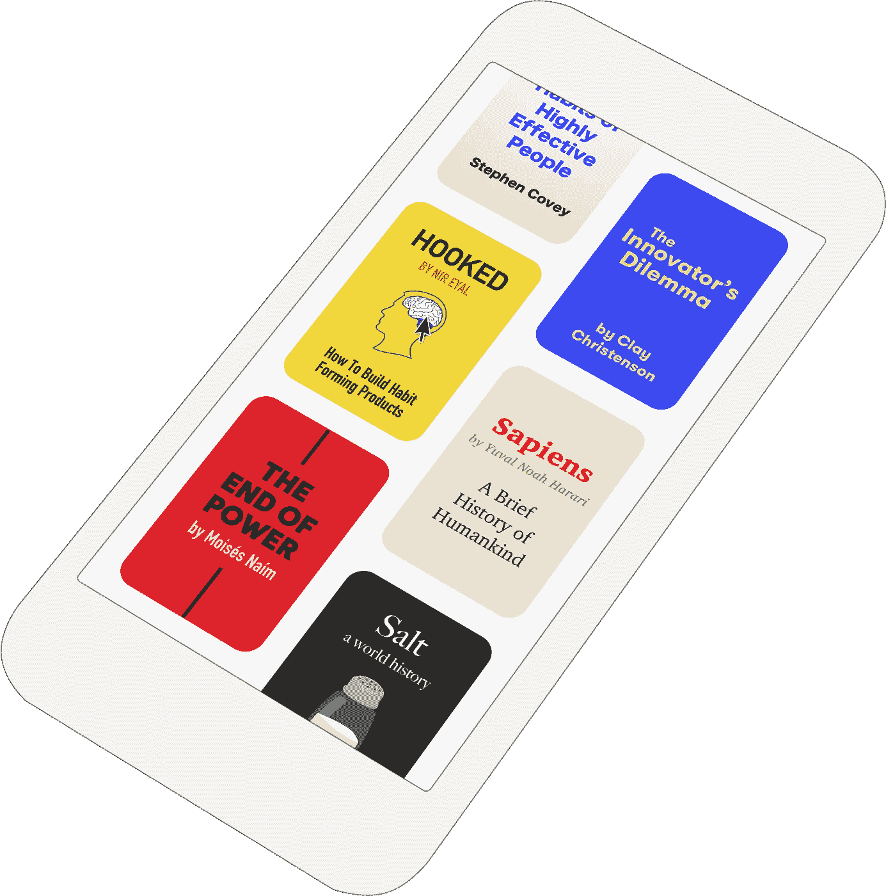

# 精装书的新焦点:书籍。

> 原文：<https://medium.com/hackernoon/a-new-focus-for-hardbound-books-3d0225d3029a>

## 我们正在根据商业、历史和科学领域最引人入胜的书籍创作 5 分钟的图文并茂的故事。

# TL；速度三角形定位法(dead reckoning)

*   我们喜欢书。你喜欢书。但是说实话:书籍是时间和精力的巨大投入。
*   当你有五分钟空闲时间时，查看 Twitter(或者你选择的多巴胺彩票)比打开一本书容易得多。但是当你完成后，你通常会感到内心空虚。(至少我是这样的。)
*   使用 Hardbound，你可以在 5 分钟内阅读一个有趣的，基于一本伟大的非小说书籍的插图故事——足够长的时间来学习一些东西并感觉很好，但足够短以适应你的一天。
*   这些不完全是“总结”在我们看来，书籍摘要往往是枯燥乏味的。他们试图把所有东西都塞进一个小空间，这给了你很多*事实*，却没有*感觉*。我们的目标是让你脖子后面的头发竖起来。
*   我们这样做的部分原因是传统的讲故事方式。我们对发布的每件东西都倾注了大量的爱。但是，如果你不熟悉精装书，我们独特的“tap story”格式确实是秘方。这里可以试一个例子[。](https://www.hardbound.co/read/the-righteous-mind/1)
*   我们挑选书籍是基于我们认为它们有多好，以及它们对文化有多大影响。我们发布的每个故事都基于我们推荐购买的一本书。
*   我们希望通过给人们一个可行的社交媒体的替代品，我们可以让这个世界变得更好奇、更有爱、更勇敢。我们希望人们利用它成为最好的，最聪明的自己。

这就是它的主旨！如果你愿意，[下载我们的新应用](https://itunes.apple.com/app/apple-store/id1037112353?pt=117888646&ct=Medium%20Launch&mt=8)踢踢轮胎。您也可以在我们发布新故事时收到通知(目前每周 1-2 个),方法是在下面输入您的电子邮件。

*想知道我们决定从事这项工作的背景吗？*

***继续阅读……***

九个月前，当我们在 T21 推出第一版精装书时，我们的银行存款只剩下几个月了。这显然是一个“不成功便成仁”的时刻。我永远不会忘记那天早上我走进办公室去见乔时有多紧张。我几乎吃不下任何东西。

如果你能回到过去，告诉我接下来的六个月会发生什么，我想我不会相信你:

*   大约有 25 万人阅读我们的故事，阅读了超过 1400 万页。
*   我们的故事得到了前所未有的平均 67%的完成率。那就是围绕*的五分钟*的一心一意。
*   我们是**产品搜索** 的[第一名，也是](https://www.producthunt.com/posts/hardbound-3)[“年度应用”](https://www.producthunt.com/@goldenkittymeow/collections/2016-mobile-app-of-the-year)的亚军
*   **Fast Company** [将我们](https://www.fastcompany.com/3066678/tech-forecast/the-10-best-free-apps-of-2016)评为 2016 年十大应用之一
*   **苹果**将我们列为“最佳新应用”之一，并表示我们的故事“设计得如此之好，以至于我们不想停下来。”

还不错！这至少足以帮助我们解决现金问题🤑

A Hardbound story about our experience in Techstars

# 现在，坏消息是。

我们的模型有三个大问题:

## 问题# 1——不可扩展的故事创作。

直到最近，这个过程一直是这样的:每个星期，我都试图研究、写作和设计一个好的故事。不要误解我——我喜欢写精装的故事——但这很难！我一个人做不到。

回过头来看，我认为这是建立一个合适的故事团队的完美垫脚石——但显然它只是一个垫脚石:)

## 问题# 2——价值主张不明确。

许多人认为精装本“难以解释”这不是一个好兆头。我们的数据清楚地表明，设法进入网站的人真的很喜欢它，但我们知道，许多人倾向于早早退出，因为他们没有看到我们内容的足够价值。一些人以一种独特的方式阅读他们从未听说过的随机人的随机资料，但大多数人没有。

## 问题# 3——缺乏分销策略

因为人们喜欢我们的格式，我们能够产生相当数量的嗡嗡声。(苹果对我们进行了专题报道，我们在 TechCrunch、Fast Company、Mashable 等网站上都有报道。)

但是那东西来来去去。如果没有一个清晰、易于解释的价值主张，口碑增长多少会受到限制。我们的故事在网上获得了很好的病毒式增长，但转化到我们的应用程序中的却很少。我们需要给人们一个更好的下载理由。

# 所以，我们决定修复它。

第一步是申请 Techstars。我们知道我们必须做出改变，我们想不出更好的地方来做这件事。我很高兴我们被录取了，因为正如我在[上一篇文章](https://hackernoon.com/i-used-to-be-a-skeptic-but-the-first-two-weeks-of-techstars-boulder-have-blown-my-mind-d05c6fc55c91)中所说的，在这里的经历太棒了。他们真的创造了一个特殊的环境。

这就像 x 战警一样，我们都在这里，因为我们有一些我们还没有完全理解，也不能完全控制的"[怪异魔法](https://hackernoon.com/hardbound-why-i-invest-in-weird-magic-5e8fb774dde6)"。他们教我们如何运用我们的力量做好事。

The moral equivalent of the Techstars Boulder office

经过数十次导师会议、数百次精装用户访谈，以及几个晚上痛苦的自我反省，我们最终选定了一个感觉正确的答案:书籍。

关注书籍不仅从商业角度来看是正确的(稍后会有更多介绍)，而且这也是团队非常热衷的事情。这让我想起了[公司](/@nbashaw/twenty-six-ce42e888ca65#.4jkhp6kl2)的最初灵感，当时我已经辞职将近两年，开始在这个领域进行尝试。老实说，精装书的目标不是赚一大笔钱。现金只是实现我们愿景的一种手段，我们的愿景是通过使用技术创造更具吸引力的阅读体验，创造一个更智能、更美好的世界。

*如果我们只是另一个低劣的点击诱饵公司，或者另一个无聊的社交应用程序，让你在完成后感到空虚，那还有什么意义呢？我们想创办这家公司的全部原因是，我们认为有可能建立更令人满意的东西！*

但是，这一新的关注点不仅仅满足了我们的内心——我们认为它对我们的指标也有很大帮助。原因如下:

## 解决方案 1 —可扩展的故事创作

我们今年做的第一件事就是关闭几乎所有的东西，这样我们就可以从头开始重建。这很糟糕，但也是一种解放。我们取消了睡帽，因为尽管有些人真的很喜欢它，但我们知道专注于常青树内容比试图在嘈杂的新闻空间竞争更好。我们取消了超贵的短信列表，而是聘请了一名设计师。

有了这些，我们就有资源来建立一个合适的故事团队，而不仅仅是每周让我的头发着火。在过去的几周里，我们作为一个团队一起工作，这真的很棒。我会再写一篇文章，详细介绍我们创作故事的过程，以及我们的[心得](https://hackernoon.com/tagged/learnings)，但现在我确切地知道了我们该如何扩展团队，以创作出比现在多 10 倍的内容。

但是我们可能根本不需要这么做！因为我们的新焦点(书籍)自然适合市场。从我们与作者和出版商的交谈中，很明显，他们愿意也有能力为有助于书籍销售的优秀内容付费。从我们早期的数据来看，我们非常有信心能够帮助卖出很多书。所以现在我们有了一个自然的市场，人们愿意自己创作精装故事，或者至少为精装故事的创作付费。

我们的一个想法是创建一个市场，让那些想创作精装故事的企业可以雇佣作家和设计师来为他们创作精装故事。

如果你对此感兴趣(创作精装故事以换取金钱，或者雇佣我们为你创作精装故事，或者为你自己创作精装故事)[在这里注册市场测试版](https://hardbound.typeform.com/to/wrf5AH)！

A scene from [our origin story](https://www.hardbound.co/read/hardbound-history/1), in which a VC confidently makes a suggestion. VCs: I still love you, and all of your suggestions! Just giving you shit :)

## **关于用户生成内容的补充说明:**

风投们喜欢建议的一个想法是，我们应该为用户构建一个简单的[工具](https://hackernoon.com/tagged/tool)，让他们在 30 秒内从应用程序内部创建自己的精装故事。

当然，他们说得有道理——如果我们能免费获得优秀的内容，那就太棒了！需要明确的是，我们*计划在适当的时候开放平台。*

但专注于休闲的 30 秒用户生成内容将从根本上改变应用程序的目的，从讲故事到交流。由于高质量的写作/设计是后天习得的技能，大多数人都不具备，我想不出一个很好的理由来解释为什么人们会希望以这种形式进行随意的交流，我非常怀疑这是否可行。

另外，还有这个:**我厌倦了社交应用。**

在我看来，这些已经够多了。这个世界缺少的是特殊的、高质量的、互动的讲故事——让你变得更聪明而又不无聊的东西。不是又一次虚荣心作祟的浪费时间。

因此，我们不会让自己因为试图推广社交应用的策略而分心。这并不是说我们将永远在精装本上创作所有的内容。完全相反！我们的目标是授权给*有动力的*创作者，并为他们建立一个可持续的收入模式。

## 解决方案 2 —清晰的价值主张

这是我对我们的新焦点最感兴趣的地方。到目前为止，我们所有的牵引力(老实说，还不算太差！)一直是我们旧的价值主张的结果(老实说，这并不伟大)。

我们将从“以一种很酷的视觉格式讲述随机的、有趣的事情，由你从未听说过的人创作的故事”转向“以一种很酷的视觉格式学习最有趣和最重要的非小说类书籍的要点”。

很容易解释，对吧？

最终，我们肯定会回归原创内容。当我们沿着增长曲线走得更远时，我们将开始使用类似网飞的模式(但更便宜)委托制作“精装原件”。但是，根据畅销的非小说类书籍创作故事的策略是一个非常好的开端，因为它允许我们“聚合”已经有大量市场需求的内容，同时将其转换为更简单的格式。当然，我们不会取代书籍——我们的故事更多地是社交媒体的替代品，而不是整本书——但我们认为大多数书籍的受众比它应有的规模小 100 倍，这仅仅是因为购买、阅读和分享过程中涉及的所有摩擦。

## 解决方案 3——出色的分销策略

以前，唯一有动机分享我们内容的人是我们自己。我们非常幸运地获得了大量的关注和媒体报道，我认为大部分的功劳归于这种形式。如果说有什么不同的话，那就是内容阻碍了增长。

现在，我们正与作者和出版商的利益保持一致。我们发布了基于两本书的故事(“[我包含众多](https://www.hardbound.co/read/i-contain-multitudes/1)”和“[正义之心](https://www.hardbound.co/read/the-righteous-mind/1)”)，这两本书的作者在 24 小时内转发了我们的故事。

This was an exciting moment for us!

我们开始在书籍发行前接触到它们(敬请关注我们对尼尔·德格拉斯·泰森即将出版的书的改编)😉)并且相信如果我们打对了牌，我们可以成为新书发布会的一部分。新闻媒体可以把我们的故事嵌入他们写的关于新书的文章中，并让他们的读者参与的时间延长 5 到 10 倍。

此外，从历史上看，我们排名前五的故事中有四个是基于书籍的。它们往往是我们分享最多的内容。

这是有道理的，如果你仔细想想:*书是伟大的*。

# 总之…

我们已经为此努力了一段时间，一如既往，我们的首要动机是通过故事让你感到惊奇，并在此过程中建立一个伟大的、可持续的企业。

如果你喜欢我们正在做的事情，如果你能分享这篇文章，或者告诉朋友们关于我们的应用程序，那将会有很大的帮助。🙏🏼

非常感谢[乔](https://twitter.com/oneyenjug)、[威尔](https://twitter.com/willhoekenga)、[莫莉](https://twitter.com/mollyguinn)和[埃里克](https://twitter.com/eriklriley)——我为我们共同建立的一切感到骄傲，无法想象没有你们会是什么样子。老实说，我们的合作是我整个职业生涯中最有趣、最有成效的，而我们才刚刚开始。

此外，非常感谢所有与我们合作将《精装》带入生活的投资者:布拉德、丹、杰森、格雷格、海顿、马特、彼得、约翰、贾斯汀、本、克里斯蒂娜、安东尼、纳蒂和朱莉——每天我都感谢你们，并提醒我们与你们合作是多么幸运。

前进！我们才刚刚开始😄

> [黑客中午](http://bit.ly/Hackernoon)是黑客如何开始他们的下午。我们是 [@AMI](http://bit.ly/atAMIatAMI) 家庭的一员。我们现在[接受投稿](http://bit.ly/hackernoonsubmission)并乐意[讨论广告&赞助](mailto:partners@amipublications.com)机会。
> 
> 如果你喜欢这个故事，我们推荐你阅读我们的[最新科技故事](http://bit.ly/hackernoonlatestt)和[趋势科技故事](https://hackernoon.com/trending)。直到下一次，不要把世界的现实想当然！

