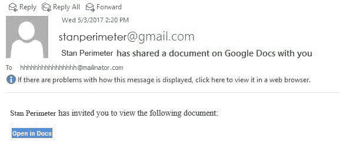
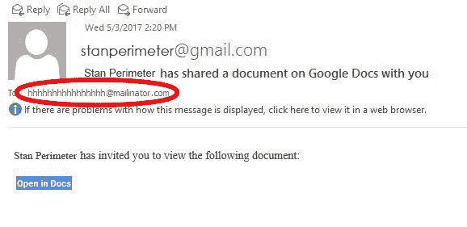

# 一个新的谷歌文档钓鱼骗局——你需要知道的

> 原文：<https://medium.com/hackernoon/a-new-google-docs-phishing-scam-what-you-need-to-know-987e01b6541b>

一个新的谷歌文档钓鱼骗局正在互联网上传播。为了理解这种非常复杂的尝试是如何工作的，以及你如何处于危险之中，想象一下下面的场景:

你正在查看你的电子邮件，突然，你的好朋友 Stan Perimeter 与你分享了一份谷歌文档。兴奋地看到你的朋友认为重要到可以放在谷歌文档中，你开始打开它。也许你会在一些令人惊奇的事情上合作。

你快速点击“在文档中打开”链接，你会被带到一个安全的页面，在那里你可以登录你的谷歌账户并查看文档。你输入你的用户名和密码，然后提交。你会看到一个谷歌文档，要么是胡言乱语，要么就是一片空白。

与此同时，您的电子邮件地址和密码已被提交给一个恶意软件脚本，由随机的第三方不知情地托管。您的 Google 用户名和密码现在已被此网络钓鱼攻击窃取。

## 那么如何保证自己的安全呢？你如何识别这一企图？

**看到这封邮件了？**

看，这不是一个谷歌地址或任何你知道的地址。**删除它**。不要打开它，不要通过 go，不要收集 200 美元。

如果您已经成为受害者并填写了表格，请立即更改您的 Google 密码。

> 注意:目前网络钓鱼的目标似乎是媒体和学校的成员，但这种情况可能会很快改变。

*最初发表于* [*绝对技术方案*](https://www.getabsolute.com/blog/new-google-docs-phishing-scam-what-you-need-know/) *。*

> [黑客中午](http://bit.ly/Hackernoon)是黑客如何开始他们的下午。我们是 AMI 家庭的一员。我们现在[接受投稿](http://bit.ly/hackernoonsubmission)并乐意[讨论广告&赞助](mailto:partners@amipublications.com)机会。
> 
> 如果你喜欢这个故事，我们推荐你阅读我们的[最新科技故事](http://bit.ly/hackernoonlatestt)和[趋势科技故事](https://hackernoon.com/trending)。直到下一次，不要把世界的现实想当然！

