# 一种新的池层，实现更快、更清晰的融合

> 原文：<https://medium.com/hackernoon/a-new-kind-of-pooling-layer-for-faster-and-sharper-convergence-1043c756a221>

假设有一些 conv 网的先验知识

## 介绍

在最大池层(用于几乎所有的视觉任务，甚至一些 NLP 任务)，你丢弃了大约 75%的激活。我想设计一种新的池层，消除一些与之相关的问题。

这些问题是:

1.  空间信息的丢失。当您丢弃 75%的激活时，关于这些激活来自哪里的信息就丢失了。
2.  最大池不能使用来自多次激活的信息。
3.  反向传播只会提高最大池化激活，即使其他激活可能具有错误的值。

我想设计一种新的池层，尽可能多地解决这些问题。在这个过程中，我想出了一个非常简单的技巧来解决第二和第三个问题。

## 想法和动机

不是取 4 次激活中的最大值，而是按升序对 4 次激活进行排序。将它们乘以 4 个权重[w1，w2，w3，w4]并将这 4 个值相加。

这个想法背后的动机非常简单:

1.  这样，网络仍然能够[学习](https://hackernoon.com/tagged/learning)对应于[w1，w2，w3，w4] = [1，0，0，0]的良好的旧最大池。
2.  后面的层可以访问更多的信息。因此，如果非最大激活对降低损失函数有用，网络可以学习使用其他值。
3.  渐变流过前一层中的所有 4 个值(相比之下，最大池中只有 1 个值)。

因此，我的直觉是，由于这些原因，这个想法会比最大池好得多。这是一个非常罕见的 DL 实验，一切都如我所料。

## 具体定义

设汇集前层的输出为张量 T，大小为[B，H，W，C]。我定义了一个超参数 pool_range，它可以是[1，2，3，4]之一。pool_range 指定激活的数量(按排序顺序)。意思是给定张量 T 的 4 个激活，它们将被汇集，我首先将它们按照[a1，a2，a3，a4]的顺序排序，其中 a1 ≥ a2 ≥ a3 ≥ a4。然后我保留它们中的第一个 pool_range。我称这个新的载体为**激活载体**。

我定义了一个大小为 pool_range [w{1}的**权重向量**，....w{pool_range}]。这里需要注意的是，如果这些权重中的任何一个是负的，那么激活向量按强度排序并且我们取加权平均值的假设就不成立。因此，我没有直接使用权重，而是对权重向量取一个 softmax，并将结果乘以激活向量。为了测试添加 softmax 的重要性，我在 fuzzy-mnist 数据集上进行了一个玩具实验，有和没有 softmax，pool_range=3。以下是测试数据集的结果。

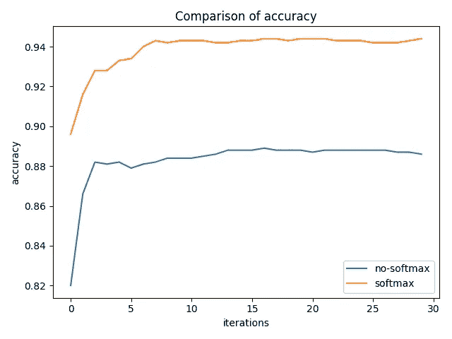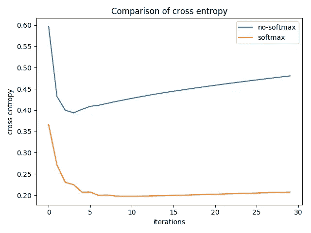

Comparison of accuracy and cross entropy on test data for cluttered-mnist dataset

显然，softmax 是这里的赢家。

我也可以对不同的通道使用不同的权重，但是为了保持与 max_pooling 的可比性，我在通道之间使用了相同的 4 个权重。

## 实施细节

我用 tensorflow 写这一层的代码。tensorflow 的 top_k 层在 CPU 上速度很快，在 GPU 上速度非常慢。因此，我没有使用它，而是编写了自己的排序例程来对 4 个浮点数进行排序。测试 sort_pool2d 的代码在[这个文件](https://github.com/singlasahil14/sortpool2d/blob/master/sortpool2d_test.py)中给出。导入并使用它作为图层的代码是这个文件中的[。](https://github.com/singlasahil14/sortpool2d/blob/master/sort_pool2d.py)

## 结果

我在许多不同的数据集和架构上尝试了这个想法，它在所有数据集和架构上都优于基线最大池。所有实验都是用 pool_range 的所有四个值来执行的:1、2、3、4。pool_range=1 对应于最大池。

以下是我的实验结果:

## 杂乱主义者和时尚主义者的玩具实验

**乱糟糟的人**

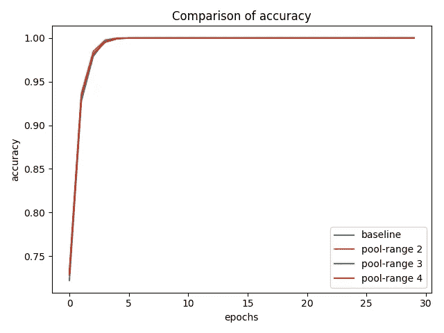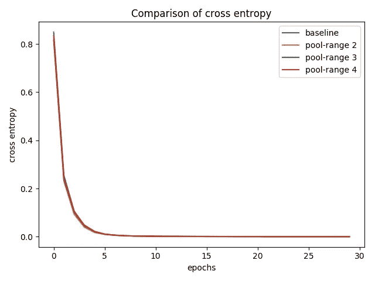

Comparison of accuracy and cross entropy on train data for cluttered-mnist dataset

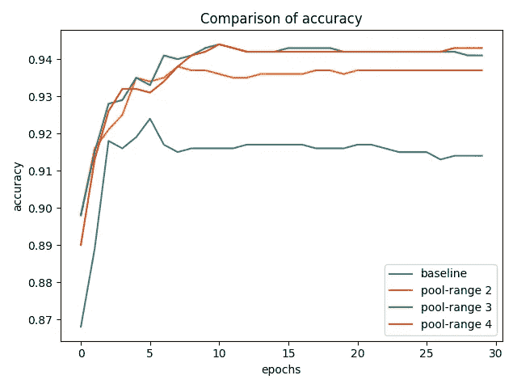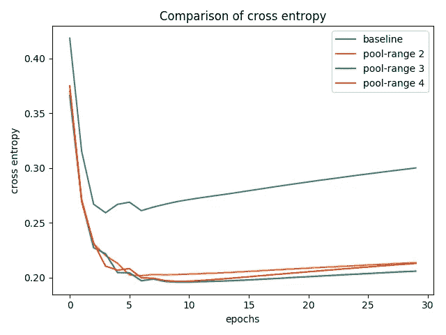

Comparison of accuracy and cross entropy on test data for cluttered-mnist dataset

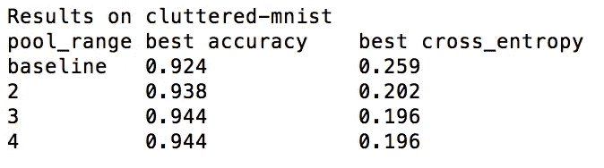

Values of best accuracy and cross_entropy throughout training on test data

网络实现的训练损失和准确度是相同的，但是 pool_range = 2，3，4 的验证准确度远远好于标准最大池。

**时尚达人**

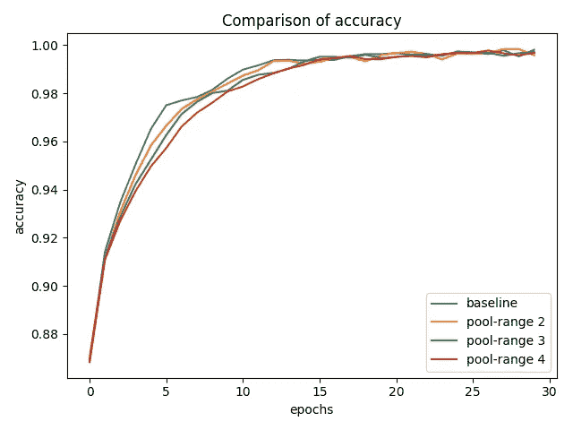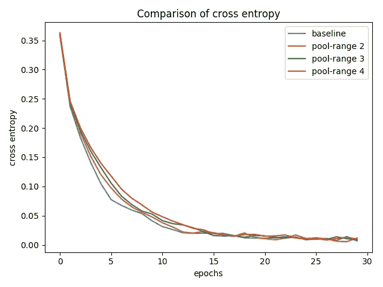

Comparison of accuracy and cross entropy on training data for fashion-mnist dataset

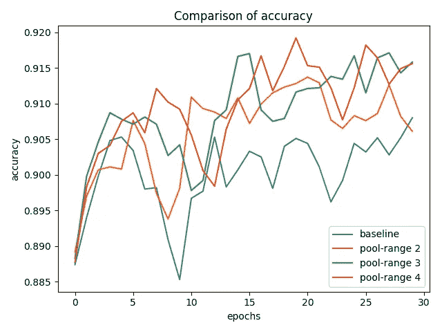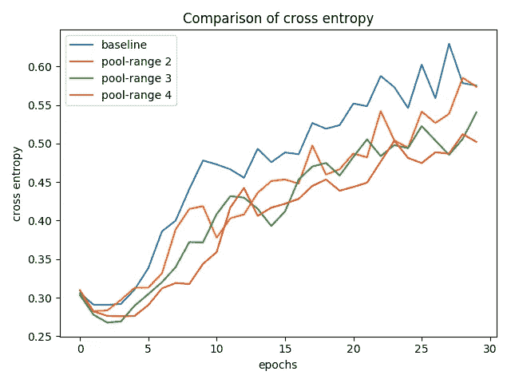

Comparison of accuracy and cross entropy on test data for fashion-mnist dataset

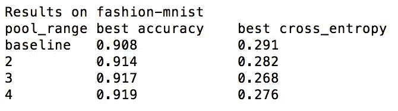

Values of best accuracy and cross_entropy throughout training on test data

pool_range>1 的结果要好得多。

## 对最先进模型的实验

**resnet 上的 cifar-10**

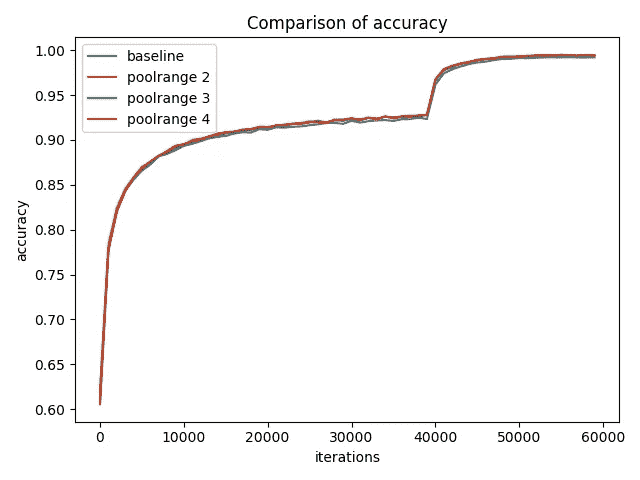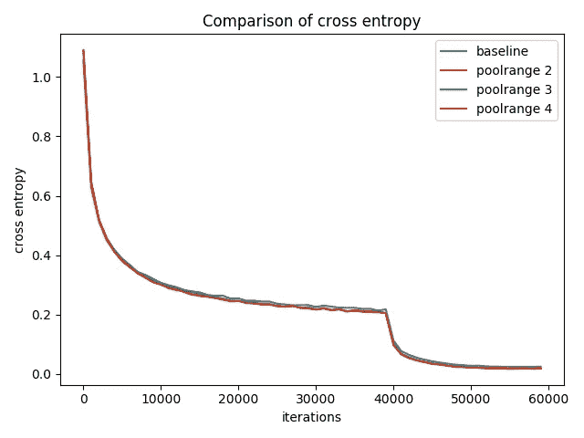

Comparison of accuracy and cross entropy on training data for cifar-10 dataset

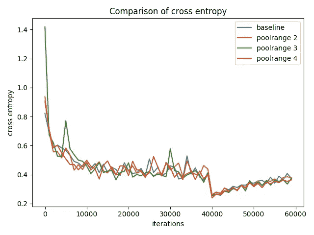

Comparison of accuracy and cross entropy on test data for cifar-10 dataset

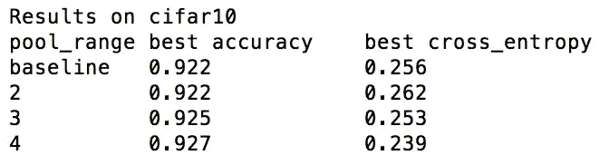

Values of best accuracy and cross_entropy throughout training on test data

pool_range>1 的结果也更好。

**resnet 上的 cifar-100**

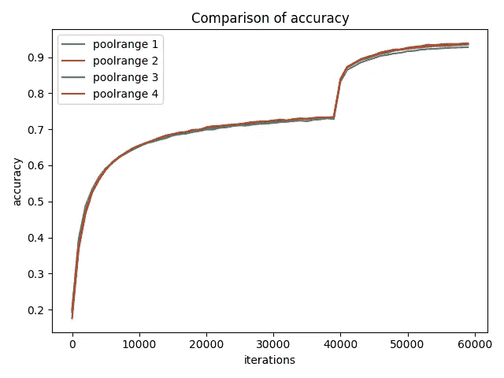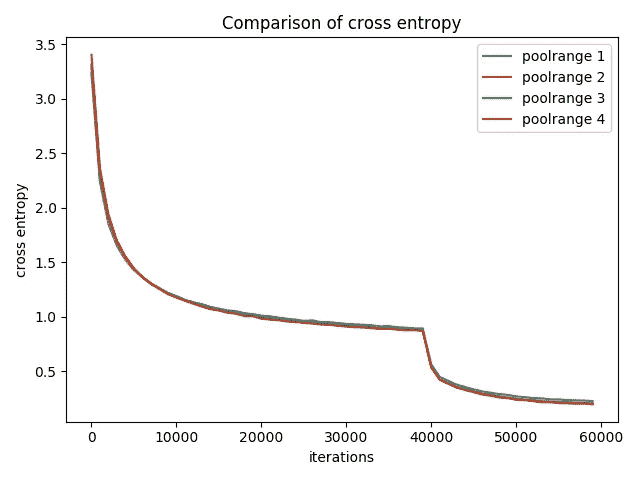

Comparison of accuracy and cross entropy on training data for cifar-100 dataset

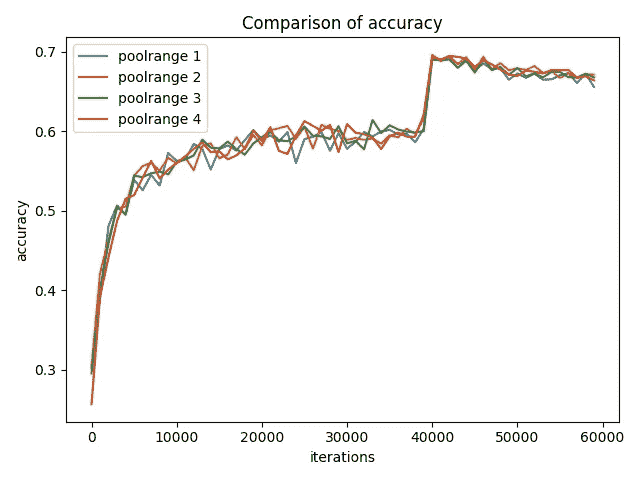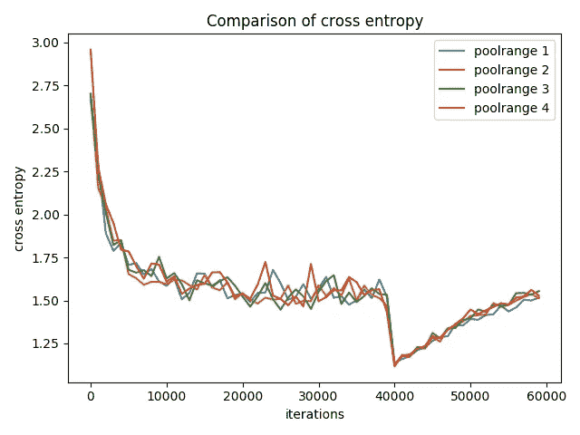

Comparison of accuracy and cross entropy on test data for cifar-100 dataset

Values of best accuracy and cross_entropy throughout training on test data

pool_range>1 的结果也更好。此处的结果优于 cifar-10 的结果，因为 cifar100 的每类数据较少。这表明，这种想法特别适用于每类数据较少的问题。

**匹配网络上的 omniglot**

我尝试在 omniglot 数据集上使用“[一次学习论文的匹配网络](https://arxiv.org/abs/1606.04080)”中提出的架构比较一次 20 路分类的结果。

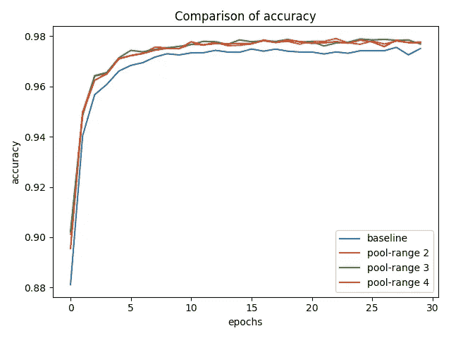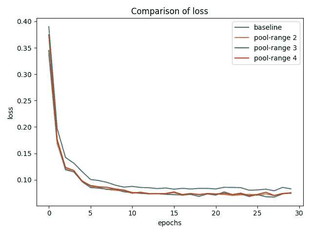

Comparison of accuracy and loss on training data for omniglot dataset

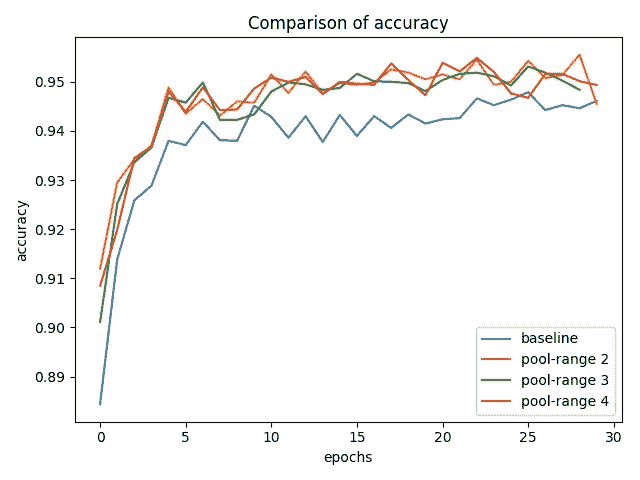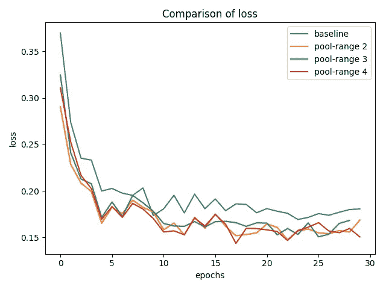

Comparison of accuracy and loss on validation data for omniglot dataset

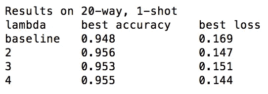

Values of best accuracy and loss throughout training on validation data

请注意，这种实现方式使用了论文中已经规范化的最新实现方式。因此，这些改进是在许多现有技巧之上的。

**omniglot 关于学习记忆罕见事件的论文**

我尝试在 omniglot 数据集上使用“[学习记忆罕见事件](https://arxiv.org/abs/1703.03129)”论文中提出的架构比较 1 次拍摄、5 次分类的结果。

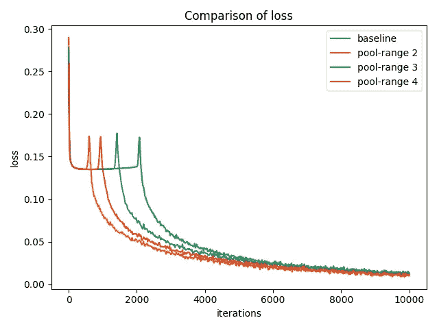

Comparison of loss on training data for omniglot dataset

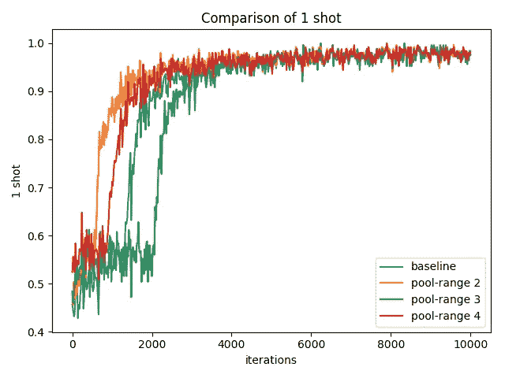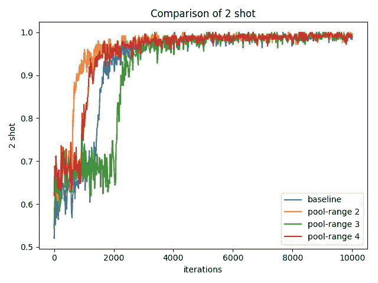

Comparison of 1-shot, 2-shot accuracy on validation data for omniglot dataset

pool_range=2，pool_range=4 的收敛比使用基线最大池快得多。

同样，这种加速也超过了论文的现有技术水平。因此，这些改进是在许多现有技巧之上的。

## **用于再现结果的代码和命令行参数**

所有这些实验都可以从[这个报告](https://github.com/singlasahil14/sortpool2d)中重现。

在这里给出了在杂乱 mnist 和时尚 mnist 上重现结果的命令行参数[。](https://github.com/singlasahil14/sortpool2d)

此处的[给出了在采用 resnet 架构的 cifar10 和 cifar100 上重现结果的命令行参数。](https://github.com/singlasahil14/sortpool2d/tree/master/resnet)

在 omniglot 上使用[匹配网络](https://arxiv.org/abs/1606.04080)架构再现结果的命令行参数在[这里给出](https://github.com/singlasahil14/sortpool2d/tree/master/matching_networks)。

在 omniglot 上重现结果的命令行参数与[学习记忆罕见事件](https://arxiv.org/abs/1703.03129)架构在[这里](https://github.com/singlasahil14/sortpool2d/tree/master/learning_to_remember_rare_events)给出。

## **结论**

这个池层(我称之为 sort_pool2d)在所有数据集和架构上比 max_pool2d 做得好得多。时差也不显著。并且每次迭代的时间可以通过编写高度优化的 C 代码和 cuda 代码来进一步优化。

虽然，这并没有解决丢失空间信息的问题。而是为解决这一问题提供了一个有希望的方向。