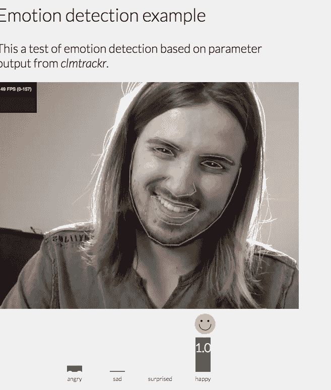
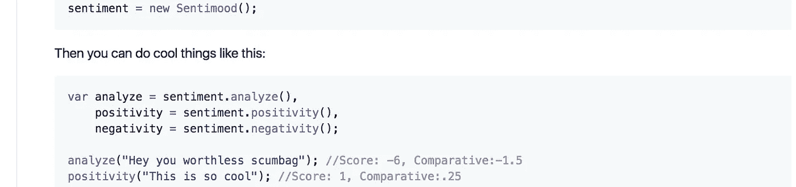
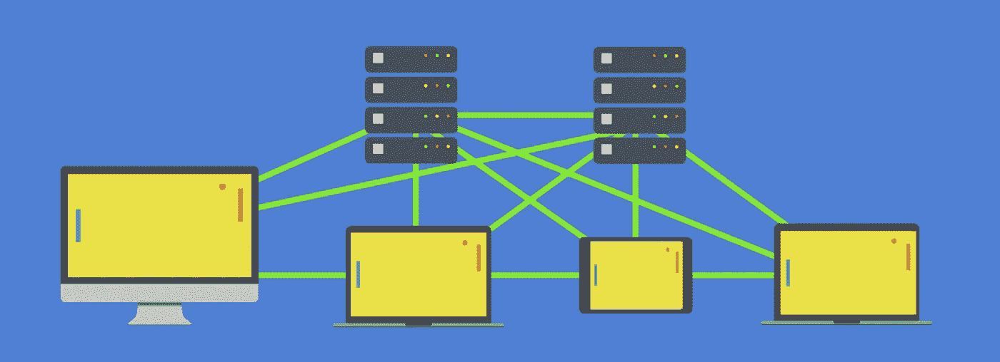
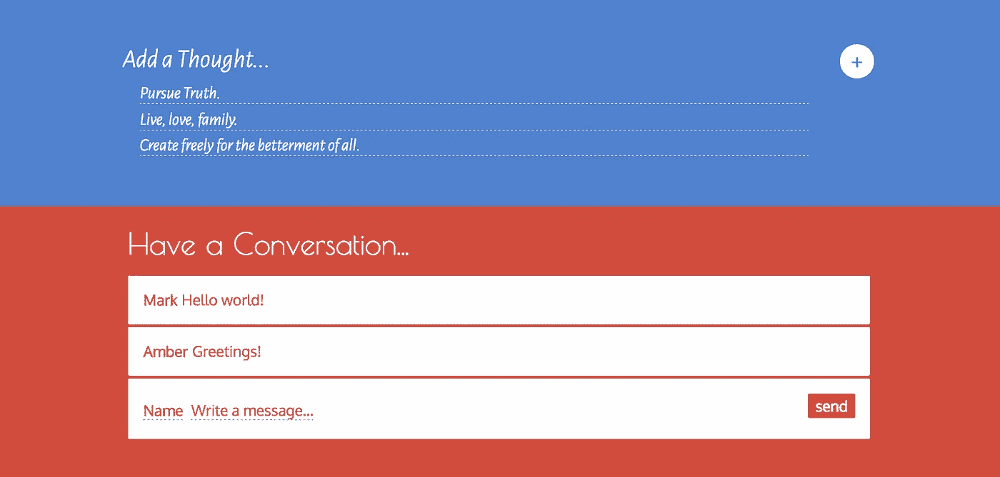

# 一种新的社会网络:情绪智力

> 原文：<https://medium.com/hackernoon/a-new-kind-of-social-network-emotional-intelligence-e45dcddb1bdb>

我感到残废和沮丧。为什么有人会花时间来斥责你并曲解你的话？一个我根本不认识的人怎么可能造成如此大的伤害，并影响我的生活？

我经历过，你也经历过。我们都没有时间让它让我们沮丧，憎恨者会憎恨，所以我们为什么要在乎？然而我们有。无论我们多么理性，这都是我们的人性:我们是社会动物。

你，我，我们。我们。那么我们该怎么办呢？如果这是一个普遍的生物特征，我们如何建立和设计傻瓜证明系统绕过这一点？我们如何重新设计我们的社会结构来适应我们的情感需求？

女士们先生们，我很自豪地宣布一种新的社交网络:情商网络。这是它的工作原理，也是我们建造它的原因。

**作为未来的预告片**，想象一下用视频游戏和动画电影用来记录演员面部表情的软件，并用它来取代 Skype？视频会议的目的是传达我们微妙的情感意图，然而附带的损害是用浪费的像素阻塞我们的带宽。

如果我们可以编码和解码我们的情感，就像图中的开源工具一样，我们可以节省 99%的带宽，同时保留 99%的意图。像这样简单的事情可以走很长的路，并很快爆发出新思想的喜悦。但首先，我们必须从基础做起，逐步积累。

# 仅向上投票

尽管脸书可能是多么善于操纵，他们确实得到了正确的“喜欢”。这应该被认为是情感智能网络的最基本层次。如果你不同意这一点，你将很难理解文章的其余部分。

这里是理论，正强化比负强化更有效。如果你不喜欢某人说的话，不要浪费时间去贬低他们。你和这个人的互动只会吸引更多的注意力到他们的想法上，这在无意中帮助了想法的传播。扼杀一个想法的最好方法是忽略它。

**审查呢？**希望历史已经回答了这个问题。审查是不好的，因为它会引起心理上的抵触。这反过来导致人们，即使有非常糟糕的想法，也变得坚信自己比以前更加正确。他们现在有了为之献身的战斗理由。人们会的，即使是愚蠢的想法。

那么，我们如何对抗愚蠢呢？通过庆祝好主意。正面强化鼓励(双关语)我们说出并放大我们认为有价值的想法。我们是群居动物，由于我们的社会性，我们潜意识里被文化强化的观念洗脑。变得积极不容易也不自然，但是很有效。

例如，可口可乐(开放的幸福！)每年花费数百万美元来强化你的大脑(嗯，那是在他们把可卡因偷偷放入你的饮料成为非法之后)。如果他们不能麻醉你的身体，他们知道如何麻醉你的心理。

只有向上投票的能力，就像手指戳一样容易，但向下投票却很难，**只是我们如何重新训练大脑的开始。它把注意力吸引到好的内容上，而忽略了坏的内容——一个信噪比。**

然而，它确实有迫使仇恨者加入评论的副作用。我们将在下一节中解决这个问题。

# 巨魔的麻烦

H 希望简单的评论和“喜欢”可以淘汰大量的讨厌者，同时增加正面总数。除此之外，我们都知道(如果我们曾在互联网附近的任何地方)一些卑鄙的人或巨魔将接受挑战。

他们对破坏你一天的虐待狂满足感的渴望就像吸血鬼对血的渴望。那么我们如何防止这种情况发生呢？首先，要明确的是，我们并不是要阻止异议。**我们试图通过将讨论推至评论中来促进讨论**，而不是制造“我这边”对“他们那边”的无声投票战。那不会有任何结果。

其次，现在有评论并不意味着这将是一场有质量的讨论。远非如此，一个坏苹果可以毁掉一切。所以我们的目标应该是剔除那些害群之马。然而，如果没有向下投票的能力(或者“报告滥用”，因为这非常主观，并且本身会被滥用)，我们如何识别文本中的巨魔呢？

# 情感分析

一个“情绪智能网络”将是完全对等的，原因将在后面解释。因此，我们可以让机器通过情感分析和我们可以决定的个性化规则来帮助我们识别巨魔。这相当于“反对票”，但防止滥用，因为它是个性化的。

情感分析试图计算一个评论是积极的还是消极的。它不关心政治观点、宗教信仰或任何其他有意义的观点。也就是说，它在争论中不偏袒任何一方，没有回音室效应。相反，它可以粗略地估计某人是否是一个仇恨者。但是有许多细微的注意事项，例如:

1.  因为可能有许多误报，所以情感分析不应该基于“每个评论”。这也意味着它不会受到任何个人评论的支持票的影响。
2.  因此，分析应计算为整个账户的比率。这种“态度”比例会带有情绪色彩(为了不打断谈话的线性流程)，使它们更难或更容易阅读。那样的话，就要花额外的精力去阅读一个憎恨者的评论。要么你会很高兴这不是恶意的，要么你会寻找自己的情感伤害。
3.  然而，用户也应该能够通过异常来影响分析。例如，将另一个用户标记为朋友，或者定期给他们的评论投票。但是请注意，这只会修改您的视图，而不是全局视图。
4.  更耐人寻味的是，你自己的内容会用你自己的标准来评判。这是有意的，因为创造自我意识干扰会驱动行为的有意识选择。当你创作内容时，你态度的改变会与过去的你形成对比。这让人们能够测量远离或接近理想自我的运动。
5.  必须再次强调分析去中心化(没有“主持人”支持)的重要性。在某种程度上，一种“更复杂和更优越”的算法将被供应商宣传，但这应该是一个危险的信号，因为它是一种充满意识形态色彩的情绪。很简单:人应该有道德，算法不应该。

如果有一句话你应该坚持，那就是情商是自我的反映。当我们从外部视角审视自己时，我们必须调和这是否是我们想要成为的人。这不仅扩展了我们的思维理论，与他人产生共鸣的能力，还让我们反映新的行为——打破坏习惯，或者选择新习惯。

我们可能犯的最大错误是将这一机制交给其他人或其他事物。没有比你自己积极强化自己的能力更好的机器学习算法或人工智能了。

# 从 Mods 分散我们

如果说万神殿是希腊人的神，那么版主就是论坛的神。就像我自 1999 年以来加入的所有互联网社区一样，mods 是一种自然的自我递归的破坏性力量。那么，有可能完全不需要它们吗？是的。事实上，在一个情商网络中，这是必要的。

# 令人作呕

我们早些时候讨论过审查制度，它是一种无效的手段。或多或少，版主是防止垃圾邮件发送者破坏社交网络的看门人。他们是人类广告拦截者，保卫罗马免受野蛮人的入侵。

这似乎是一个高尚的角色，直到我们不可避免地发现，我们所说的东西已经被审查，被标记为垃圾邮件或冒犯性的，或被标记为“假新闻”。具有讽刺意味的是，通常是在我们加入社区后出生的一个 mod，或者是一个比我们“名声”更好的用户。我见过的最糟糕的情况是，员工禁止某人违反“ToS ”,然后在事后修改它，以追溯性地掩盖他们的工具。

但并不是野蛮人导致了罗马的覆灭，他们是一根压断骆驼背的针。罗马是从内部崩溃的，用不了多久特洛伊的版主就是希腊马了。互联网论坛就像看着政治和历史的宿怨不断重演。

在权力的零和游戏中没有情商。尤其是当这种权力是通过欺凌来审查、压迫、压制和解雇你的对手时。

# 广告拦截

那么，如果版主权力没有通过情商测试，我们如何阻止垃圾邮件发送者破坏我们的社区呢？如果我们结合情绪分析部分的第(2)和第(3)点，有两个新的观察结果。

1.  **搜索**。如果用户搜索只有他们信任的朋友投票赞成的内容，这将创建垃圾邮件几乎不可能到达的社区视图。但这太过分了，不是吗？
2.  **过滤**。另一种类型的搜索是从视图中排除内容。用户可能希望从不显示憎恨者的评论。或者阻止他们可能会觉得反感的内容，如暴力、裸体或广告。

**这不是审查吗？不会。它并不禁止任何其他用户查找和查看该材料。各有所好。奇怪的是，屏蔽广告似乎是一个比禁止身体部位更有争议的话题。**

> 但是服务器成本呢？屏蔽广告是窃取他们的收入！这是不道德的。

情商让我们有义务看广告吗？不。如果我们不想被欺负，我们就不应该欺负别人。我应该用身体强迫你和我做爱吗？如果答案显然是否定的，那么我们能走多远？它也适用于视觉、听觉或嗅觉吗？我们应该强迫别人闻我们的生殖器吗？看看他们怎么样？

如果你的答案也是否定的，那么很明显，强迫一个人看广告是不道德的。顺便提一下，这也是公共猥亵法最初的来源，尽管对许多人来说似乎是维多利亚时代的。当然，你可以睁大你的眼睛，但是我们在这里摸索的——嗯，原谅，抓住——是义务。没有。

情感智能网络会被广告驱动吗？如果广告拦截不再与窃取混为一谈，我们仍然有收入的问题。我们如何抵消服务器成本？嗯，我们做的和对版主做的一样。如果我们不再需要服务器，那么将不再有任何服务器成本。

但是怎么做呢？

# 感谢激流

这是盗版的道德论据。在广告封锁的时代，torrenting 是免费内容分发的机制，目的是替换和补贴服务器。如果你的用户在“窃取”你的内容，有什么比让他们付费托管内容更好的方法呢？让我们扩展。

如果没有人盗版你的内容，那么你应该没有服务器成本(这可能是你需要更好内容的迹象)。如果每个人都在盗版你的付费内容，那么这可能意味着你收费太高了。公平的市场价格是这两者的平衡点。

这种平衡意味着双方都获得了净收益，一个双赢的体系。非零和博弈是历史的必然。为什么？因为从数学上讲，赢输没有增长，输输系统自毁。所以双赢的系统总是赢得时间。

> 但是没有付费墙我会赚更少的钱，那是损失，不是胜利！

在你可以将内容货币化之前，你必须首先生产内容。一旦创建了，就不能保证它会成功。因此，不管怎样，这都是一种风险。当然，免费提供你的内容会阻止进一步的货币化，但不会招致损失。至少对数码产品来说是这样。

消费者显然是赢家，从内容中获得知识。但是很难理解制作人的胜利。知名度和影响力固然不错，但并不能直接兑换成现金。这无疑是困难的。但是让我们通过分析极端情况来解决这个问题，就像我们对盗版所做的那样。

1.  一个饥饿的艺术家创造他们的艺术，因为这是一种必须的美，不管金钱。这可能是也可能不是他们首先挨饿的原因。但是面对逆境，他们创造的行为是勇敢的。
2.  然而，一个“邪恶”的工作室只会为现金制作内容，这可能是也可能不是他们首先有钱预付制作成本的原因。他们为了贪婪而剥削，即使是在不必要的时候。

事情是这样的，torrenting 不会停止饥饿的艺术家。但这可能会让他们出名。然而，种子可能会阻止贪婪的工作室赚钱。但这不会阻止一个工作室试图变得贪婪。意思是激流既不能停止饥饿也不能停止贪婪，这些都是行为。

那么非双曲线呢？有钱资助美好项目的工作室呢？那些项目需要由艺术家来创作。还有什么比通过观察极度饥饿的艺术家来发现天才更好的方法呢？在一个只有赞成票的世界里，盗版是一种经过审查的发现机制。

这是间接交换，导致工资的直接现金交换。也就是说，无论像现金这样的古老系统存在多久。货币被困在一个遗留系统中，在这个系统中，经济商品是由不需要劳动就无法复制的有限材料制成的。但现在已经不是这样了。

未来的经济体系是什么样子是另一篇文章的主题。但是创造未来的唯一方法是从过去架起一座桥梁。所以我们还有最后一个问题需要解决。非双曲线工作室如何获得资助项目的补偿？他们是怎么赢的？

内容不是产品(除非是在有限介质中)，座位才是。在电影行业，已经是这样了。剧院的座位有限，这就是正在出售的。其他部门也有类似的，但是如果没有经验，这些座位是没有用的。这就是电影公司的利润所在。

工作室的客户是剧院，剧院的产品是座位。那些东西没有多余的劳动是无法复制的，但是内容可以。每个经济体系只在自己的规则内运行，数字时代已经打破了先验的假设。但是一座桥是可能的。

这个故事的寓意是，盗版只有在有限的期限内才是坏的。但用现代术语来说，盗版不仅是好的，**它是双赢规模经济的道德必然未来。**

# 今天的未来

我们不需要对社交网络的未来进行理论化，我们可以建立它们。然而这并不容易，从一个时代向另一个时代过渡是很困难的。技术只是未来的一线曙光，它不能取代我们的社交网络——我们认识的人。

如果我们不善于在情感上与同事或敌人相处，我们就会烧掉通向美好明天的桥。当讨论被停止，当新闻被审查，当不同意见被压制，不要警惕你站在哪一边，而要警惕最初制造分歧的那只手。

意识形态战争中有利润和权力，就像政变和武器交易中有机会一样。政府和企业都从双赢的裂痕中受益，因为它分散了人们的注意力，让他们不去想他们是在向两党出售子弹，或者西雅图最好的餐馆只是星巴克。

我们最宝贵的资源是我们认识的人。对于未来的经济学来说，洪流可能是必要的，但你的社交网络是超越那个时代的财富。这意义深远，但这些影响对我们向第四次工业革命的演变至关重要。

这就是为什么我们需要一种新型的社交网络，一种基于情商和工具的社交网络，将意识形态权力分散到个人手中，而不是政府或公司。这就是为什么我们建立了一个[开源数据库](https://github.com/amark/gun)和[端到端加密授权](https://github.com/amark/gun/wiki/auth)。

欢迎来到[枪](http://gun.js.org/)，我们是数据和创意的军火商。用自主的数字武器装备大众，用情商的道德培养开源社区。因为我们相信赢得战争的最好方法是在战争开始前就解决它们。

未来是你的，今天就来和我们一起创造吧。

> [黑客中午](http://bit.ly/Hackernoon)是黑客如何开始他们的下午。我们是 [@AMI](http://bit.ly/atAMIatAMI) 家庭的一员。我们现在[接受投稿](http://bit.ly/hackernoonsubmission)并乐意[讨论广告&赞助](mailto:partners@amipublications.com)机会。
> 
> 如果你喜欢这个故事，我们推荐你阅读我们的[最新科技故事](http://bit.ly/hackernoonlatestt)和[趋势科技故事](https://hackernoon.com/trending)。直到下一次，不要把世界的现实想当然！

