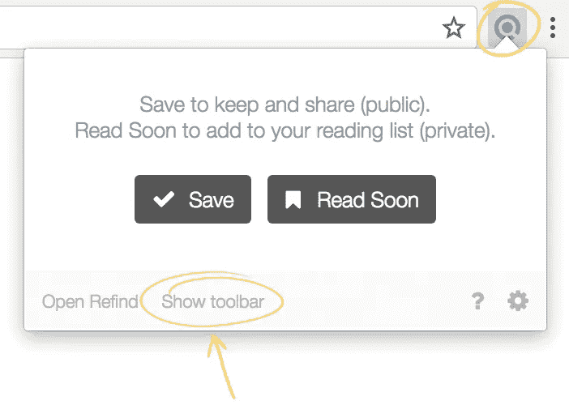
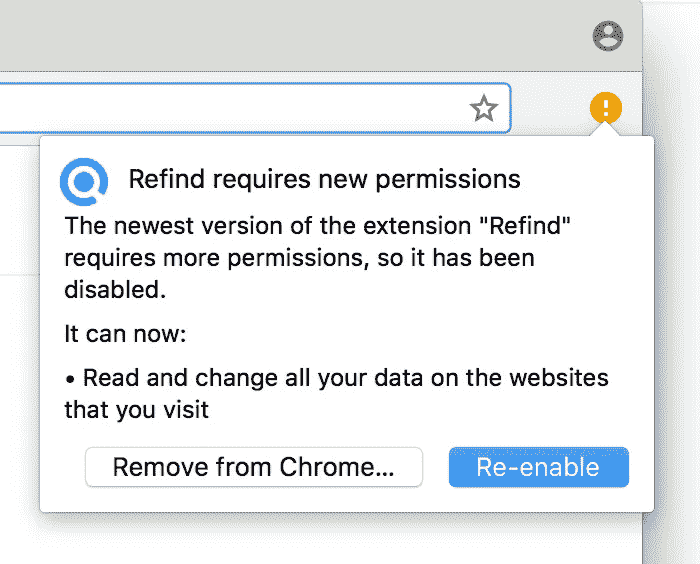

# 全新的社交网络体验

> 原文：<https://medium.com/hackernoon/a-new-social-web-experience-aaef219194fc>

获得全新的 Chrome 扩展，获得全新的社交网络体验。像往常一样浏览网页。当你登陆一个在你朋友中很受欢迎的页面时，会出现一个工具栏…

New toolbar on the bottom of popular pages

查看你的朋友中有多少人保存了链接，阅读他们的评论，听音频，阅读摘要(如果有的话)

# 特征

*   **Save (public)** :保存你想保留的链接，等你真正需要的时候再找，比如你在 Google 上搜索的时候。
*   **很快阅读(私人)**:将你想阅读的链接添加到你的私人阅读列表中。
*   **分享**:通过电子邮件或社交媒体与朋友分享链接。
*   **更多**:标签，写评论等。
*   **好友**:查看保存链接的好友。
*   **保存次数**:查看总共有多少人保存了链接。
*   **评论**:阅读好友对链接的评论。
*   **收听(如果有的话)**:收听链接的音频版本。
*   **摘要(如果有的话)**:阅读链接的摘要。
*   **发现**:在 Refind 上查看你的个人信息。
*   **随机链接**:偶然发现一个很棒的链接。
*   **设置**:关闭工具栏(永久)，或者对当前域禁用。
*   **关闭**:关闭工具栏。

# 隐私

如果您启用了工具栏(默认)，扩展会在您访问的每个页面(当前 URL)上向我们的服务器发送一个请求，我们的服务器会用工具栏中显示的信息进行响应，例如保存次数。您可以完全禁用工具栏，或者对某些域禁用，在这种情况下，不会向我们的服务器发送任何请求。单击设置菜单工具栏中的设置图标(cog)。

请求没有存储在我们的数据库中。在 https://refind.com/privacy 上查看我们的隐私笔记

# 它是如何工作的

像往常一样浏览网页。如果你登陆了一个在你朋友中很受欢迎的页面，一个工具栏会出现在底部。您也可以通过 Refind 浏览器按钮打开工具栏。

# 获取我们的工具栏

从 Chrome 网上商店获取我们最新的 Chrome 扩展(v . 2 . 0 . 0):[https://Chrome . Google . com/Web Store/detail/refind/dlapbpopbcangbnjdhajddlanbfokjaja](https://chrome.google.com/webstore/detail/refind/dlapbpopbcangbnjdhajdlanbfokjaja)

如果你已经安装了我们的扩展，确保你有最新的版本(v. 2.0.0)(见 chrome://extensions)。如果没有，重启 Chrome 或者移除并重新添加扩展。如果 Chrome 要求你重新启用你的扩展，点击重新启用。