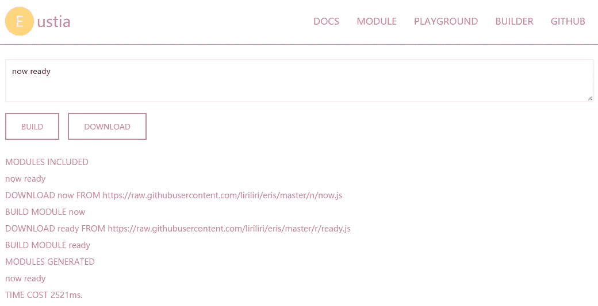

# 一个新的实用程序库，旨在完成任务

> 原文：<https://medium.com/hackernoon/a-new-utility-library-designed-to-get-things-done-d203daa91429>

Licia 是一个专注于完成日常工作的实用程序库。不同于其他库，如[下划线](http://underscorejs.org/)、 [mout](http://moutjs.com/) ，这些库将其函数严格分为数组、字符串和函数等几个类别，licia 只是有用的 [JavaScript](https://hackernoon.com/tagged/javascript) 片段的简单集合。也就是说，它是在开发网站的同时成长的。每当我找到构建我的页面所需要的东西，它就会被添加到库中。结果，licia 变成了一个拥有大约 300 个微模块的库，处理不同方面的问题。比如 dom [操纵](https://hackernoon.com/tagged/manipulation)，cookies，类创建，模板，日期格式，ajax，url，事件发射器等等一堆，甚至是 Promise。

## 利益

就像我说的，这个库专注于把事情做好，尤其是移动网络开发。您不需要使用 Zepto，因为有一个 jQuery 编码风格的 dom 模块。你不需要包含一个 cookie 库，因为[已经有一个 cookie 模块](http://eustia.liriliri.io/module.html#cookie)了。你不需要片刻，一个[日期格式](http://eustia.liriliri.io/module.html#dateformat)足以处理大多数与日期相关的工作。不需要 Promise polyfill，因为已经有[个](http://eustia.liriliri.io/module.html#promise)。微[事件发射器](http://eustia.liriliri.io/module.html#emitter) libs 的原因相同。不需要 ajax，因为我们不仅有 Ajax，还有它的 Promise 版本 fetch。仅仅因为你想使用它的 [shuffle](http://eustia.liriliri.io/module.html#shuffle) 函数，你就不再需要包含下划线了。至于 mkdirp，这个模块在 npm 中有很多依赖项，你没有必要一遍又一遍地把它安装到你的 node_modules 文件夹中…

## 使用

建议使用官方捆绑工具 [eustia](https://github.com/liriliri/eustia) 来扫描您的代码，以生成一个只包含您实际使用的方法的定制版本。不过，如果你不喜欢，就装[licia](http://npmjs.org/package/licia)吧。

```
npm i licia --save
```

然后像任何其他 npm 实用程序模块(如 lodash)一样使用它。

```
var uuid = require('licia/uuid');

console.log(uuid()); // -> 0e3b84af-f911-4a55-b78a-cedf6f0bd815
```

还有一个在线建设者，点击[这里](http://eustia.liriliri.io/builder.html)试试看。



## 结论

这个项目仍在开发中，每周都会添加模块。如果你有一些有用的 JavaScript 代码片段，请联系我，只要遵循一些简单的规则，很可能会被添加进去。

官方网站:[http://eustia.liriliri.io/](http://eustia.liriliri.io/)

模块回购:[https://github.com/liriliri/licia](https://github.com/liriliri/licia)

联邦债券回购:【https://github.com/liriliri/eustia】T2

[](http://bit.ly/HackernoonFB)[](https://goo.gl/k7XYbx)[](https://goo.gl/4ofytp)

> [黑客中午](http://bit.ly/Hackernoon)是黑客如何开始他们的下午。我们是 [@AMI](http://bit.ly/atAMIatAMI) 家庭的一员。我们现在[接受投稿](http://bit.ly/hackernoonsubmission)并乐意[讨论广告&赞助](mailto:partners@amipublications.com)机会。
> 
> 如果你喜欢这个故事，我们推荐你阅读我们的[最新科技故事](http://bit.ly/hackernoonlatestt)和[趋势科技故事](https://hackernoon.com/trending)。直到下一次，不要把世界的现实想当然！

