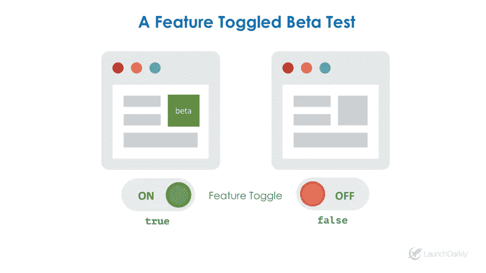
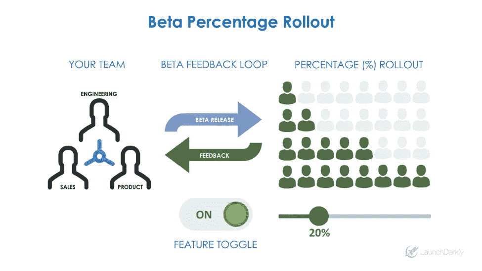

# 测试的新方法

> 原文：<https://medium.com/hackernoon/a-new-way-to-beta-test-136e80e58ddc>

## 使用功能切换到真实环境中的 beta 测试

对产品来说，最好的做法是进行某种测试，这是一种在向所有人发布之前收集客户反馈和测试性能的方法。在一个持续交付的时代，我们更频繁地提供新的功能和体验，并且用更少的时间来收集全面的客户和性能反馈。随着节奏的加快，产品团队不得不缩短测试版，放弃所有测试版，或者放慢发布节奏以收集足够的客户反馈。

# 传统测试版的挑战

*   **协调选择加入。**有时需要几周或几个月的时间来收集客户选择来测试新的测试版。您还必须组织分发测试版密钥(即，用于提前访问游戏)和提醒电子邮件。
*   **组织焦点小组。**从焦点小组获得反馈通常既费时又费钱，形成了一个漫长的反馈循环，延长了发布过程。
*   **选择退出。**如果客户选择测试版，并且不喜欢这种体验，那么他们会想要一个简单的机制来切换回生产版。
*   **颗粒状贝塔。**很难根据用户属性进行有针对性的测试，也很难逐步推出新的测试功能。

# 功能切换

为了克服这些挑战，智能产品团队开始运行带有特性标志和切换的测试版。这些是用于精确控制软件发布的机制，允许您控制测试版发布的时间和可见性。

目前，许多测试版与代码发布相关联，并由配置文件或数据库管理。这种方法需要工程时间或定制机制来选择加入用户。

通过功能切换，您可以授权产品、营销、销售甚至客户选择新的试用体验。

在这个简单的例子中，您可以使用一个开关来控制一个新的 beta 特性的可见性。理想情况下，这种切换应该是用户界面的一部分，可以由非技术团队成员控制。代码本身可以被关闭，然后通过开关打开。

此外，您还可以使用切换来控制获得测试版体验的用户的百分比。例如，你可以发布新的测试版体验，并向 0%的用户推广。你可以逐渐增加部署百分比，从 1%到 5%到 20%甚至更多，同时收集客户和性能反馈。

在用户界面中呈现这个测试版控件功能对于让非技术团队成员访问发布控件是至关重要的。

# 区域贝塔

对于最近的一个有针对性的推出的例子，我们可以看看 Pokémon GO 是如何在各国发布他们的产品的:首先是美国，然后是国外。

这是特性切换的一个很好的用例，因为您可以创建目标规则来确定哪些用户首先接收到该特性。例如，我可以创建一个由规则控制的开关:“如果用户住在旧金山，那么提供新的附近神奇宝贝功能。”这允许您维护不同的区域特性集，而不必部署应用程序的不同版本。它还允许 Pokémon GO 在向更广泛的受众推出新功能之前，完善他们的算法并评估客户反馈。

# 功能切换的 Beta 测试的好处

*   **授权的非技术用户。**允许销售、营销、产品、设计和业务团队为特定用户打开功能，收集反馈，并控制业务逻辑。这也大大减少了工程时间。
*   **你的 beta 测试的生产反馈。**在有限的用户群中测试产品特性，以收集客户和性能反馈。
*   **增量百分比转出。**逐步推出功能，逐步测试性能并降低风险。如果该功能不好，则将其关闭。
*   **实时选择加入和退出。**允许用户通过功能切换控制，实时选择加入或退出 beta 测试。Skylight 在这方面提供了一篇很好的[文章](http://featureflags.io/2016/12/14/feature-toggles-at-skylight/)。

# 切换入门

从概念上讲，功能切换相对简单。您可以在代码中创建一个控制代码段可见性的条件。有很多[开源库](http://featureflags.io/)可以让你入门。