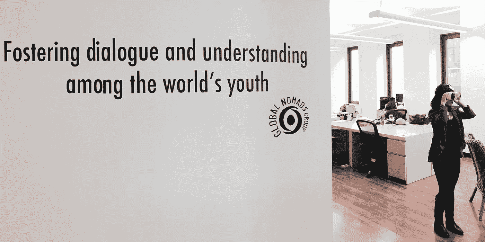
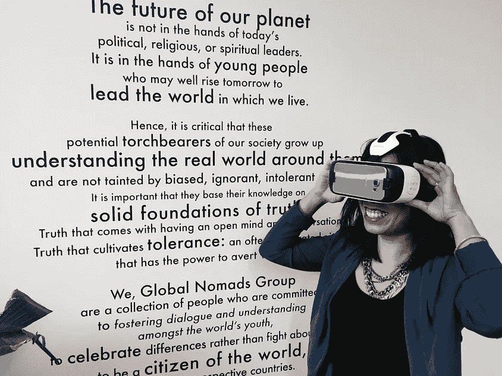
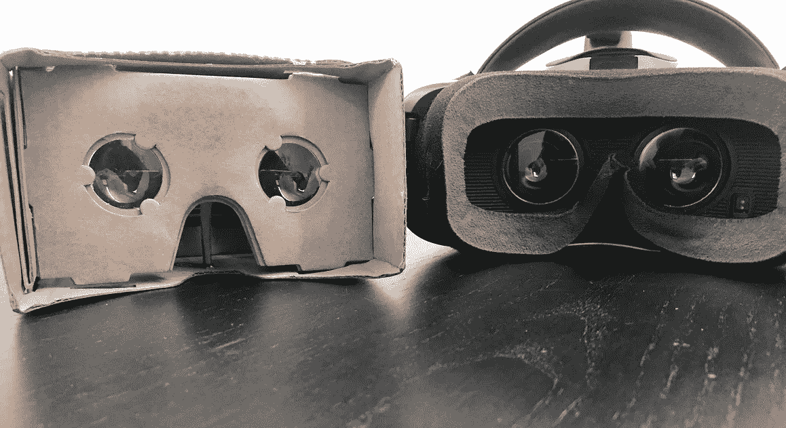

# GNG 虚拟现实总监的笔记。

> 原文：<https://medium.com/hackernoon/a-note-from-gng-s-director-of-virtual-reality-d1dd77a275ab>

> 十多年来，我一直与青年合作，推进我们共同的人性，我想不出还有比这更重要的时机来开展有意义的跨文化对话。在我们的本地和全球社区中，存在着深深渗透的文化差异。我们目睹了其不信任、恐惧甚至暴力的症状通过我们的头条新闻表现出来——从我们自己后院暴露出来的种族不公正的阴影，到伊斯兰恐惧症的兴起，甚至到针对难民危机的仇外言论。具有讽刺意味的是，在技术使我们比以往任何时候都更加相互联系的时候，我们的人类社区正在扩大。为了消除彼此之间的分歧，我们必须在社区内部和社区之间进一步发展我们的同理心。

> 过去 18 年来，全球游牧者组织一直在通过我们的虚拟交流项目这样做。我们很高兴宣布使用虚拟现实(vr)的新工作系列，我将作为虚拟现实总监领导这项工作。虚拟现实让我们有机会体验“他人”的生活，以我们尚未发现的方式发展同理心。想象一下，戴上耳机，立即沉浸在难民营中，或者发现自己生活在致命的种族冲突的错误一方。也许更简单，想象一下在另一个国家当学生的日常生活是什么样子。虚拟现实使这种思想实验成为一种几乎发自内心的体验，从一个与自己完全不同的角度加深了人们对人类历史和文化的理解。我们可能会发现我们并没有那么不同。
> 
> 在接下来的一年里，我们将策划一系列可在课堂上使用的虚拟现实内容，包括原创虚拟现实体验的制作，以及符合标准的课程，以深化学生的学习成果。像我们的其他计划一样，我们将提供专业发展研讨会，以确保教育工作者能够有效地使用该技术，并为他们的学生带来最大利益。
> 
> 我们将在几周后的 SXSWedu 2016 上首次展示这款作品。要了解虚拟现实发展的最新动态，请注册[我们的邮件列表](http://gng.org/virtual-reality)——我希望你和我们一样热情，释放虚拟现实作为全球教室变革性教学工具的潜力！

*格蕾丝·刘，GNG 虚拟现实导演*

> [黑客中午](http://bit.ly/Hackernoon)是黑客如何开始他们的下午。我们是 [@AMI](http://bit.ly/atAMIatAMI) 家庭的一员。我们现在[接受投稿](http://bit.ly/hackernoonsubmission)，并乐意[讨论广告&赞助](mailto:partners@amipublications.com)机会。
> 
> 如果你喜欢这个故事，我们推荐你阅读我们的[最新科技故事](http://bit.ly/hackernoonlatestt)和[趋势科技故事](https://hackernoon.com/trending)。直到下一次，不要把世界的现实想当然！

