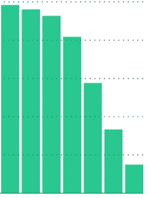

# 关于 33 小时内失去 89，000 名读者的说明

> 原文：<https://medium.com/hackernoon/a-note-on-losing-89-000-readers-in-33-hours-423861897748>

## 尊敬的[黑客正午](http://hackernoon.com)社区，

我们很抱歉，我们的网站将于周日上午 12:01 至周一上午 9:05(太平洋标准时间)关闭。现在是现场直播。贡献者信任、读者信任、品牌资产——我们烧掉了一些。糟透了。我想分享所发生的事情，并让你知道我们一直在努力工作——与其他人——这样这种事情就不会再发生了。希望你能继续花一些[时间和我们一起阅读](http://hackernoon.com/trending)。

停机时间是由未更新 SSL 证书引起的。不更新 SSL 证书是网站关闭的一个愚蠢的原因。

如果你用一个[媒体](https://medium.com/u/504c7870fdb6?source=post_page-----423861897748--------------------------------)出版物构建，你不能实现你自己的 SSL 证书。 [Medium](https://medium.com/u/504c7870fdb6?source=post_page-----423861897748--------------------------------) 表示“[涵盖设置、SSL 证书和对域名的持续支持](https://help.medium.com/hc/en-us/articles/115003053487-Custom-Domain-FAQ)。”关于谁、如何以及何时为全球顶级 10K 网站和美国顶级 5 K 网站续订 SSL 证书的错误沟通令人遗憾，我希望我们能够利用这种情况更好地合作。

在周日早上 4 点和 6 点换完尿布后，我在周日早上 8 点 50 分打开手机，看到一连串的推文、短信和电子邮件，说我们的 SSL 证书过期了。这就是我喜欢[黑客午间社区](/hacker-daily/followers)的原因——他们不会发关于网站关闭的微博，他们会发关于网站关闭的原因以及需要做些什么来修复它的微博。[Medium support 的 Berik Dossayev](https://medium.com/u/acc6682c5e58?source=post_page-----423861897748--------------------------------) 在凌晨 1 点 34 分发邮件给我说，**“**看起来我们对 HackerNoon.com 的自动续订失败了。”为什么会失败？我在上午 8:57 回复了邮件，然后玩了等待游戏……我也发了支持邮件，联系了我在 Medium 的其他联系人。伸出了这么多的方式，我没有意识到媒体巩固了门票，并回复了我一个链，我没有遵循。写了这个帖子。和家人一起吃午饭。试着忘记用[媒介](https://medium.com/u/504c7870fdb6?source=post_page-----423861897748--------------------------------)工作的成本。后来我发现我叔叔死了。撕开。我暂时忽略了这个问题。在外面多呆了一会儿。复活节周日继续。奶奶主动提出上早班，给我们的新生儿换尿布。是生活中的小事，比如睡眠。周一上午 8:29，我收到了来自媒体支持团队的进一步澄清 SSL 的自动续订失败了。我们实施了新的 CNAME 信息。向前看，所有的 [AMI 出版物](http://amipublications.com)都是为 SSL 证书的更新而设置的。

What your traffic graph looks like when you don’t renew a cert.

[黑客正午](http://hackernoon.com)日均阅读量 6.5 万。宕机 33 小时已经损害了 89，000+读者和许多贡献者的信任。我们的贡献者是这个社区的基础，我们的读者是扩大这个社区的人，我们今天的失败损害了他们的信任。再说一次，糟透了。

这项业务存在平台依赖风险。这件事让我想起了依赖他人的代价。这就是今天的互联网。用脸书登录。注册谷歌。所有的技术都有平台依赖性问题。我的目标是 Medium，我们将继续发展 Medium，但在过去的 33 个小时里，我不禁要问，作为互联网上的人，我们可以做些什么来发展和扩大我们的业务。作为平台的一部分，我们集体共享资源的效率比我们自己共享更高吗？我仍然这样认为。我希望你也是。请继续和我们一起阅读，如果你想发泄一下这段时间有多愚蠢，请给我发短信，我很乐意打电话。

我选择建立在 Medium 上，因为当我看到它时，我知道它是这个星球上最好的博客平台。让我们继续朝着这个标准努力。技术上的失败是技术的一部分。我认为这是一个加强我们与平台关系的机会。

> **厌倦了这种说法？得到你想要的。阅读:** [人工智能](https://hackernoon.com/artificial-intelligence/home)，[API](https://hackernoon.com/api-stories/home)，[开发者训练营](https://hackernoon.com/developer-bootcamp/home)，[收藏夹](https://hackernoon.com/tagged/favorites)， [Javascript](http://hackernoon.com/javascript) ，[最新，](http://hackernoon.com/latest) [MVP 课程](https://hackernoon.com/mvp-minimum-viable-product/home)，[产品管理生活](https://hackernoon.com/product-management-life/home)，[编程语言](https://hackernoon.com/tagged/programming)，[编程语言](https://hackernoon.com/tagged/programming-languages)，[软件开发](https://hackernoon.com/tagged/software-development)，[软件工程](https://hackernoon.com/tagged/software-engineering)

> [黑客中午](http://bit.ly/Hackernoon)是黑客如何开始他们的下午。我们是 [@AMI](http://bit.ly/atAMIatAMI) 家庭的一员。我们现在[接受投稿](http://bit.ly/hackernoonsubmission)并乐意[讨论广告&赞助](mailto:partners@amipublications.com)机会。
> 
> 如果你喜欢这个故事，我们推荐你阅读我们的[最新科技故事](http://bit.ly/hackernoonlatestt)和[趋势科技故事](https://hackernoon.com/trending)。直到下一次，不要把世界的现实想当然！

