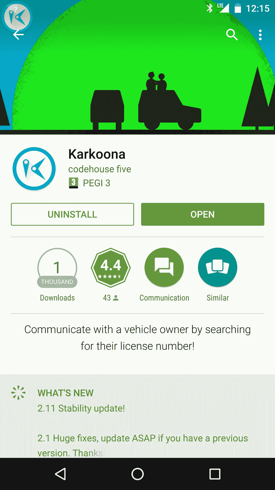

# 一星点评诞生

> 原文：<https://medium.com/hackernoon/a-one-star-review-is-born-bd31073afbdd>

所以你工作了好几天——不！几个月——不！你在说什么？几年。年！你在那个应用上生活了几年，你知道它将改变世界，逆转气候变化，甚至可能与决心摧毁世界的外星飞船接触，并通过在他们的 Windows 95 安装中发送和执行【virus.exe】T2 来摧毁*他们*。

这一天终于到来了。

到目前为止，一切都很顺利:鸟儿在外面叽叽喳喳地叫着，大多数错误都被解决了，Eclipse 没有在几分钟内崩溃，您已经打开了 Google Play 开发人员控制台，准备上传。apk 并启动你的良性世界统治计划。

五分钟后，你就完成了。一个小时后，该应用程序可供大众使用。你和你剩下的三个朋友(请记住，你已经远离了所有人，专注于你的杰作)给这个应用程序五星评级，你紧紧地坐着，等待世界认可你的蒙娜丽莎。

当然，我说的“坐着别动”是指你对 Reddit、脸书、Twitter、Instagram、几个博客和当地媒体的打击，比 90 年代末/21 世纪初灾难电影中的陨石撞击地球还要大。

很快，你就会得到一些下载。我不会深入到如何获得两次以上下载的整个推广方面，因为这不是这里的重点。也许你剩下的三个朋友仍然有他们自己的朋友，他们让他们下载应用程序。也许吧。

关键是，很快你就会开始得到一些评论。在你的标题为“牛肉酱”和副标题为“我一直知道你是特别的”的 10 个初始五星评论之后。爱你的，妈妈。”，你很可能会得到每个 Play Store 开发者一生的克星:无言的一星评论(WOSR 从现在开始)。

WOSR 是小型创业公司/单独的应用程序开发者可能遇到的最令人恼火的事情。这是怎么回事？让我解释一下。在 Play Store 中，开发者只能回复实际包含评论的评级，即。一些文字来配合评级。如果有人给你 1 星评价却什么都没写，你本质上是无能为力的。你不会知道他们的问题是什么，你无法解决它，更糟糕的是，你无法用一句令人满意的“舔鸡巴”和中指表情符号来回应他们的评论。

WOSR 重要吗？你说得太对了，这很重要。当你花了大量的时间来完善应用程序，应用所有你能应用的好东西，到处保存该死的实例状态，优雅地处理旋转(是的，我对保存实例状态有意见。那又怎样？起诉我)你最不需要的就是两个你甚至无法回复的 1 星评论，以开始看到你的应用程序的平均分数直线下降，尤其是在早期。然后有人搜索你的应用程序，看到低于 4 分的分数，决定下载其他东西。

甚至用户对你的应用有没有合法的问题都不重要。他们不厌其烦地回到 Play 商店，搜索你的应用程序，并给它一星评级。他们至少可以写几句话来描述他们的实际问题。根本没有办法处理这样的垃圾，这就是为什么我一直认为谷歌不应该允许 Play Store 上的一星评论实际上不包含一些文字。

我现在正在看我们的应用程序 [Karkoona](https://play.google.com/store/apps/details?id=com.threeeplusplus.karkoona) 。在撰写本文时，它有两个工作报告。是的，我们也有五个以上的一星评价，但这些实际上包含了一些帮助我们快速排除故障和解决令人讨厌的错误的信息(尽管如果人们在我们解决他们的问题时回去修改他们的分数，我会很感激)。问题是，我们总共有 56 个评分/评论。两个 WOSRs 一炮而红。它会建立恶意。简直龌龊。

我知道你要说什么。“让你的应用更好”。“批评有帮助”。“长一对”。“Ia！Ia！克苏鲁·法塔恩！”。我明白了——但是这些都不是这篇文章的主题。是的，批评是有帮助的。是的，如果你发布东西给人们使用，你应该脸皮厚一点。是的，唤醒来自外太空的水下触手怪物是很棒的。

然而,《世界工作报告》没有提供任何东西:它不是批评(因为它没有提供反馈),也绝对不是建设性的。因此，它对你的应用程序的改进没有任何帮助。事实上，*它剥夺了开发者改进应用程序的任何动力。*

破坏性批评是个东西吗？应该是。

> [黑客中午](http://bit.ly/Hackernoon)是黑客如何开始他们的下午。我们是 [@AMI](http://bit.ly/atAMIatAMI) 家庭的一员。我们现在[接受投稿](http://bit.ly/hackernoonsubmission)并乐意[讨论广告&赞助](mailto:partners@amipublications.com)机会。
> 
> 如果你喜欢这个故事，我们推荐你阅读我们的[最新科技故事](http://bit.ly/hackernoonlatestt)和[趋势科技故事](https://hackernoon.com/trending)。直到下一次，不要把世界的现实想当然！

