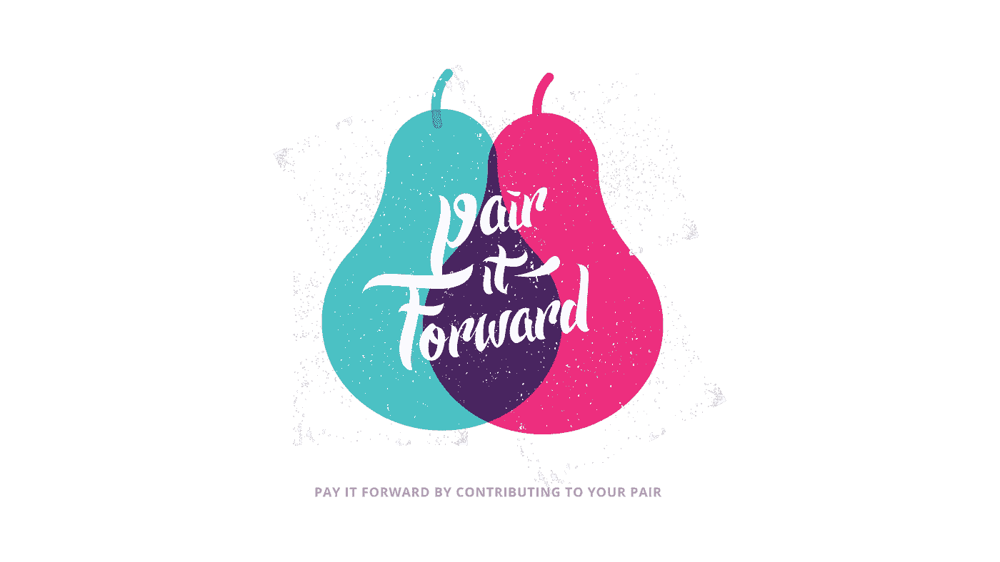

# 一对总比一对好

> 原文：<https://medium.com/hackernoon/a-pair-is-better-than-one-e9d4514add9f>

## 结对编程提供了更好的代码

## 作者:[欧宰尔汗](https://medium.com/u/68cbab1333a5?source=post_page-----e9d4514add9f--------------------------------)

结对编程是一种敏捷开发技术，两名程序员在一台计算机上一起工作，编写同一段代码。我第一次了解结对编程是在大学，但直到我为一家敏捷软件开发公司工作，我才获得整天练习结对是什么感觉的第一手知识。

结对编程一直是一个有争议的敏捷开发实践。我最初对结对有所怀疑，像许多人一样想知道:“结对不会导致开发花费两倍的时间吗？”然而，一旦我有机会在纯结对编程环境中完成一个大型项目，我就被吸引住了。从那以后，我在不同的公司工作过，有些是成对的，有些不是。在我的职业生涯中，这些经历让我看到了配对和非配对环境的积极和消极方面。直到今天，我仍然认为结对是开发软件的最佳方式。

我在去年年底加入了 Connected，因为我渴望回到结对为常态的环境中。我很高兴能在一家核心价值观之一是“向前看”的公司工作。

这些年来，我的朋友、客户和前同事总是问我关于结对编程的类似问题，所以我决定写一篇博客来回答他们。我的目标是解决与实践相关的所有主要问题，并解释为什么 Connected 将配对确立为公司的基本价值观。

# 它是如何工作的？

很简单，结对编程就是两个程序员在一台计算机上一起编写同一段代码。坐在键盘前的开发人员充当编写实际代码的“驾驶员”，而另一名开发人员充当引导代码方向的“导航员”，在代码创建时对其进行审查，并关注实现的更大战略方向。

# 谁使用结对编程？

这种实践已经被不同的团队以非正式的方式使用了几十年，但是最近随着敏捷开发实践的兴起，如极限编程(XP)，它在 90 年代得到了广泛的采用，极限编程使用结对编程作为其过程的基本部分。

许多开发团队已经将结对编程作为一种他们遵循的方法，而一些团队在他们觉得需要一双额外的眼睛时会实践它。在 Connected，我们所有的项目都是由至少一对开发人员在一个结对编程环境中开发的。

# 连接时配对

结对在 Connected 是如此重要，以至于我们把它作为一个实际的公司价值观。结对的好处对 Connected 的团队来说是如此明显，以至于该公司的许多其他非技术人员也建立了结对文化。在 Connected 网站上，你会经常看到设计师之间或者与工程师结对，甚至销售代表与开发人员和设计师结对。我们认为结对已经并将继续成为我们为客户打造高质量产品的原因之一。

# 为什么你应该这样做

以下是你和你的公司应该考虑结对编程的一些主要原因:

## **1。加强合作**

大多数开发人员都有过这样的经历:在一个问题上工作一整天，只有一个同事快速浏览他们的工作，并几乎立即提供一些帮助。结对编程在任何时候都给你第二双眼睛。结对要求程序员大声思考并清楚地表达要解决的问题的细节和复杂性，这通常会导致高度创造性和高效的技术解决方案。许多开发人员告诉我，由于不得不与他们的搭档一起“大声编程”，他们的沟通技巧有了很大的提高。

## **2。高质量解决方案**

由于导航员的唯一工作是关注高层次的策略并寻找优化解决方案的方法，因此由两个人创建的解决方案几乎总是非常高质量的。此外，两位程序员通常会给任务带来不同的体验，因此，对于给定的问题，通常会比单独的程序员产生更广泛的解决方案。

## 3.不断审查的代码质量更高

在结对的环境中，审查代码的过程变得更加有效，因为结对的人已经理解了上下文，而在传统的代码审查中，审查者需要花费额外的时间去理解它。在结对编程中，已经有两对眼睛盯着一段代码，所以并不总是需要正式的代码评审。在 Connected，我们仍然在大多数情况下进行代码审查，以确保所有合并的代码都是最高质量的。

At Connected, our pairs pair with other pairs!

## **4。分享知识**

大多数实践结对编程的开发人员都认同的一个最大的好处是结对可以让你在短时间内学习和吸收大量的知识。

在这样的环境中，初级开发人员通常会从高级开发人员那里学到很多东西。此外，高级开发人员还可以接触到新的视角，并从初级开发人员那里学习解决问题的创新方法。

无论是学习一门新的语言、平台，还是设计技能，在配对环境中分享的知识量都无法在单飞开发者环境中这么短的时间内达到。当一个开发人员的任务是学习一些新的东西时，他们不得不阅读许多教程和文章，而这些可以由成对的开发人员直接教授，效率更高。

没有一个开发人员能够成为所有开发语言、平台或最佳实践的专家；能够在具有不同背景的不同团队成员之间进行配对，允许开发人员从他们的同行那里学到很多东西，并拓宽他们的经验。如果一个开发人员是某个代码库领域的专家，将他们与另一个对该领域知之甚少的开发人员配对，可以非常快速地传播知识，并避免团队内部的知识孤岛。知识共享在 Connected 非常重要，因为我们一直在开发新的平台和前沿技术。

## **5。保持高效**

我们每天都有分心和注意力不集中的时候，尤其是在独自完成一项任务的时候。有时候拖延症开始了，我们需要别人来让我们负责。结对意味着双方都有责任保持专注和高效。这对我们 Connected 来说至关重要。我们努力在上午 9 点到下午 6 点的工作日保持高效和多产。这意味着我们把工作留在办公室，很少加班。

Pair programming gives you a second set of eyes at all times

# 共同关心的问题

大多数人认为让两个开发人员一起工作会增加开发成本和交付时间。简单地看一下这个过程，就意味着成本和时间是两个单独开发人员的两倍。然而，已经有许多研究对这两种方法的成本进行了比较，相对于两个单独的开发人员，实际开销的估计只有 [15%](https://collaboration.csc.ncsu.edu/laurie/Papers/XPSardinia.PDF) 。另一个发现是，生成的代码平均少了大约 [15%](https://collaboration.csc.ncsu.edu/laurie/Papers/XPSardinia.PDF) 的错误。

有经验的开发人员知道，识别 bug 并尽早解决它们比开发过程中任何额外的维护和 bug 修复都要便宜得多。这是结对编程中的主要权衡:一点点额外的总时间可以大大降低潜在的维护成本。在经历了配对和非配对环境之后，我看到了一些在单独开发环境中的噩梦般的维护/错误修复时期，有时加起来会使实际实现成本翻倍。

# 挑战

结对确实伴随着挑战。结对要求个人对与任何人和任何技能水平的人一起工作持开放态度。它需要一定程度的成熟、耐心、一定程度的谦逊，以及一个把自我扔出窗外的环境。

经验丰富的开发人员需要放慢速度，向他们可能不太熟悉问题的搭档解释事情。这些有经验的开发人员，尽管他们可能觉得他们可以走得更快，但确实需要记住结对对团队和项目的整体好处，并抵制成为牛仔或控制狂的冲动。

结对对于天生内向的开发人员来说也是一个挑战，因为他们没有大声编程的天赋。对于这样的人来说，他们可能需要一段时间才能适应这样的环境。

我经常听到许多人说，开发人员在自己的角落里工作得最好，戴着耳机，处于“最佳状态”虽然这在许多组织中是一个常见的环境，但我亲眼看到，当开发人员走出他们孤独的自然倾向并与其他人合作时，他们可以取得伟大的成就。

# 最后的想法

我们喜欢 Connected 的结对编程，我们认为这是在协作敏捷环境中开发软件的最佳方式。如果结对在你当前的工作场所或当前的项目中并不常见，我们鼓励你尝试一下，并让我们知道它是如何为你工作的！

如果你喜欢这篇文章，请点赞并分享给你的网络。
在这里 *注册我们的邮件列表* [*保持联系。感谢阅读！*](http://eepurl.com/bFBVSD)

*欧宰尔是 Connected 的工程经理，他领导、指导和管理着我们才华横溢的工程团队。他热衷于软件工艺和敏捷开发，建立令人惊叹的世界级团队，并不断改进软件实现和交付的方式。他重视与家人和朋友在一起的时间，喜欢电影，尤其是 80 年代的电影——如果你让他开始看《回到未来》,他会给你背诵电影中的每一句台词。*

*互联实验室是一家产品创新和交付公司。我们的使命是制造更好的产品。我们是数字原住民，在过去十年里，我们帮助推出了一些最具颠覆性的产品。*

> [黑客中午](http://bit.ly/Hackernoon)是黑客如何开始他们的下午。我们是 [@AMI](http://bit.ly/atAMIatAMI) 家庭的一员。我们现在[接受投稿](http://bit.ly/hackernoonsubmission)，并乐意[讨论广告&赞助](mailto:partners@amipublications.com)机会。
> 
> 如果你喜欢这个故事，我们推荐你阅读我们的[最新科技故事](http://bit.ly/hackernoonlatestt)和[趋势科技故事](https://hackernoon.com/trending)。直到下一次，不要把世界的现实想当然！

