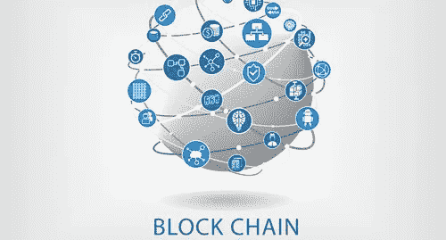

# 区块链技术一瞥——人力资源应用

> 原文：<https://medium.com/hackernoon/a-peek-into-blockchain-technology-human-resources-applications-408a9497ce2e>

# 罗伯特·本特

BAE 系统公司福利战略和管理总监。

在过去的十年里，人力资源技术发生了巨大的变化。人力资源解决方案已经从公司内部程序转移到基于云的平台。组织需要更多的移动应用程序，员工希望应用程序简单易用。

未来几年将充满挑战，因为发展速度加快，公司需要创新，以简化客户体验，满足集成高级数据分析和社交媒体平台的需求。

与此同时，我们面临着整合下一个技术进步的挑战——区块链技术。

目前，许多人力资源技术供应商正在探索区块链技术的集成将为人力资源技术领域带来的进步和好处。

一些可能性包括不再需要人力资源专业人员独立集成和验证各种员工数据，如员工的资格、职位历史、职业经历以及交易数据，如婚姻状况、受抚养人人数、邮寄地址和纳税身份信息以及选举。

区块链技术与人力资源技术的整合将改变公司履行其主流人力资源职能的方式，包括招聘、员工和组织发展以及财务流程，如工资处理和员工福利管理。

***一个区块链技术—招聘实例***

如今，雇主在内部人力资源记录系统上维护员工数据。每个员工都有一个独特的个人资料，包括他们的工资历史，邮寄地址，福利信息，受益人选择，绩效历史以及培训证书，证书和大学学位。内部人力资源系统中维护的数据仅代表基于员工在当前雇主处任职期间的信息。当员工离开当前雇主时，这些数据不会随之转移，新雇主需要重新构建和验证这些信息。鉴于当今的移动工作人员，这些数据复制工作给世界各地的公司带来了越来越大的管理负担。

转移到基于区块链的分散环境可以消除当员工从一个雇主转移到另一个雇主时复制和验证员工基本信息的需要。这些信息可以保存在一个安全的数字化“员工档案”中，员工可以在从一个雇主转到另一个雇主时随身携带。

***接下来是什么***

一旦“员工档案”记录由源创建并存储在区块链上，人力资源系统就可以链接到该记录并以数字方式接受其真实性。从而消除了数据收集、验证和输入的需要。

最近，麻省理工学院(MIT)迈出了将区块链技术应用于其毕业生成绩单的第一步，让毕业生获得可验证、防篡改的电子版毕业证，并与潜在雇主分享。每个文凭被分配一个数字密钥，该密钥被记录在文凭的数字副本中。当雇主想要检查文凭是否合法时，他们可以访问一个门户网站，在那里输入数字密钥并接收毕业生身份的确认。

如你所知，区块链技术的发展正处于非常早期的婴儿阶段。就像互联网的应用多年来呈指数级发展一样，我们可以预计区块链技术的应用将获得牵引力，并将我们带到更简单、更移动的人力资源应用，在这些应用中，用户体验和数据分析的进步可以更快、更容易地实现。

# 在 LinkedIn 上寻找更多最新头条新闻？

[发现更多故事](https://www.linkedin.com/)

*原载于 2017 年 10 月 29 日*[*https://www.linkedin.com*](https://www.linkedin.com/pulse/peek-blockchain-technology-human-resources-robert-bent/)*。*