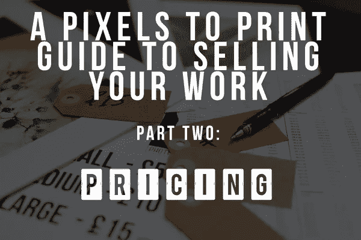

# 像素打印指南第 2 部分:你值得拥有

> 原文：<https://medium.com/hackernoon/a-pixels-to-print-guide-pt-2-you-re-worth-it-1317f752fc1>

欢迎来到我的便捷指南将印刷品转换成英镑第二部分:设定价格。愿它在你的艺术惠勒交易之旅中为你服务！

正如曾经开明的欧莱雅宣称的，你是值得拥有的，因为你值得拥有，所以你需要表现得像它一样。

我不是指在走廊里大摇大摆地走着，吸引陌生人赞赏的目光(尽管我不会阻止)。我的意思是为你提供的东西向人们收取合理的价格。当然，如果不先了解自己的价值，就很难知道自己能提供什么，当谈到总是以成本开始的产品时。

一想到要看这些东西，我甚至能感觉到自己的眼皮越来越沉，所以我决定用方便的要点格式保持简洁。对于每一种产品，游戏的主要目的是计算出每种产品的实际价格。

这是:

*   产品成本——印刷品、装裱、胶带等都固定在产品上，因此很容易得到一个基准数字。
*   启动成本——除了产品成本之外，你还需要考虑启动成本，如展示桌、桌布、价格标签、画架等，但这些都是一次性的，所以从长远来看，这不是一个问题，我会在每个产品的成本上加一点税，这样就可以涵盖你了。
*   运营成本——运营成本包括名片、网站、市场交易员执照(并不总是需要)和你的主要推介费。摊位费是等式中的 buggers，因为无论你一天赚多少，这些都是一样的。如果你的推销费是 30 英镑，而你卖出了 20 件商品，那么你就能获得可观的利润。如果你只卖了两个，那么你的利润率会随着你受伤的自尊一起缩水。最好的方法是估计每天的平均销售额，并分摊每件商品的成本。这不是一门精确的科学，但它有帮助。

一旦你想出了这些，你就会大致知道你需要什么来获得“账面”利润(可能是虚构的)，但这只是一半。

最后一个领域被证明是最困难的，因为它完全是主观的。点燃你的篝火和木吉他，因为它会变得情绪化；你有多看重你？

希望你觉得“你”作为一个总体概念是好的。然而，这里的“你”是指你的时间、你的经历、你的天赋和独特性等等。你的时间值多少钱？所有这些辛苦获得的经验值多少钱？你因为你的淫秽自画像获得的那个奖，值多少钱？只有你能决定，但是令人烦恼的“我只是被喜欢我工作的人奉承”的态度在这里没有位置。

最好的方法是用第三人称来看待你自己，做你自己的“前所未见”的烟鬼，不要被骗。不是得到你能得到的一切，而是得到你应得的。介于 100%和 300%之间的利润是一个很好的利润空间，但开始时，你可能最好从低端开始。不要忘记，你出售的每一件商品都是它自己的一个小广告，是不可低估的晚餐聊天武器。

你当然也可以对别人在做什么好管闲事。如果你的价格大幅下跌，那么你可能需要再次审视你的价格(以及你的自我形象)，彻底结束，你最好有一些非常特别的事情发生。

最重要的是，一旦你开始卖(或不卖)，你很快就会知道你的立场，并能做出相应的调整。如果事情进展缓慢，即使定价正确，也不要失去希望，这可能是正确的地点、错误的时间甚至错误的地点，但这是第三部分的全部内容，请继续关注。

> [黑客中午](http://bit.ly/Hackernoon)是黑客如何开始他们的下午。我们是 [@AMI](http://bit.ly/atAMIatAMI) 家庭的一员。我们现在[接受投稿](http://bit.ly/hackernoonsubmission)，并乐意[讨论广告&赞助](mailto:partners@amipublications.com)机会。
> 
> 如果你喜欢这个故事，我们推荐你阅读我们的[最新科技故事](http://bit.ly/hackernoonlatestt)和[趋势科技故事](https://hackernoon.com/trending)。直到下一次，不要把世界的现实想当然！

