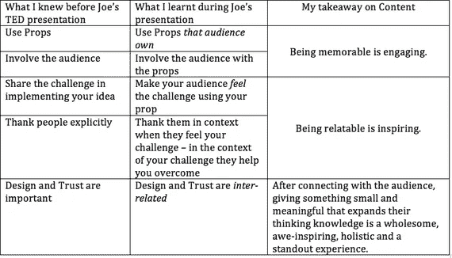

# Airbnb 联合创始人在 TED 演讲中的一段演讲

> 原文：<https://medium.com/hackernoon/a-presentation-hack-from-a-ted-talk-by-airbnb-co-founder-589ab3b59741>

当我恍然大悟的时候，我很高兴。当它与人们联系在一起时，它是双倍的快乐。我在 Joe Gebbia 的 TED 演讲中找到了我的时刻。他是 Airbnb 的联合创始人，Airbnb 是一家使用应用程序将酒店业引入我们家中的公司。

当他走上红色的 TED 地毯走向舞台中央时，我的思绪飞快地在制作一份清单，上面列着将要发生的事情。他可能会努力让它变得有趣、鼓舞人心、引人入胜。他可能会采用几个传统的选择——分享他反映 Airbnb 发展的个人旅程，他可能会分享未来的愿景，并根据 Airbnb 的“独角兽”地位，加入一些令人印象深刻的统计数据。

我听着他的话，笑了。我在核对我自己的心理游戏中创造的项目。然后，他用一个精彩的笑话让我大吃一惊——对我来说是一个精彩的学习时刻。

Joe Gebbia 做了什么让我吃惊的事？

他让观众掏出我们的手机(我是在一个远程直播地点看的)。他催促我们打开手机，我们很多人小心翼翼地照做了。接下来，他让我们把手机给坐在我们左边的人。在我们坚持下去之前，有一个明显的停顿。那一刻，他分享了他的企业所面临的挑战。他的工作是鼓励人们与陌生人分享他们的私人空间——他们的家。在那一刻，他毫不犹豫地感谢了他的忠诚主人，感谢他们向不知名的客人敞开家门——这是 Airbnb 作为一个可识别的名字取得巨大成功的核心。

使用道具是一个古老而明智的建议——一个很好的例子是《内向者的力量》的作者 Susan Cain 在 TED 的演讲。她著名的道具是她带上台的装满书的袋子。她谈到了它，但从未打开过(直到接近尾声)——这产生了一种好奇心，吸引了她的观众。

让你的听众参与进来是另一个经常听到的清晰的建议。

Joe 这个简单的行为的非凡之处在于，他将两者融合在一起，创造了一种倍增效应——每个观众都拥有的道具！

> 他不仅吸引了观众；他让我们感受到了他的商业挑战——分享个人物品意味着什么——就像我们解锁的手机一样私人。

就在那一刻，他给了我一个思考啊哈。他提出了一个类似的问题，“如果在分享你的手机之前，你对左边的人有更多的了解，你会让分享变得更容易吗？多了多少？”在他的生意中，客人分享适量的食物作为对主人的介绍是关键。Airbnb 应用程序中“恰到好处”的文本框设计认为关键信息有助于建立信任。他巧妙地把我带回了他的专业领域——设计。

当他把我认为设计可以建立信任的观点联系起来时，这吸引了我的左脑。我知道设计和信任很重要。啊哈是当我感觉到设计和信任是相互关联的时候。

TED 演讲中的啊哈和一般内容有什么关系？

引人入胜的书面内容比谈话有更多的自由度。作者可以按自己的速度写作，读者可以以自己舒适的速度阅读。与演讲不同，个人道具并不局限于人们随身携带的物品。与视觉道具不同，作者可以描述道具，读者可以根据自己的经历，用自己的声音来想象。其他一切都有关联。

内容营销上有大量的材料。Joe 与观众手机的简单互动体现了内容营销的核心——唤起人们可以联系起来的感情，在上下文中感谢他们，并提供一个整体上让观众兴奋的啊哈。

**总之**

我感谢我在 TEDx 休斯顿的朋友们在休斯顿站的小屋现场举办这次活动。#TED2016。

对你在评论区的想法感兴趣。

【www.huffingtonpost.com】最初发表于**。**

******

> *[黑客中午](http://bit.ly/Hackernoon)是黑客如何开始他们的下午。我们是 AMI 家庭的一员。我们现在[接受投稿](http://bit.ly/hackernoonsubmission)并乐意[讨论广告&赞助](mailto:partners@amipublications.com)机会。*
> 
> *如果你喜欢这个故事，我们推荐你阅读我们的[最新科技故事](http://bit.ly/hackernoonlatestt)和[趋势科技故事](https://hackernoon.com/trending)。直到下一次，不要把世界的现实想当然！*

**