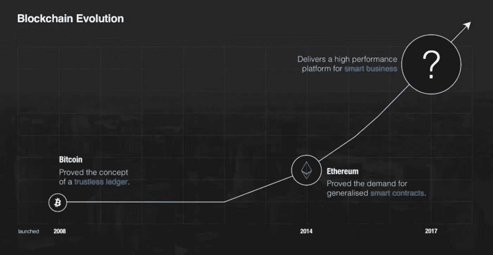
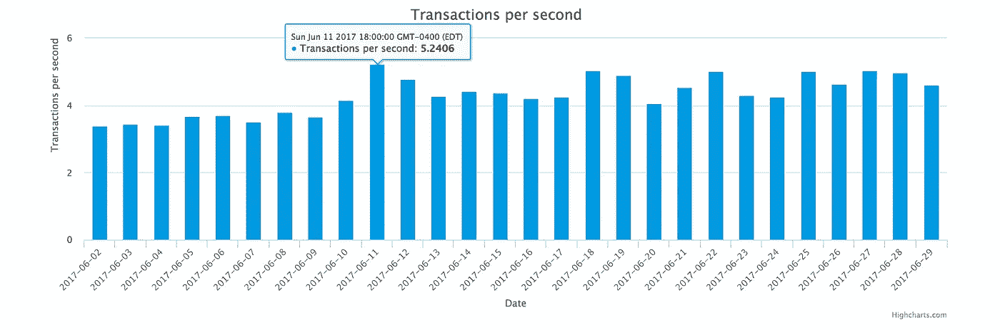
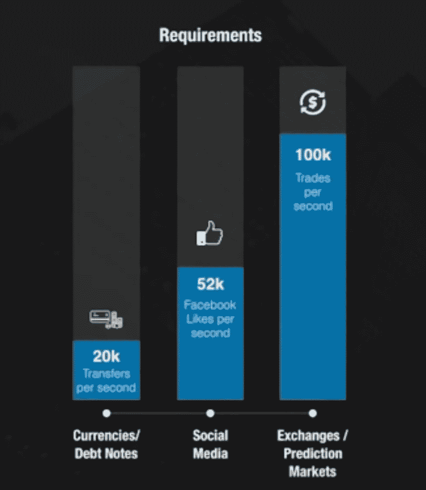
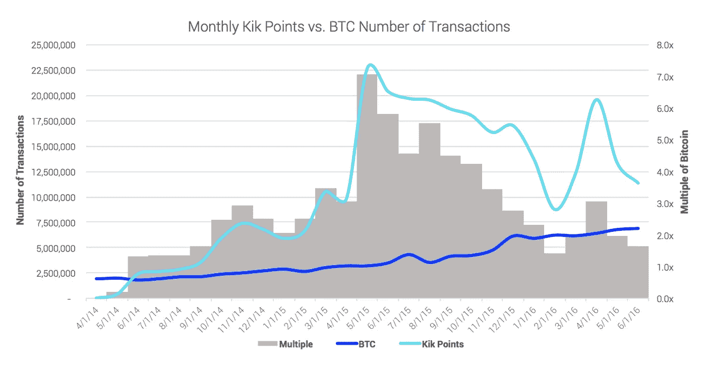

# 以太坊的最新竞争对手 EOS 的初级读本——以及它为什么一夜之间增长了 3.2 倍

> 原文：<https://medium.com/hackernoon/a-primer-on-eos-ethereums-newest-competitor-and-why-it-grew-3-2x-overnight-5211b7207a85>

也许你错过了。我几乎做到了——事实上，尽管今年夏天我小心翼翼地追踪 ICOs，我还是差点让这个沉睡的巨人从我的指缝中溜走。

与我的其他一些帖子不同，我甚至不能告诉你是我的研究帮助我发现了这个发现。相反，当一篇北海巨妖的博客文章进入我的收件箱时，我恰好醒了。

北海巨妖不是我通常交易的地方，但我会非常小心地关注他们的更新。

与许多交易所不同的是，北海巨妖对加入交易所的交易对进行了选择——作为一名曾在一家加密交易所担任主管、必须做出这些决定的人，我知道做出正确选择有多难。但是，北海巨妖总是在包括大多数赢家方面做得很好(尽管我仍然对[甜瓜](https://melonport.com/)持怀疑态度)。因此，当我看到他们增加了一项我从未听说过的资产时，我意识到我遗漏了一些东西。

# 什么是 EOS？

EOS 是经验丰富的[区块链](https://hackernoon.com/tagged/blockchain)企业家丹·拉里默的最新项目。

Dan 是 BitShares、[STEEM](https://coinmarketcap.com/currencies/steem/)(+The[SteemIt platform](https://steemit.com/))和 BitUSD 三个项目的创始人，这三个项目的总市值为 8 . 86 亿美元，他现在是构建 EOS 平台的 block.one 公司的首席技术官。

那么 EOS 到底是什么？用他们自己的话来说，EOS " *是一款引入区块链架构的软件，旨在支持分散应用的垂直和水平扩展。*

# 那是什么意思？

现在，有数百家大公司、银行和政府希望在区块链上构建企业级应用程序，并利用以太网的智能合约技术。

问题是，正如我们在这一季看到的 ico 的崛起，这些技术没有很好地扩展。目标是通过创建一个为企业级采用而设计的系统来改变这种情况，该系统允许大公司构建 DAPPS(分散式应用程序)。

# 比特币和以太坊处理不了企业 DAPPS 吗？

简而言之:没有。

更长的答案是:还没有，目前的基础设施也没有。

2017 年 6 月 11 日，以太坊网络受到流量的冲击，每秒钟产生 5.2 次交易。这似乎是一个巨大的成功！然而，考虑到 6 月 20 日在状态 ICO 期间以太网每秒钟能处理 5.04 笔交易，而且一些用户要等几个小时才能收到以太网发送的信息，事实证明，从整体来看，以太网只能处理很小的交易量。

虽然对于加密货币来说，每秒 5.2 次交易是一个巨大的里程碑，但与某人在区块链上托管企业级解决方案所需的交易数量相比，这是失败的。

在 Dan 在 Consensus 2017 上的 [EOS 演示](https://www.youtube.com/watch?v=MUZWZj1pu94&feature=youtu.be)中，他强调了一些消费者服务的每秒交易数。

在我们能够在区块链运行稳定的金融市场之前，我们必须突破障碍，甚至能够支持社交网络的交易量。

仅脸书一个国家每秒就有 52000 个赞。不是帖子，不是留言， ***只是*** 喜欢。

这意味着，为了让脸书在区块链技术上运行他们系统的一个组件，需要以太坊这样的平台比现在的效率高出 10，000 倍。

# 这不就是一个节点/矿工的问题吗？我们不能用更多的工程师来解决这个问题吗？

网络速度不仅仅是矿工、节点或散列能力的函数。这又回到了区块链运行的基本方式。

过于简化的版本是，在当前的区块链上，信息按照每个块的顺序以连续的方式进行处理，并且没有实现像 [Falcon 网络](http://www.falcon-net.org/)这样的修改结构，直到整个块完成时才开始发送该信息。

即使修改过的实现也有其局限性。以 Kik 即将实施的“ [Kin](http://kin.kik.com) ”为例，尽管是一家拥有大量工程资源的 10 亿美元独角兽初创公司，但 Kik 宣布，Kin 将需要实施“ [*一种混合的链上和链下解决方案*](https://kin.kik.com/papers/Kin_Whitepaper_V1_English.pdf) ”以跟上交易量。

几年前，在 Kin 的早期规划阶段，Kik 推出了一项名为“Kik Points”的实验，允许用户在应用程序中赚取传统货币。他们监控他们看到的交易数量，并将其与比特币区块链进行比较:

在高点时，他们看到的交易数量是比特币网络的 7 倍，而 Kik 在过去 3.5 年里只是继续增长。

# 那么，解决办法是什么呢？

这又把我们带回了 EOS。EOS 的目标是创建一个开发人员友好的操作系统，允许私有和公共区块链在多个内核上并行处理信息，而不是将其限制为一个线程。

EOS 还引入了一些其他概念，使企业客户端更容易访问区块链:

*   为了提高速度，将读取和写入操作分开。
*   在公共和私有区块链之间异步通信的能力。
*   能够管理具有不同权限级别的用户帐户。
*   帐户名而不是长地址。
*   修复 bug 和角色反转的能力需要绝大多数人的一致同意，而不需要硬分叉。

这些特征依赖于被称为“委托利益证明”的基础设施的改变，其中多个“见证节点”被网络提名为代表，这些代表帮助更快地做出某些高层决策，而无需轮询整个网络。

一些加密货币的强硬派认为，这最终会使区块链“不那么分散”，尽管这是事实，但重要的是要认识到，像 VISA 和 IBM 这样在这项技术上花费数亿美元的公司永远不会采用完全公开的区块链。他们正在寻找方法在内部利用区块链技术来降低成本，同时与外部区块链网络进行交互。

# 那么 EOS 是未来吗？

在这一点上很难说。EOS 仅处于发展的初级阶段，其首次发行硬币(ICO)计划持续到 2018 年 7 月 3 日。

如果该团队能够交付 EOS 项目，这应该是自以太坊以来区块链技术的最大飞跃，并且它可能是一个实际上具有所需组件的平台，以导致主流企业大规模采用区块链。

如果该团队能够交付，如果 EOS 提供的功能集将使其最容易获得并最具成本效益地在区块链上进行构建，那么它将面临巨大的风险——然而，创建这样一个系统并不是一件小事，它可能会面临那些深深拥抱传统区块链分类账的去中心化思想的人的巨大阻力。

就我个人而言，鉴于该团队的过往记录，我很乐观，基于 EOS' token 在交易所的快速增长，我不是唯一一个乐观的人。EOS 以 0.68 美元对美元开始交易，目前约为 3.5 美元，使当前流通货币的市值达到 5.6 亿美元。

*   免责声明:本帖中的任何内容都不应被视为金融或投资建议，也不应被视为对上述任何资产、货币或服务的招揽。ico 和加密货币可能代表您所在司法辖区的监管产品，您应该咨询熟悉当地法律的律师。