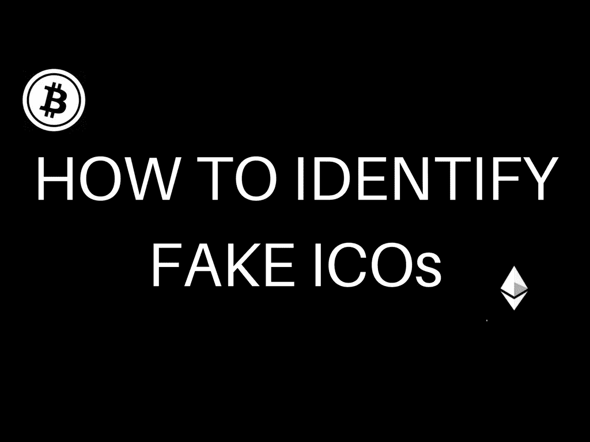

# 如何识别假冒 ico 的初级读本

> 原文：<https://medium.com/hackernoon/a-primer-on-how-to-identify-fake-icos-af5411aa75e4>

## 识别骗子的终极 7 点指南

如果你关注创业公司的新闻已经有一段时间了，你一定听说过随着首次公开募股(又称 ICOs)的推出，风投界掀起了一场风暴。通过 ico，仅在过去的 6 个月里，初创公司就已经能够筹集超过 20 亿美元的资金。

似乎是一个非常大的数字。对吗？在 ICOs 的世界里没有。:P

对于企业家来说，这可能是最容易筹集资金的方式，因为他们克服了所有通常面临的偏见，同时试图寻求其他融资方式，即风险资本和众筹。你可以在这里了解更多关于[的信息。你所需要的只是一个人们喜欢的产品，一份白皮书(概述你的创业路线图的文件)，你就可以在 30 秒内筹集到 2000 万美元。(是的，有可能。)](https://hackernoon.com/wtf-is-an-initial-coin-offering-ico-8b03b18b0bd0)

但是，

> 人类有规避每一个范式规则的倾向。

而 ico 也没什么不同。

如果你密切关注 ICOs 现场，那么你一定见过[帝国卡 ICO](http://empirecard.network/) 。

根据各平台的讨论， [ICO](https://hackernoon.com/tagged/ico) 被很多分析师宣布为假的。但这只是许多即将到来的之一(假的，伙计。)

像我一样，如果你真的倾向于投资 ico，那么你应该留意哪些 ico 是合法的，哪些是假的。

如果你是一个定期投资 ICO 的投资者，或者是一个希望投资任何即将发行的 ICO 的新手，这里有 7 点指南可以帮助你识别假 ICO

## 路标

> *创业公司在基因上是雄心勃勃的。*

但是，一个 6 个月大的初创公司计划在 3 个月内创造 100 万美元的收入，或者在他们华而不实的网站上使用“没有损失，只有利润”、“10，000%的利润率”这样的短语，会怎么样呢？

似乎有点可疑，不是吗？

**正是。**

任何一家计划在 3 个月内拥有 100 万 dau 的初创公司，或者一家 SaaS 的初创公司，在进行计算时假设流失率为零，或者在他们的白皮书中做类似的事情，都很可能是假冒的 ICO。

你需要全面评估他们的目标，以及他们实际计划如何利用分配给他们的资金，因为如果你不这样做，有太多的初创公司会欺骗你。

## 创始人和顾问

每一个假 ICO 都有一个共同点，那就是他们会贴上与项目无关的人的照片。

只有你的研究能救你。现在，去帝国令牌网站，看看他们的会员资料。他们没有提供任何链接，所以你必须将这些名字复制粘贴到谷歌搜索栏中，你会惊讶地发现，这些人实际上并不存在于 Linkedin、Twitter、脸书或 Instagram 上。

这是 ICO 是假的一个主要标志。

为你计划投资的每一个 ICO 做这个搜索，以做出正确和明智的决定。

## 创始人的可信度

让我们假设创始人在社交媒体上非常活跃，对他们的产品直言不讳。但是，如果他们不能做到他们在白皮书中承诺的事情，该怎么办呢？

这就是你进来的地方。显然，没有办法预测一家初创公司的成功，但至少你可以通过检查他们的个人资料、他们与什么样的人有联系、哪些人推荐了他们等等，来验证这些人关于自己的说法是真实的。

如果你真的想从你的投资中赚钱，在做研究的时候，这个因素应该被给予一个重要的权重。

## 该死的代码

大多数即将推出 ico 的初创公司都在 GitHub 上建立了代码库。在投资之前，先检查一下这是否真的是好东西，还是 5000 行代码实际上毫无意义。

如果你不是一个技术人员，请一个技术朋友帮助你解决这个问题。

这一部分对 ico 的评价至关重要。

## 白皮书

评估 ico 的另一部分是他们的剧本，也就是白皮书。

如果你在白皮书中看到的只是华而不实的关键词，那么是时候关闭标签，开始研究投资其他 ICO 了。

## 在线论坛

有一件事你不应该忘记检查是什么人在谈论你感兴趣的 ICO。如果你有任何疑问，你可以在论坛上提出一个开放式的问题，询问人们的意见。

这里的所有讨论将是一个很好的指标，表明 ICO 是一个真正的 ICO。

你可以去[比特币对话](https://www.google.co.in/url?sa=t&rct=j&q=&esrc=s&source=web&cd=1&cad=rja&uact=8&ved=0ahUKEwihtbD78NHWAhXGsI8KHalOBIoQFggnMAA&url=https%3A%2F%2Fbitcointalk.org%2F&usg=AOvVaw3dUt6E1-k88EIlB10O6eKA)或者 [Reddit](https://www.reddit.com/) 了解这些信息。

但是有人会买下假的 BTC 和 Reddit 账号。意识到这一点。:)

## 妥协托管

代管基本上是一种服务或钱包，为客户保存硬币，直到某项交易完成。一旦客户的任务完成，供应商就获得资金。如果工作没有完成，钱会退还给客户。

确保启动只使用顶部托管服务。如果不是，这可以很好地表明 ICO 是一个非真实的 ICO。

最后，我想说的是，这并不是确定 ICO 真实性的完美技术，但您可以检查一些主要的勾选框，以确保对您的投资有一定程度的信心。

无论你保持多高的警惕，在未来的时间里，会有一些人欺骗你，即使是最聪明的人，但是随着市场的成熟，ICO 是欺诈性的可能性会降低，最终达到零价值。

祝你投资好运😄

## 感谢阅读。😄如果你喜欢它，你可以通过鼓掌来表达你的欣赏👏。