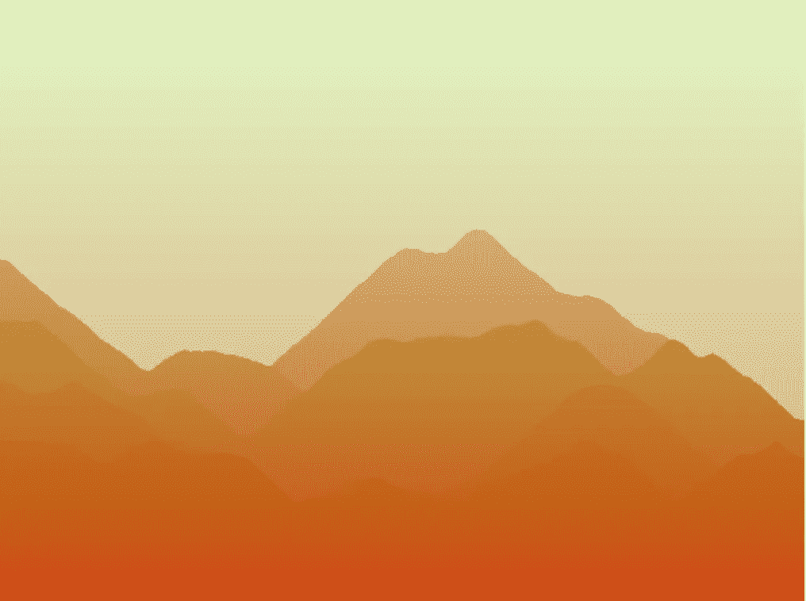
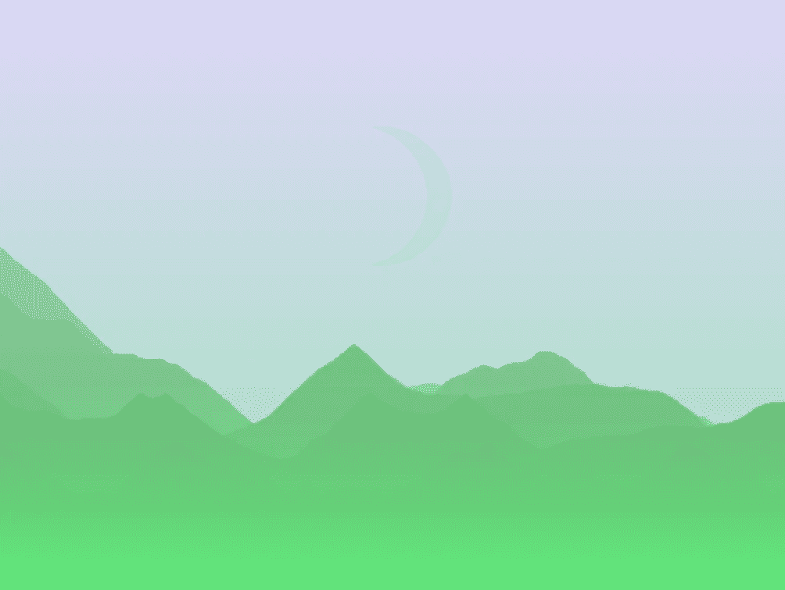
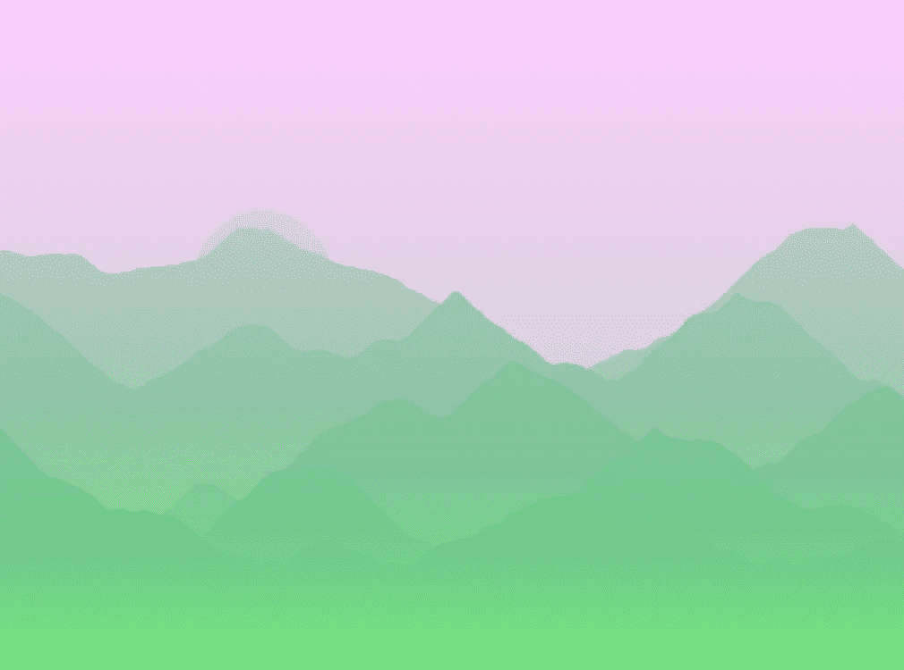
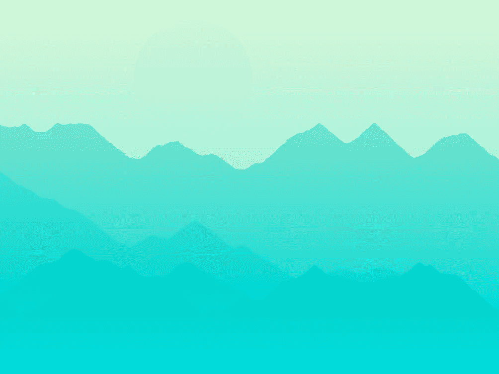
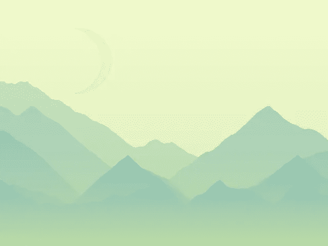

# 程序性景观实验

> 原文：<https://medium.com/hackernoon/a-procedural-landscape-experiment-4efe1826906f>

## 快脏(？)Rust 的 99 LoC 中的程序生成

几天前，我试图创建一个程序化的景观生成器。下面是实际结果:[https://rap2hpoutre.github.io/landscape-site/](https://rap2hpoutre.github.io/landscape-site/)

Sometimes there is a moon or a sun.

我喜欢知道事物是如何运作的；这是我如何建造的。

# 山脉

我不是一个好的程序员，也不知道如何创造山。我在栈交换上找到这个答案:[https://gamedev.stackexchange.com/a/93531/81351](https://gamedev.stackexchange.com/a/93531/81351)

所以，我把这段代码转换成了 Rust，因为我喜欢 Rust 是有原因的。首先，我创建了一个`Mountain`结构。

`points`是每个顶点的“y”位置:在 640x480 的图像上，有 640 个点，从 0(最高)到 480(最低)不等。

然后我创建了两个相关的函数:一个用于初始化点的`new`方法和一个用于渲染山脉每个像素的`draw`方法。

这是最长的部分(它很脏，但不是最丑的！)，觉得只是对我提到的 StackExchange 帖子的改编复制/粘贴。

`new`方法采用一组参数`y_amp`，这是当前山脉的边界(最大高度和最小高度)。这些点用随机的相邻值初始化。

`draw`方法引用了我们正在绘制的图像和两种颜色:山脉的初始颜色(`color`)和雾的颜色(`c_fog`)，这是创建渐变所必需的。对于每个`point`，从图像的顶部到底部画一条渐变“线”，混合雾色和初始色。

我本可以使用常量(640、480 等。)，为变量选择更好的名称并添加注释但是，嘿！没时间了！要快，要脏。

# 随机颜色助手

这个程序的主要任务是生成随机的颜色。我创建了一个小助手来生成颜色:

*我忘了说所有的函数和结构，像*`*Rgb*`*`*RgbImage*`*`*interpolate*`*等等。来源于优秀的、部分记载的和或多或少的厩“***”和“*[*image proc*](https://crates.io/crates/imageproc)*”板条箱(一个板条箱就是一个锈库)。****

**我写的`rgb_rand`函数可以从红色范围、绿色范围、蓝色范围中随机生成一种颜色。从现在起，我将在任何地方使用它。**

# **渐变天空和随机月亮**

**在`rgb_rand`函数的帮助下，我可以初始化一个随机的天空颜色，一个随机的雾颜色，和一个随机的月亮颜色。**

**天空。它可以是浅色、深色或浅蓝色，让我们扔 1D3:**

**雾有完全随机的颜色和行星(月球？孙？谁在乎呢。)颜色是天空和随机颜色的混合:**

**现在让我们画出一切。所以我从天空开始(我们的基础图像缓冲区):**

**然后程序用`gen_weighted_bool`扔硬币后往往会画出星球。这个星球只是一个实心圆。有时，另一个实心圆会用天空的颜色画出来，创造出新月的效果。**

**然后在我们画的所有东西上应用渐变。**

**有了主函数中的所有代码，我们现在有了一个带月亮的渐变天空。**

****

# **渐变天空中柔和的山脉**

**是时候在这个渐变的天空上添加一些山脉了。**

**简而言之，我只是定义了一个山脉随机数`mountain_count`，然后是一个基色`c_mountain`。然后我们对每一条山脉进行迭代，构建并绘制我们在第一步中创建的`Mountain`。**

**深山的颜色随着天空的颜色变得柔和了。记住雾的颜色也和山脉混合在一起，使它们看起来不那么平坦。**

**可能我忘了什么，完整代码在这里:[https://github . com/rap 2 HP outre/landscape/blob/master/src/main . RS](https://github.com/rap2hpoutre/landscape/blob/master/src/main.rs)**

****

# **最后的想法**

**我喜欢程序化的生成，我喜欢阅读关于程序化的东西是如何被创造出来的，即使我大部分时间都不明白。这篇文章是对我编写的代码的描述，显然不是关于 Rust 的指南或教程。结果并不超级性感，但我喜欢创造它。我还建立了一个小网站，每分钟都有新的风景出现。装在相框里，因为我想让它看起来有艺术感！这就是:[https://rap2hpoutre.github.io/landscape-site/](https://rap2hpoutre.github.io/landscape-site/)**

**我的主要灵感来自于[纳瓦拉](https://en.wikipedia.org/wiki/Navarre)山脉。这里有一个比我的好得多的项目列表，也是我搜罗的他们的想法:**

*   **【https://foopod.github.io/sunset/ **
*   **[http://v21.io/softlandscapes/](http://v21.io/softlandscapes/)**
*   **[https://www . Reddit . com/r/procedural generation/comments/606 y33/procedural _ generated _ landscapes/](https://www.reddit.com/r/proceduralgeneration/comments/606y33/procedurally_generated_landscapes/)**
*   **[http://imgur.com/a/3Fmuf](http://imgur.com/a/3Fmuf)**
*   **[https://game dev . stack exchange . com/questions/93511/how-can-I-generate-a-2d-mountain-landscape-procedurally](https://gamedev.stackexchange.com/questions/93511/how-can-i-generate-a-2d-mountain-landscape-procedurally)**

**我很乐意回答问题，听取建议或面对批评。**

**感谢@dorhan_ 的点评！**

****************

> **[黑客中午](http://bit.ly/Hackernoon)是黑客如何开始他们的下午。我们是阿妹家庭的一员。我们现在[接受投稿](http://bit.ly/hackernoonsubmission)并乐意[讨论广告&赞助](mailto:partners@amipublications.com)的机会。**
> 
> **如果你喜欢这个故事，我们推荐你阅读我们的[最新科技故事](http://bit.ly/hackernoonlatestt)和[趋势科技故事](https://hackernoon.com/trending)。直到下一次，不要把世界的现实想当然！**

****