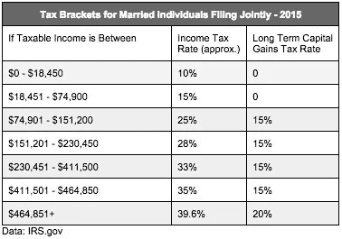

# 一名程序员试图弄清楚资本利得税实际上是如何运作的。

> 原文：<https://medium.com/hackernoon/a-programmer-tries-to-figure-out-how-capital-gains-tax-actually-works-26d3d9f40751>

我总是被告知(在美国)长期资本利得的税率是 15%。当我的注册会计师告诉我有时可能是 0%时，我开始对资本利得税的细节感到好奇。原来我已经跌跌撞撞地走进了税法的迷宫，里面充满了地雷和令人痛苦的数学难题。

我是程序员，不是税务专业的，希望我的幼稚可以原谅。我点击我友好的邻里搜索引擎，搜索资本利得税率，找到了这样的图表:

原来资本利得税只有 15%。如果你赚的不多，实际上是 **0%** 。整洁！如果你赚了很多，那就是 20%。不算太坏。

但是，后来我想，资本利得税的税收等级和所得税的税收等级一样吗？如果你不熟悉美国的税级，它们更像是你收入上升的楼梯。你不会说“哦，我赚了 20，000 美元，所以我的税率是 15%，所以我付了 3，000 美元”。上面的税表实际上说的是，你在 0 美元到 18，450 美元之间赚的钱被征收 10%的税。只有超过 18，451 美元的*部分被征收 15%的税。所以你的税是 18，450 美元* 10%+1，550 美元* 15% = 2，077.50 美元。*

这就是为什么当人们抱怨“哦，天哪，我的加薪将使我进入一个更高的税级，而我实际上赚的钱会少一些！”很奇怪。这有时会发生，因为你的高收入可能会导致失去一些扣除。但这并不是因为你被列入了更高的税级。只有你的加薪被征收更高的税。

**免责声明**:我不是税务专业人士。这些都不是税务建议。这只是我的笨拙的故事，火腿拳头税法。

所得税就是这么运作的。但是，资本利得税级的作用是一样的吗？我的搜索结果都不清楚，所以我继续调查。我找到了一个网上税收计算器，它肯定*看起来*像资本利得一样工作。8 万美元的资本利得应该产生 765 美元的联邦税。不错！

"但是等等……"我想，"如果你既有收入又有资本收益呢？"你是否对每一项分别征税，对每一项进行分类计算，然后将结果相加？或者比这更复杂？

当我把收入和资本收益输入在线计算器时，没有任何意义。于是我拉起 irs.gov，戴上手套，跳进水里。

最终我找到了“[合格股息和资本利得税工作表](https://apps.irs.gov/app/vita/content/globalmedia/capital_gain_tax_worksheet_1040i.pdf)”。你填完附表 D 后再填，算出你的税(扣除前)。至少，我是这么理解的。现在，我的问题是，在确定你的税收时，收入和资本收益是如何相互作用的？我应该可以拿着这个表格，搜索它，找出决定它的简单规则。

对我来说没那么简单。无论我通读那张表格多少次，我都不明白它想做什么。只有两个真实的输入，你的收入和你的收益，但它们被编织成太多的非线性最小函数。

我从来不擅长数学和软件的理论方面，所以我做了我最擅长的事情:我编写了表单:[https://gist . github . com/fpgaminer/d 64 b 7a 933d 1d 551d 9 f 4c 4b 8 c 0869 CD 61](https://gist.github.com/fpgaminer/d64b7a933d1d551d9f4c4b8c0869cd61)

这个小 Python 程序将收入和收益作为输入，并计算最终的税收。可以对其进行探测，以计算出税收工作表中每一行的值，并观察不同收入和收益值的行为。它不是 100%准确；我只需要一个粗略的近似值。如果你的总收入真的很高(income_tax 函数没有对所有的括号进行编码)，那么它肯定是失败的。括号里的数字是*稍微*错了，因为我插入了两个不同纳税年度的数字。够近了！

在我妻子的帮助下，我们不断尝试各种想法和价值观，最终明白了这一切是如何运作的。

看起来你首先计算你的收入的税，只是使用通常的税级规则。然后你计算资本收益税。但是，当你在计算支架时，你会跳过支架中已经被你的收入使用的部分。

例如，假设你有 70，000 美元的收入和 10，000 美元的收益。你可以像平常一样计算你的收入税:18450 * 10%+51550 * 15% = 9577.50 美元

现在，计算你的资本收益，但从“18，451 美元到 74，900 美元”的中间值开始。你的收入“吃掉”了资本利得的第一部分。所以你的资本利得税是:4900 * 0%+5100 * 15% = 765 美元。

把它们加在一起，你得到 10，342.50 美元。你的收入实际上被征收了 13.7%的税，你的收益被征收了 7.7%的税。

这比你用简单的方法计算括号要高得多；完全分开。这将是相同的所得税，但你的收益将在 0%的范围内。所以你只需支付 9577.50 美元。

现在，再一次，这仅仅是这个税单的大概功能。有各种边缘条件。但我认为这是大多数情况下的工作方式。

在 Python 代码中，我还加入了一些数学知识，根据经验计算出边际税率(使用离散导数)。当你输入你的收入和收益时，它不仅会吐出你当前的税收，还会吐出收入的边际税率和收益的边际税率。

什么是边际税率？如果你最终获得了额外的一美元收入，边际税率就是这额外的一美元的税率。很高兴知道这一点，因为通常你的有效税率(你的税收/收入)要低得多，因为你的大部分收入/收益都在较低的等级。了解你的边际税率有助于你计算出新的加薪会被征税多少。

但当我插入 5 万美元的收入和 3 万美元的收益时，我感到惊讶。收入的边际税率是 30%！天哪！难道 5 万美元的收入不应该导致只有 15%的边际税率吗？该计划称，收益的边际税率为 15%，这是有道理的。收入怎么了？

这就是上面的税收工作表中复杂计算的用武之地。还记得你的收入是如何从你的资本收益中蚕食税收等级的吗？你收入每增加一美元，不仅要缴纳 15%的所得税，还会将一美元的资本利得从 0%的税率等级中剔除。因此，1 美元的收入被征收 15%的税，1 美元的资本利得也被纳入 15%的范围。15% + 15% = 30%.真扫兴。

这意味着，如果你处于那样的情况，赚取额外收入是特别痛苦的。一旦你的收入超过 74，900 美元，这种影响就会消失，此后，收入的边际税率降至正常的 25%，收益保持在 15%。

多么古怪的系统！虽然我不能说我会改变它…资本收益已经足够有利了；消除收入对收益征税的影响会使资本收益更具税收优势，这可能不是一件好事。

作为参考，像加利福尼亚这样的州将资本收益视为普通收入，所以你不必做任何奇怪的计算。唷！

> [黑客中午](http://bit.ly/Hackernoon)是黑客如何开始他们的下午。我们是 [@AMI](http://bit.ly/atAMIatAMI) 家庭的一员。我们现在[接受投稿](http://bit.ly/hackernoonsubmission)并乐意[讨论广告&赞助](mailto:partners@amipublications.com)机会。
> 
> 如果你喜欢这个故事，我们推荐你阅读我们的[最新科技故事](http://bit.ly/hackernoonlatestt)和[趋势科技故事](https://hackernoon.com/trending)。直到下一次，不要把世界的现实想当然！

