# 程序员的生活:创造、改进、冷却、重复

> 原文：<https://medium.com/hackernoon/a-programmers-life-create-improve-chill-repeat-9ef214c610f2>

哦，程序员的生活！这是一段平稳的旅程——直到疯狂发生。

对于我们的程序员来说，阿姆斯特丹提供了完美的背景。

“阿姆斯特丹是我真正热爱的生活方式。这给人一种宾至如归的感觉。

“我喜欢阿姆斯特丹，因为这里有很多活动。但你也可以放轻松，”VEON 后端开发人员 Rohit 指出。

既然你已经见过了 Elena 和 Rohit，让我们开始对话——了解更多关于成为阿姆斯特丹 VEON 程序员的信息。

# 你能描述一下你在 VEON 的角色吗？

**艾莲娜**

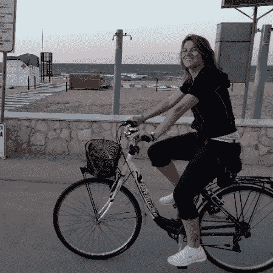

当我刚到 VEON 时，我是前端团队的 scrum master。现在，我是敏捷的负责人，这意味着我负责整个[项目平台](/veon-careers/why-you-should-join-veon-now-86f426dc2c36)的敏捷方法实施。我正在处理 scrum 过程中的所有活动。我们对每个功能都有 scrum masters 和团队，比如 self-care，我一直在努力确保这个过程支持跨团队功能，允许有效的反馈，并且没有瓶颈。

我的工作可能很累人，但也非常令人兴奋，尤其是现在发布会已经准备好了。阿姆斯特丹非常适合平衡工作和生活。如果我需要休息，我可以去像 Javastraat 这样的地方，那里有很多很酷的商店和休闲场所。

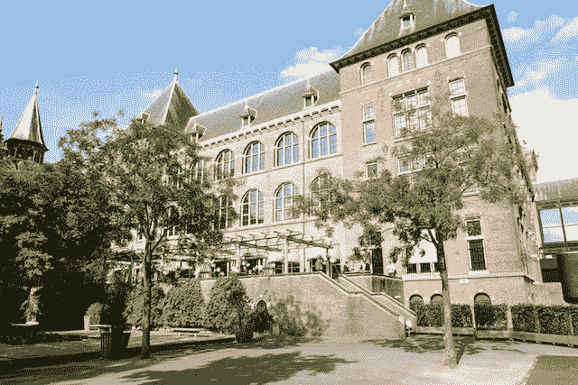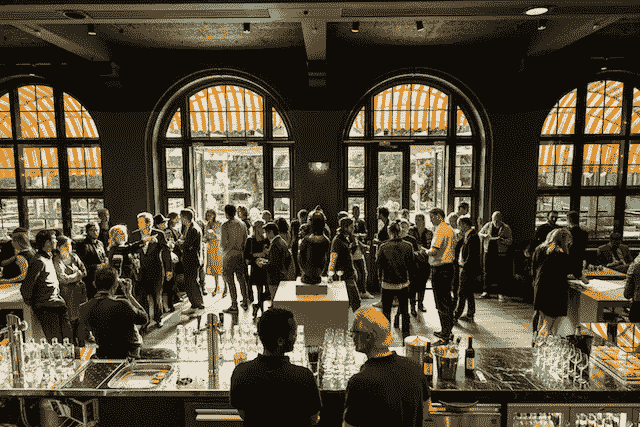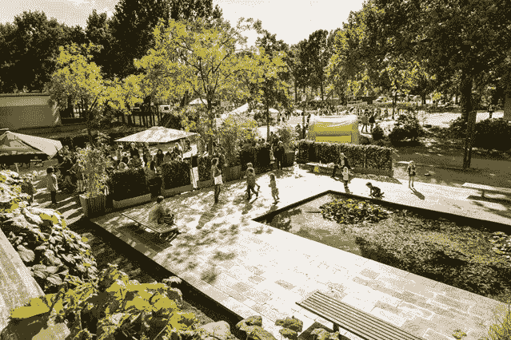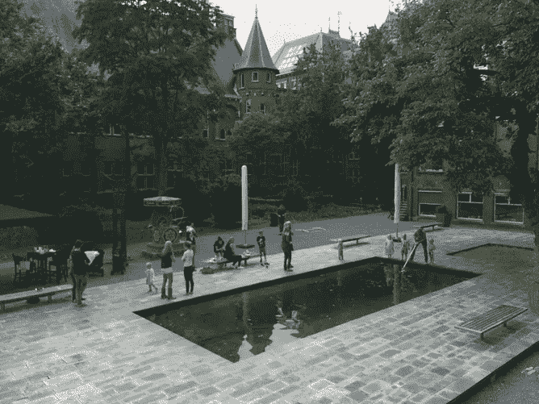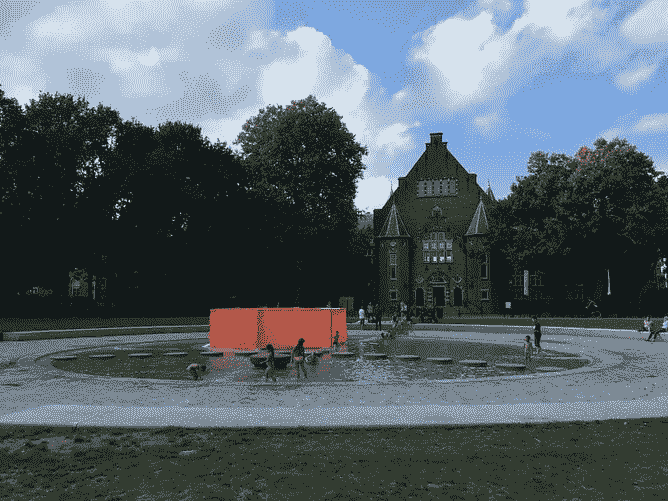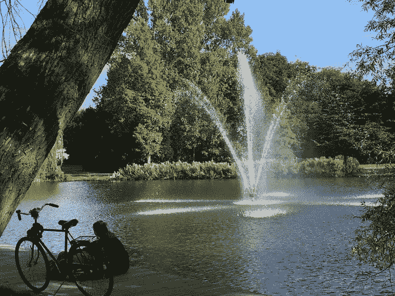

Javastraat area

**Rohit**

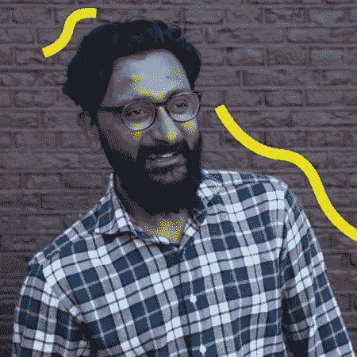

我是身份管理团队(IDM)的后端开发人员。我负责新用户的入职工作，包括身份验证、创建个人资料和获得同意等。我还负责与我们运营国家的用户进行互动。

这项工作很有活力。从来没有沉闷的时刻。[我们正在从零开始建设](/veon-careers/why-you-should-join-veon-now-86f426dc2c36)。这很艰难，但也很刺激。就像 Elena 说的，在阿姆斯特丹做这样的项目很不错。我住在日本，所以当我需要休息的时候，我离美食或饮料只有几步之遥。

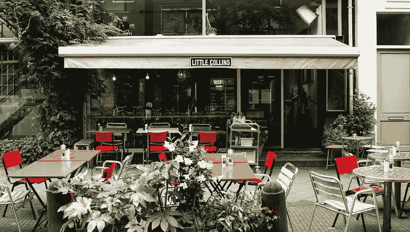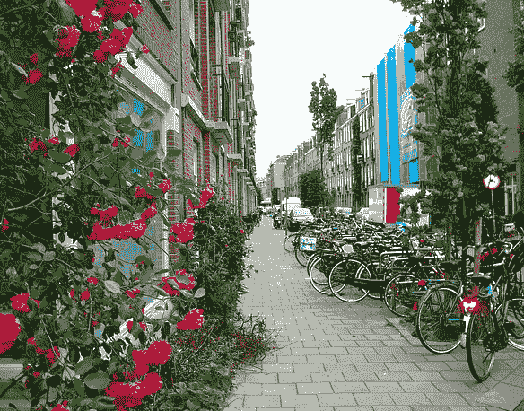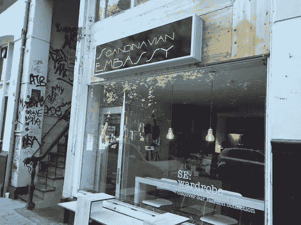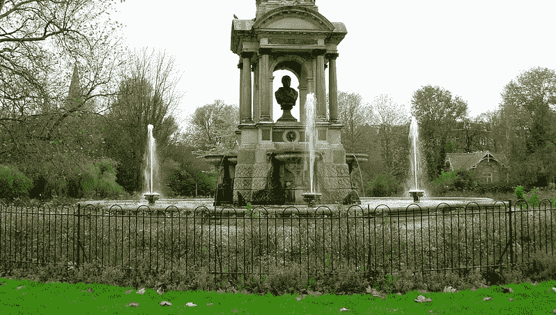

De Pijp

# VEON 最近推出了它的应用程序。这是什么感觉？

**艾琳娜**

累人但有收获！我们为此非常非常努力。前一天晚上工作到很晚后，我在发布会上仍然精力充沛。

很高兴看到这款应用出现。我们可以开始从用户那里获得反馈，并着手清理和改进产品。

**罗希特**

在市场上看到它也只是一种解脱。我认为根据用户的反应来调整应用程序是非常重要的。

# 你能描述一下你的职业道路吗？

**艾莲娜**

我在保加利亚获得了工商管理学士学位，重点是会计。保加利亚的一家 IT 公司找到了我，因为我了解金融方面的知识，我在那里学到了很多技术和软件方面的知识。之后，我在一家为新闻出版物提供移动解决方案的初创公司担任项目经理。后来我来到阿姆斯特丹，在 comScore 公司担任技术项目经理。comScore 被 Adobe 收购，我在 VEON 找了个职位。

 [## 今天就实现梦想

### 今天，我们在 VEON 遇到了两位杰出的人才:UI/UX 工程师 Leo 和大数据团队后端工程师 Oliver

medium.com](/veon-careers/live-the-dream-today-e430204474a6) 

> “有趣的是，[我一开始并没有一个大计划](/veon-careers/live-the-dream-today-e430204474a6)。我偶然来到了软件工程专业。我在阿姆斯特丹结束似乎是合适的。在这个地方，你可以追随自己喜欢的东西，捕捉眼前的瞬间，我在职业生涯中也是这样做的。”
> 
> “对我来说，我的职业道路就是不安定。你可以取得更多成就——在阿姆斯特丹这样的时尚城市，你可以享受时尚的生活。”

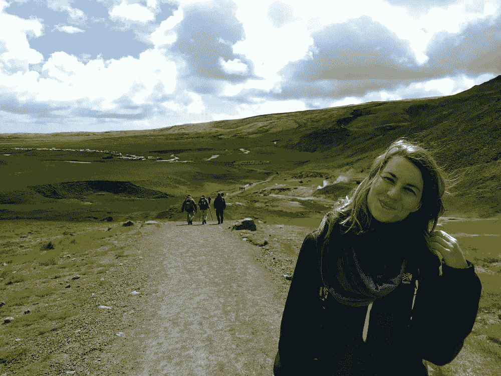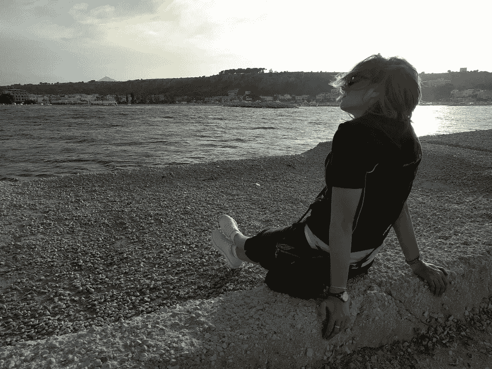

**Rohit**

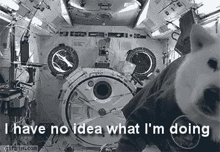

有趣的是，我在印度学的是航空航天工程。但是我在印度找了一份程序员的工作，因为我意识到如果我不造飞机，世界会变得更好！

在那之后，我决定尝试攻读计算机科学博士学位，并成为一名教授。所以，在申请之前，我去了法国雷恩做了一年的研究。在那段时间里，我渴望做更多的编程，所以我决定跟随这个愿望。在来 VEON 之前，我在阿姆斯特丹做过两份编程工作，其中一份是在 Treatwell.com。一路走来，我学会了七种编程语言。我在一次聚会上通过一个联系人找到了 VEON，所以我也是偶然来到这里的。

> “正如你所看到的，我发现编程融入了我的血液——我只是决定追随适合我的东西。如果你[不断进步](/veon-careers/how-to-improve-as-you-go-wisdom-and-espresso-from-a-test-automation-engineer-c4a0c012a6c2)，你会发现更多的机会。你将有能力在阿姆斯特丹选择一份工作，尽情享受生活。”

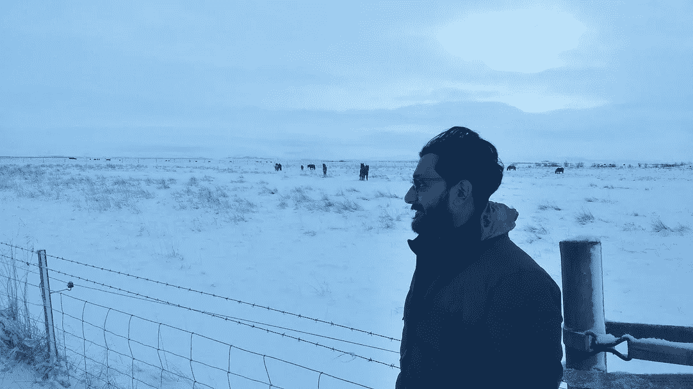

# 你会给今天的程序员同事什么建议？

**艾莲娜**

> “首先，看一份工作是否符合你自己的性格和抱负。第二，明白没有一个理论是稳固的。研究、创造、测试和改进——这就是 scrum 方法。记住那句教老狗新把戏的话。”

> 还有，我面试过很多人。我想要能把分析思维应用于一切的人。在给出你的观点之前，先了解一个问题。

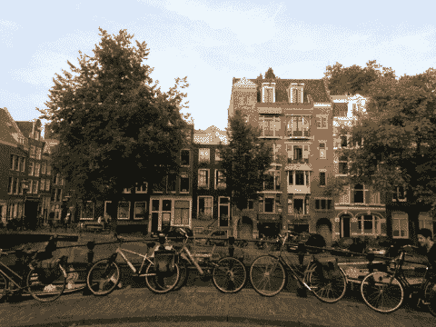

> “此外，要学会适应新的情况。这让我想起了阿姆斯特丹的生活。一切都很冷。然后，自行车高峰期来了，你不得不在疯狂中穿行。”

**Rohit**

> “不要只是学习新的东西。学习如何正确选择工具。这对任何学习编程的人来说都很重要，因为太多的工程师浪费时间和精力与语言斗争，而不是专注于实际问题。”

> “除了构建您知道如何部署的工具集，[还要成为一名终生学习者](https://www.economist.com/news/special-report/21714169-technological-change-demands-stronger-and-more-continuous-connections-between-education)。如果你太犹豫不学，你会变成恐龙。恐龙也死了！”

 [## 终身学习正成为经济发展的当务之急

### 接待区包含一节废弃的地铁车厢，游客在这里等待…

www.economist.com](https://www.economist.com/news/special-report/21714169-technological-change-demands-stronger-and-more-continuous-connections-between-education) 

> 另外，[沟通技巧对程序员来说至关重要](https://www.codingame.com/blog/10-tips-to-improve-your-communication-skills-as-a-software-developer/)。编程是一件非常需要协作的事情。学习一些编程笑话也是很酷的。

# 你有什么爱好？

**艾莲娜**

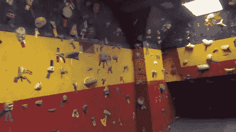

我出去骑自行车，[去抱石](http://amsterdamclimbers.com/page/indoor-climbing-walls-nederland)，这是一个挑战。当我需要独处的时候，我会做瑜伽和跑步。除此之外，我喜欢探索阿姆斯特丹这座城市。

**Rohit**

我有时对事情感到厌烦。所以，我每年都试着培养一个新的爱好。阿姆斯特丹是一个很棒的城市。例如，我开始学摄影，现在正在学萨尔萨舞。我也刚刚开始抱石。

# 尽你所能成为最好的程序员

成为一名程序员是一种生活方式，一种你不必遵循固定路线的生活方式。你可以创造令人敬畏的生活，做令人兴奋的事情，比如花数亿美元从头开始开发一个应用程序，周末去攀岩(另一篇文章中有更多关于攀岩的内容)。

希望 Elena 和 Rohit 的故事告诉你，无论你擅长什么，你都可以过上你想要的生活。如果你愿意，你甚至可以加入阿姆斯特丹的自行车高峰时间(这太有趣了！).

在此找到我们所有的空缺职位:

 [## 在此申请

### 要了解更多有关 VEON 当前所有职位的信息，请点击此处:

medium.com](/veon-careers/apply-here-1c8366d85e87) 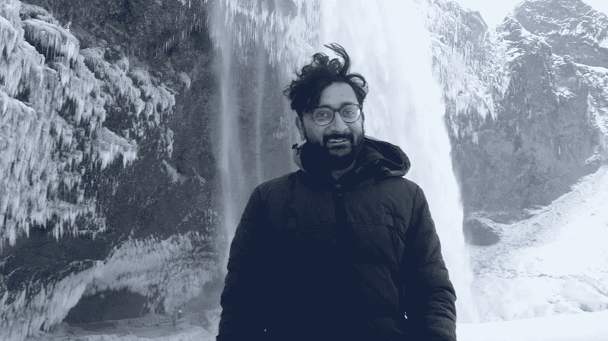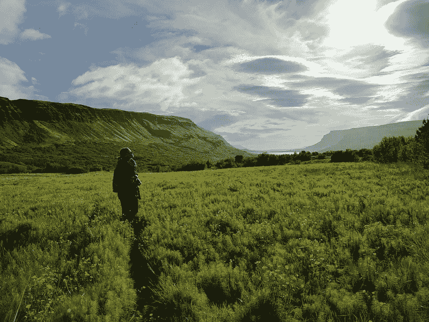