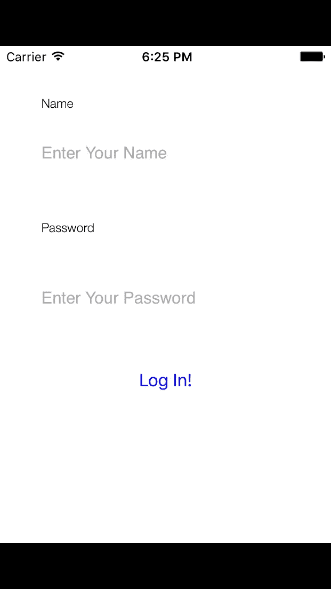

# Haskell 的一个项目:一周应用

> 原文：<https://medium.com/hackernoon/a-project-in-haskell-one-week-apps-6ccb87e6ce10>

最近我们关注了如何学习 Haskell 的一些细节。但是在某一点上，我们真的想要建造东西。下一系列文章将关注 Haskell 的一些更实际的方面。本周，我将介绍我自己的一个 Haskell 项目。我们将首先考察我选择 Haskell 的一些原因。然后我们将看看我是如何组织这个项目的，以及这些选择的利弊。

# 一周应用简介

我创建的程序叫做一周应用程序(名字从来不是我的强项…我愿意接受更好的想法)。它旨在帮助你**快速创建移动原型**。它允许你用一种简单的领域特定语言来指定应用程序的重要元素。截至本文撰写之时，支持的应用程序功能有:

1.  颜色；色彩；色调
2.  字体
3.  警告弹出窗口
4.  程序员错误(想想 NSError)
5.  本地化字符串
6.  查看布局
7.  简单的模型对象。

例如，假设您想从头开始创建一个应用程序，并添加一个简单的登录屏幕。您将从使用`owa new`命令生成 XCode 项目本身开始。首先，您将通过命令行提示符输入一些关于应用程序的信息。然后，它将生成项目以及一些目录，供您放置代码。

```
>> owa new
Creating new OWA project!
What is the name of your app:
>> Blog Example
What is the prefix of your app (3 letters):
>> BEX
What is the author's name:
>> James
What is your company name (optional):
>> Monday Morning Haskell
Your new app "Blog Example" has been created!
```

然后，我们开始指定应用程序的不同元素。为了表示颜色，我们将把下面的代码放在生成的`app`目录下的一个`.colors`文件中。

```
Color labelColor
  Hex 0x000000Color fieldColor
  Hex 0xAAAAAAColor buttonColor
  Blue 255
  Red 0
  Green 0
```

我们还可以为屏幕上的元素指定一些不同的字体:

```
Font labelFont
  FontFamily HelveticaNeue
  Size 12.0
  Styles LightFont fieldFont
  FontFamily Helvetica
  Size 16Font buttonFont
  FontFamily Arial
  Size 24
  Styles Bold
```

现在我们将为字符串添加一些本地化内容:

```
NAME_TITLE = “Name”
“NAME_PLACEHOLDER” = “Enter Your Name”
PASSWORD_TITLE = “Password”
“PASSWORD_PLACEHOLDER” = “Enter Your Password”
SUBMIT_BUTTON_TITLE = “Log In!”
```

最后，我们将指定视图布局本身。我们可以使用上面写的颜色和字体。我们还可以修改不同元素的布局。

```
View loginView
  Type BEXLoginView
  Elements
    Label nameLabel
      Text “NAME_TITLE”
      TextColor labelColor
      Font labelFont
      Layout
        AlignTop 40
        AlignLeft 40
        Height 30
        Width 100
    TextField nameField
      PlaceholderText “NAME_PLACEHOLDER”
      PlaceholderTextColor fieldColor
      PlaceholderFont fieldFont
      Layout
        Below nameLabel 20
        AlignLeft nameLabel
        Height 30
        Width 300
    Label passwordLabel
      Text “PASSWORD_TITLE”
      TextColor labelColor
      Font labelFont
      Layout
        Below nameField 40
        AlignLeft nameLabel
        Height 30
        Width 100
    TextField passwordField
      PlaceholderText “PASSWORD_PLACEHOLDER”
      PlaceholderTextColor fieldColor
      PlaceholderFont fieldFont
      Layout
        Below passwordLabel 40
        AlignLeft nameLabel
        Height 30
        Width 300
    Button submitButton
      Text “SUBMIT_BUTTON_TITLE”
      TextColor buttonColor
      Font buttonFont
      Layout
        Below passwordField 40
        CenterX
        Height 45
        Width 200
```

然后我们将运行`owa gen`命令来生成文件。我们需要手动将它们添加到您的 XCode 项目中(目前)，但它们至少应该出现在正确的文件夹中。最后，我们将在视图控制器中添加几行简单的连接代码:

```
class ViewController: UIViewController { override func loadView() {
    view = BEXLoginView()
  }
...
```

我们可以看看我们的基本观点:



# Haskell 的基本原理

当我第一次提出这个项目的想法时，我知道 Haskell 是一个不错的选择。我们应该注意的一个主要特征是程序的**简单结构。它有**有限的 IO 边界**。我们在开始时读入一堆文件，然后在最后写入一堆文件。在这两者之间，我们有的只是复杂的业务逻辑。我们解析文件内容，并将它们转换成代数数据结构。然后我们根据所选择的语言对它们执行更多的转换(你现在可以使用 Objective C 或者 Swift)。**

几乎没有全局状态可以跟踪(至少现在没有“编译”发生)。没有任何数据库连接。许多让 Haskell 难以处理的东西(IO 内容和全局状态)并没有出现在程序的主体中。

相反，身体由计算组成，这符合哈斯克尔的长处。这些包括字符串处理、抽象地表示数据等等。这些是为这个项目选择 Haskell 的主要标准。当然，有一些库可以处理我前面提到的所有“笨拙”的问题。但是我们甚至不需要为这个项目学习那些。

# 体系结构

现在我将给出一个我如何设计这个程序的基本概述。我决定采用多包方法。我们可以在我的`stack.yaml`文件中看到不同的包:

```
packages:
  - './owa-core'
  - './owa-model'
  - './owa-utils'
  - './owa-parse'
  - './owa-objc'
  - './owa-swift'
```

1.  `model`部分包含移动应用程序对象的数据类型。其他软件包依赖于此。
2.  `parse`包包含所有与解析文件相关的代码和测试。
3.  `objc`包包含了创建目标 C 文件并打印出来的所有代码。它也有这些功能的测试。
4.  `swift`包对 Swift 代码做同样的事情。
5.  `core`包处理诸如 CLI、解释命令、搜索文件等功能。
6.  `utils`包包含多个包需要的某些额外代码。

# 赞成和反对

让我们来看看这种架构的一些优点和缺点。作为替代，我们可以使用单包装结构。所选方法的一个优点是开发周期内的编译时间**更短。总编译时间是有代价的。拥有许多包会导致库之间更多的链接，这需要一些时间。然而，一旦你编译了这个项目一次，每次后续的重新编译将花费更少的时间。在大多数情况下，你只需要重新编译你正在处理的模块。这导致了更快的开发周期。在这种情况下，开发周期比总的编译时间更重要。如果程序需要在部署机器上有规律地从头开始编译，我们可能会做出不同的选择。**

代码的**组织是另一个重要因素。现在，您想在哪里添加解析代码已经很明显了。如果一个特性看起来有问题，你知道去哪里找到一个失败的测试或者添加一个新的测试来重现这个错误。这个系统比我之前遇到的随意的基于版本的测试组织要好得多。**

我想列举的另一个优点是现在**添加另一种语言**来支持是一个更干净的过程。为了支持一种新的语言，对核心模块的改动很少。您将添加另一个包(比如说`owa-android`)并向 Core 添加更多选项。这将使它成为一个简单的存储库，比如说，对于任何想开发 android 版本的人来说。

让我们也考虑一些缺点。这些封装中的许多封装不太可能**彼此完全隔离**使用。例如，`owa-parse`模块牢牢依赖于`owa-model`包。特定于语言的模块不会相互交互。但是它们也不是特别有用，除非你正在使用解析器。

此外，`utils`模块是一个真正的眼中钉。它有几个随机的实用程序，用于几个包的测试代码和打印代码。它似乎建议应该只有一个包用于测试，但我发现这并不令人满意。相反，它建议应该有共同的印刷代码。简单地让这些代码在某些地方重复可能是一个合理的解决方案。这是另一种代码气味。但是如果不同的语言分别进化，那么它们的实用程序代码也可能。

# 摘要

那么我们从这个项目中学到了什么呢？Haskell 非常擅长内部处理。但是具有宽 IO 边界的程序会引起一些麻烦。幸运的是，One Week Apps 有很多内部处理，但是 IO 限制有限。所以哈斯克尔是自然的选择。同时，多包组织在代码组织方面有一些优势。但是，就放置公共代码而言，这也会导致一些令人头疼的问题。

[One Week Apps](https://github.com/jhb563/OneWeekApps) 现已开源，请随时登陆 [Github](https://github.com/jhb563/OneWeekApps) 查看！你喜欢这个想法吗？你认为它会大大提高你写应用程序的速度吗？您应该联系我并查看我们的[问题](https://github.com/jhb563/OneWeekApps/issues)页面！

想投稿但没接触过 Haskell？您很幸运，因为我们有一些很好的资源可供您开始使用！首先，您应该查看我们的[入门清单](https://www.mmhaskell.com/checklist)。它将引导您完成安装 Haskell 的一些基本步骤。它还会向您展示一些极好的资源，帮助您开始编写 Haskell 代码。

如果你有一点经验，但想要更多的实践，你应该下载我们的[递归工作簿](https://www.mmhaskell.com/workbook)。它会教你递归，一个基本的函数范式。它也有一些练习问题让你学习！

[](http://bit.ly/HackernoonFB)[](https://goo.gl/k7XYbx)[](https://goo.gl/4ofytp)

> [黑客中午](http://bit.ly/Hackernoon)是黑客如何开始他们的下午。我们是 [@AMI](http://bit.ly/atAMIatAMI) 家庭的一员。我们现在[接受投稿](http://bit.ly/hackernoonsubmission)并乐意[讨论广告&赞助](mailto:partners@amipublications.com)机会。
> 
> 如果你喜欢这个故事，我们推荐你阅读我们的[最新科技故事](http://bit.ly/hackernoonlatestt)和[趋势科技故事](https://hackernoon.com/trending)。直到下一次，不要把世界的现实想当然！

