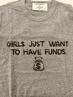
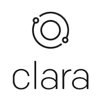
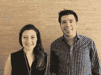
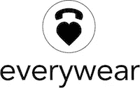

# 四分之一的乐趣。。。从记号处开始重复一遍

> 原文：<https://medium.com/hackernoon/a-quarter-of-fun-ds-44f260cdeda3>

T-Shirts from Bow and Drape

当你玩得开心的时候，时间过得很快！这句话对 XFactor 团队来说绝对正确。我们真不敢相信，自从我们启动 [XFactor Ventures](http://www.xfactor.ventures) 以来，已经过去了 90 天，该公司专注于投资至少有一名女性创始人的早期公司，抓住数十亿美元的市场机会。在过去的 3 个月里，我们审查了近 400 项交易，会见了 100 多家公司，我们对科技生态系统中女性创始人的质量和数量感到震惊。我们还在纽约和旧金山为女性创始人举办了活动，找到了作为团队分享和制定投资决策的方法，最重要的是，完成了我们的前 8 项投资，今天我们很高兴地向大家介绍:

由马兰·尼尔森和迈克尔·阿基连创建的[克拉拉](https://claralabs.com/)是一个安排会议的人性化助理。XFactor 的 [Danielle Morrill](https://www.xfactor.ventures/danielle-morrill) 领导了对该公司的投资，这是 700 万美元首轮融资的一部分，由 Basis Set Ventures 领导，Slack Fund、红杉和首轮资本参与。

[Court Buddy](https://www.courtbuddy.com/) 由克里斯蒂娜·琼斯(Kristina Jones)和小詹姆斯·琼思(Court .)先生创建，是一个法律技术平台，它可以根据消费者与法庭相关的需求和预算，立即为他们匹配经过审查的单独律师，收取统一的费用。XFactor 的 Aubrie Pagano 领导了该基金对该公司的投资，这是由 LDR 风险投资公司领导的 100 万美元种子轮投资的一部分，LSS 基金/Lightspeed，UpHonest Capital，GingerBread Capital/KKR，Equipo Ventures 和几个天使投资人也参与了投资。

Ellen and Paul’s new Startup

由艾伦·千纱和保罗·比格创立，[艾伦和保罗的新创业公司](http://www.ellenandpaulsnewstartup.com)(好吧，这是个工作名称！)是我们在 XFactor Ventures 完成的第一笔投资。该公司正在建立一个云平台，其目标简单而雄心勃勃:让在一个下午内构建一个完整的可扩展应用成为可能。XFactor 的 Erica Brescia 领导了该公司的种子投资。

由 Brandon Holley 创建的 Everywear 是一个 B2B 电子商务软件解决方案，通过了解顾客的偏好、行为和购物模式来个性化顾客的购物体验。XFactor 的[安娜·帕尔默](https://www.xfactor.ventures/team-anna-palmer)领导了对该公司的投资，作为 8 月份结束的 100 万美元种子轮的一部分。

由丽莎·费特曼创立的 [Nomiku](https://www.nomiku.com/) 创造了[工具](https://hackernoon.com/tagged/tools)让每个人都能烹饪出最好的食物。Nomiku 推出了第三代 sous vide 设备，这是市场上最强大的家庭沉浸式循环器，深受全球顶级餐厅和厨师的喜爱。今年，他们推出了一个利用真空烹饪精确度的送餐系统。XFactor 的 Ooshma Garg 和 Erica Brescia 领导了对该公司的投资，这是三星领导的 300 万美元战略轮的一部分。

由 Andrea Barrica 创建的 O.School 是一个无羞耻的社区平台，通过直播和实时聊天来学习性、快乐和身份。有了智能手机，世界上的任何人都可以参加世界上最好的性教育者的现场课程。XFactor 的杰西卡·马赫领导了该公司的种子前投资。

由 Melissa Pancoast 和 Matthieu Tourne 创立的 [The Beans](https://www.thebeans.io/) 自动为美国中产阶级提供财务规划和支持。凭借喜悦、智能设计、心理学和机器智能，该团队正在改变我们对金钱的感受。XFactor 的杰西卡·马(Jessica Mah)和艾丽卡·布雷西亚(Erica Brescia)共同领导了种子前投资。

由 Megan Nunes 和 Tomas Svitek 创建的 [Vinsight](http://www.vinsight.co) 是 YCombinator 年冬季公司，该公司开发了一个人工智能平台，可以更准确地预测农业行业的作物产量，比行业标准高出 4 倍。XFactor 的[丹妮尔·莫里尔](https://www.xfactor.ventures/danielle-morrill)领导了种子融资，该融资于 2017 年 7 月结束。

如你所见，我们的投资团队广泛参与其中。九个 XFactor 合作伙伴中有六个在第一季度进行了投资。同样广泛的是涵盖的市场范围——金融科技、农业科技、时尚科技、法律科技、人工智能、应用开发、未来工作、健康科技和硬件。我们对该基金的多样性、每家公司的创新水平以及每家公司瞄准的市场规模感到非常满意。

再次感谢大家的支持和介绍，感谢我们遇到的所有女性创业者，感谢你们的才华、毅力和勇气。一如既往，如果你有兴趣与我们的[团队](http://www.xfactor.ventures/team)交流，请发邮件至 hello@xfactor.ventures