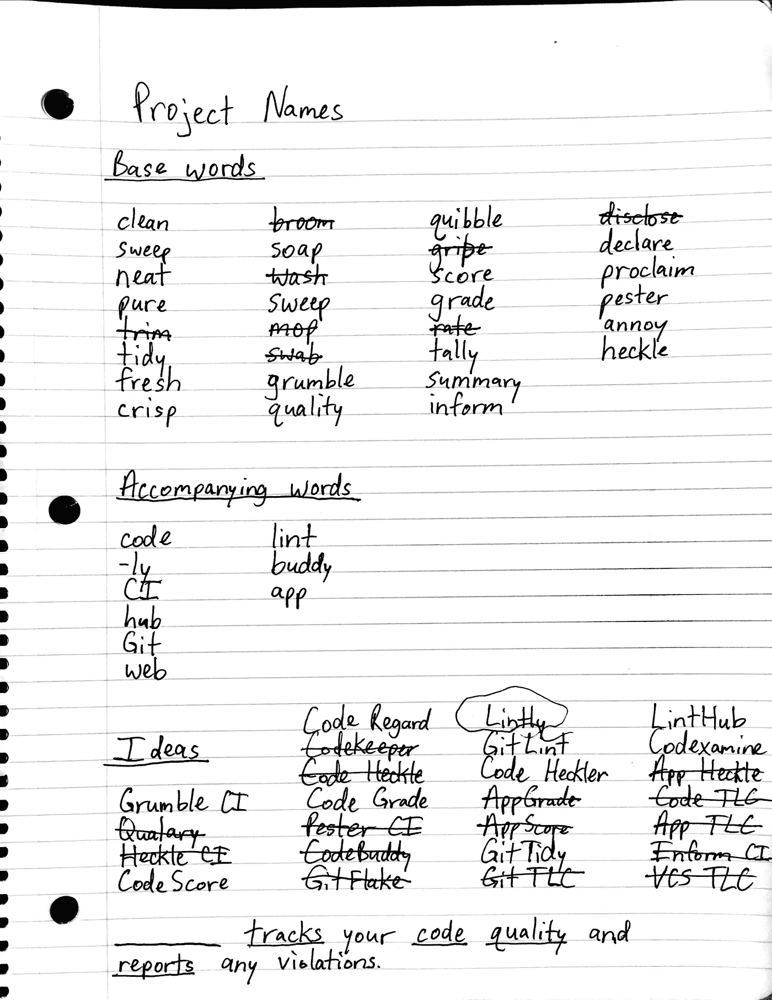

# 为你的下一个应用或创业命名的 7 步快速指南

> 原文：<https://medium.com/hackernoon/a-quick-7-step-guide-for-naming-your-next-app-or-startup-481c260528da>

几周前我向全世界发布了[一个小小的网络应用](https://lintly.com)。这款应用名为 Lintly，它是一款代码质量检查工具，有助于保持代码库干净整洁。

林特利是一个我很喜欢的名字。它很短，是一个你在字典里找不到的词，它唤起了[代码林挺](http://stackoverflow.com/questions/8503559/what-is-linting)，这是它存在的目的。但也许最好的是，我能够得到 lintly.com 的网址！🎉

在这篇文章中，我将回顾我头脑风暴并最终决定应用程序名称的步骤。我相信，遵循这些步骤可以使整个过程更加简单。

**注意:**在本文的其余部分，我将使用“app”这个词来表示一个应用程序、一个创业公司或一个副业项目。

# 你需要什么

首先，让我们收集一些资源来帮助我们命名应用程序。确保以下物品随手可得:

*   一个**笔记本**
*   一支**笔**(用[先导笔 G2](https://www.amazon.com/Pilot-Retractable-Roller-12-Pieces-31002/dp/B00006JNJ8) 不会错)
*   一个**网络浏览器**

# 想名字

下面的 7 个步骤可以帮助你为你的应用取一个名字。应该按顺序执行。

## 第一步:用一句话描述你的应用程序是做什么的

你应该做的第一件事是写一个简短的句子来解释你的应用程序是做什么的。你将使用这个句子来帮助想出组成这个名字的单词。写完你的句子后，在句子中的**关键词**下面画线。这些词与你的应用最相关。

对于林特利，我想到了下面这句话:

> _ _ _ _ _ _ _ _ _ _ _ _ _ 跟踪您的代码质量并报告任何违规行为。

在我的例子中，我用下划线标出了**跟踪**、**代码**、**质量**，以及**报告**。回想起来,“代码”这个词可能太笼统了,“违规”是一个很好的下划线。关键是我们需要一些单词来开始。

## 第二步:列出基本词汇

接下来，是时候想出一些可以纳入 app 名称的**基础词**了。所以，拂去那本尘封已久的辞典，或者前往 thesaurus.com。

要创建基本单词，请在 thesaurus.com 中输入您在步骤 1 中加下划线的每个单词。对于每个单词，阅读同义词列表，并写下你认为可能在名称中使用的同义词。在这一点上，你应该非常自由地使用你所考虑的词语；如果你持观望态度，那就写下来。

以下是我想到的一些基本词汇:

*   干净、清扫、整洁、纯净、整齐、清爽——这些都与**质量**和**清洁度**有关
*   分数、等级、比率、计数、总结——这些都与**报告**和**评分**有关
*   抱怨、声明、宣告、通知——这些都与**跟踪**和**通知**有关

## 第三步:想出伴随的词

许多公司和应用程序的名字都是一个单词。Twitter、Pocket、 [Google](https://hackernoon.com/tagged/google) 和 [Amazon](https://hackernoon.com/tagged/amazon) 立刻浮现在脑海中。其他应用程序将单词或单词的一部分组合成一个新单词。一些例子是网飞(" net" + "flix ")和 Feedly ("feed" +后缀"-ly ")。

对于步骤 3，写下尽可能多的与你的应用相关的**伴随词**。这些词通常是:

*   **后缀。** *-ly* 是常见的，如在 Lintly 或 Feedly 中。 *-hub* 也很常见，比如在 GitHub 或者 ZenHub 中。最后是后缀 *-let* ，如 Quizlet。
*   与你的应用不太相关但不是重点的词。我添加了“git”和“code”作为 Lintly 的伴随词，尽管该应用程序的主要焦点是清洁和质量。

提示:如果你想得到与单词相关的帮助，可以看看你浏览器的书签栏。您可能会访问几个名称中带有后缀的网站。

## 第四步:头脑风暴

步骤 1-3 都是为这一步提供输入。这是经典的头脑风暴步骤。

使用你的应用程序的句子、基本词和伴随词，尽可能多地想出公司名称。组合基本单词和后缀。把基本词和其他基本词结合起来。当你在头脑风暴中想到新词或新主题时，一定要把它们写在基本词或伴随词部分。

在这一步中，你还可以做一些其他的事情来想出一个名字:

*   拼写错误的单词(网飞，Reddit)
*   删除字母(Tumblr、Toggl、Modernizr)
*   创建一个组合包(Pin+Interest =**Pinterest**，Code+Academy =**Codecademy**)
*   添加数字(37 个信号)
*   将你的基本词汇转换成另一种语言，如西班牙语或法语

The notes I took when thinking up a name for Lintly

## 第五步:缩小选择范围

现在是时候缩小头脑风暴时想出的名字范围了。我喜欢用几个标准来轻松去掉一些名字:

1.  **删除立即被认为是不好的名字**。这些名称可能太普通、太长或者没有意义。我也划掉了几个太消极的名字。
2.  **去掉你对**犹豫不决的名字(你应该真正喜欢你最终选择的名字)。
3.  **删除没有. com 域名的域名**。要找出答案，请到[namecheap.com](http://namecheap.com)并在搜索栏中输入每个单词。请记住，一个域还有其他的可能性，比如使用. io 或。请改用. net 域。你也可以在域名前加上一个单词，比如“get”(get bootstrap . com)。
4.  **删除 Twitter 账号不可用的名字**。当然，这只是在 Twitter 对你很重要的情况下。如果是的话，你找不到一个合适的替代名字，那就去掉这个名字。

经过这一切，你应该有几个体面的选择。如果没有，那么回到第 4 步，重新开始头脑风暴。

## 第六步:考虑一下！

没有必要马上做决定——事实上，你应该考虑一下！一开始你可能真的喜欢或讨厌一个名字，但给它一两个晚上可能会改变你的想法。

休息一晚，第二天看看你的清单。你现在想起什么名字了吗？如果是这样，那太好了！现在是时候…

## 第七步:选择一个名字

除了选择其中一个名字之外，别无选择。如果你对名字犹豫不决，那么最好把它划掉，然后回去集思广益。但是如果你真的爱一个名字胜过所有其他的名字，那么恭喜你！你已经为你的应用、你的副业或者你的创业公司取了一个名字。

# 结论

给一个应用命名并不一定很难。诀窍是清理掉你的时间表大约一个小时，专注于手头的任务。如果你头脑风暴的时间足够长，那么将会有大量的输入。以不同的方式组合输入，最终你会有一个你喜欢的名字。

感谢你的阅读，祝你下次演出好运！

*如果你是一个 Python 开发者，想要跟踪他们代码的整洁度，那么看看我的最新项目，*[*Lintly*](https://lintly.com)*。*

*你也可以在 Twitter*[*@ gmcconnaughey*](https://twitter.com/gmcconnaughey)*上跟我联系或者在 GitHub* *上看看我在忙什么。*

> [黑客中午](http://bit.ly/Hackernoon)是黑客如何开始他们的下午。我们是 [@AMI](http://bit.ly/atAMIatAMI) 家庭的一员。我们现在[接受投稿](http://bit.ly/hackernoonsubmission)，并乐意[讨论广告&赞助](mailto:partners@amipublications.com)机会。
> 
> 如果你喜欢这个故事，我们推荐你阅读我们的[最新科技故事](http://bit.ly/hackernoonlatestt)和[趋势科技故事](https://hackernoon.com/trending)。直到下一次，不要把世界的现实想当然！

