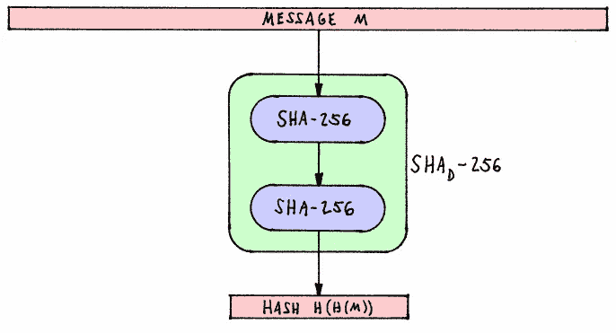
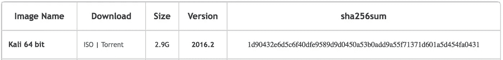

# 快速介绍:哈希

> 原文：<https://medium.com/hackernoon/a-quick-introduction-hashing-c32d1dc91871>



# 这是什么？

[散列](https://hackernoon.com/tagged/hashing)是一种确定两个数据块的等价性的方法。一个[加密](https://hackernoon.com/tagged/cryptographic)哈希函数是一个不可逆的函数，它为任何数据集生成一个唯一的字符串。这些数据的例子可以是文件、字符串、流和任何其他可以用二进制格式表示的项目。

您可能在一些您喜欢的工具、包或库的下载页面上看到过散列字符串。例如，Kali Linux [的每个版本](https://www.kali.org/downloads)都有一个。但这是为什么呢？

这是为了确保他们服务器上的原始文件与您下载的文件相同。例如，Kali ISO 的 [SHA-256](https://en.wikipedia.org/wiki/SHA-2) 散列如下。



如果您下载文件，您应该散列您的本地副本。如果产生的哈希与他们网站上的哈希相同，您可以放心，文件在下载过程中没有被篡改，并且您拥有相同的正确文件。

# 等等……但是你怎么散列东西呢？


问得好。来点技术！顺便说一下，我假设你已经安装了 Python 2。

**1-** 让我们导入我们需要的库。

```
import hashlib as hash
```

**2-** 现在让我们选择我们的哈希算法。*更多关于他们差异的信息，请查看*[](https://security.stackexchange.com/a/30209)**。**

```
*sha = hash.sha256()*
```

*我们基本上设置好了，现在我们继续测试字符串的功能。*

```
*# Insert the string we want to hash
sha.update('Hello World!')
# Print the hexadecimal format of the binary hash we just created
print sha.hexdigest()
""" 
4d3cf15aa67c88742e63918825f3c80f203f2bd59f399c81be4705a095c9fa0e
"""*
```

*太棒了，还有字符串“Hello World！”的阿沙-256 哈希。现在我们将证明相似数据的散列是不同的。*

```
*# Note the missing '!'
sha.update('Hello World')
print sha.hexdigest()
"""
a591a6d40bf420404a011733cfb7b190d62c65bf0bcda32b57b277d9ad9f146e
"""*
```

*完全不一样。*

*既然我们知道我们的函数可以工作，让我们在一个文件上试一下*

```
*# WARNING: Do NOT do this with large files.
# For large files, see the snippet here -> [https://gist.github.com/aunyks/042c2798383f016939c40aa1be4f4aaf](https://gist.github.com/aunyks/042c2798383f016939c40aa1be4f4aaf)
with open('kali.iso', 'rb') as kali_file:
  file_buffer = kali_file.read()
  sha.update(file_buffer)
  print sha.hexdigest()
"""
1d90432e6d5c6f40dfe9589d9d0450a53b0add9a55f71371d601a5d454fa0431
"""*
```

*我们走吧。你现在已经对哈希有了很好的了解。所以，去吧。去吧！保护你的数据的完整性和散列所有的东西！*

**

*另外，请在 [Twitter](https://twitter.com/aunyks) 和 [Github](https://github.com/aunyks) 上关注我。*

*[](http://bit.ly/HackernoonFB)**[](https://goo.gl/k7XYbx)**[](https://goo.gl/4ofytp)*

> *[黑客中午](http://bit.ly/Hackernoon)是黑客如何开始他们的下午。我们是 [@AMI](http://bit.ly/atAMIatAMI) 家庭的一员。我们现在[接受投稿](http://bit.ly/hackernoonsubmission)，并乐意[讨论广告&赞助](mailto:partners@amipublications.com)机会。*
> 
> *如果你喜欢这个故事，我们推荐你阅读我们的[最新科技故事](http://bit.ly/hackernoonlatestt)和[趋势科技故事](https://hackernoon.com/trending)。直到下一次，不要把世界的现实想当然！*

**