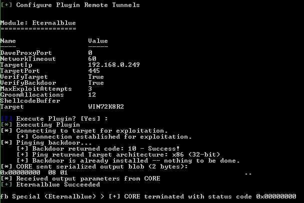
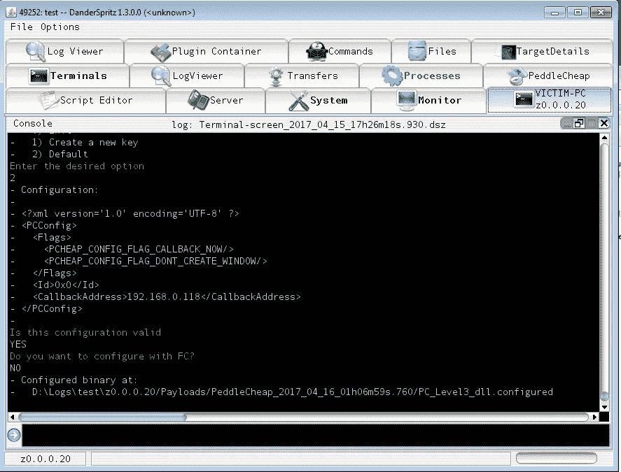
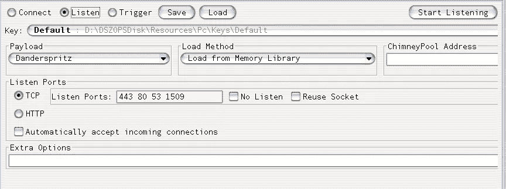
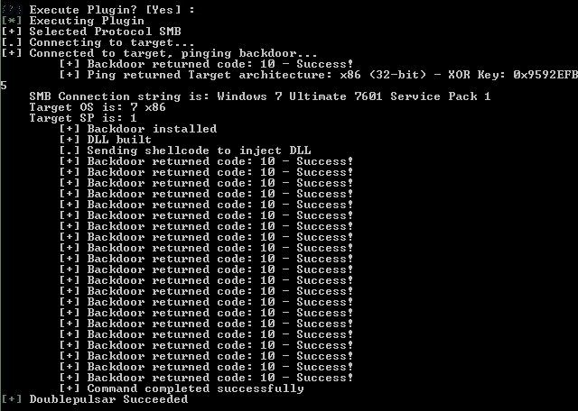
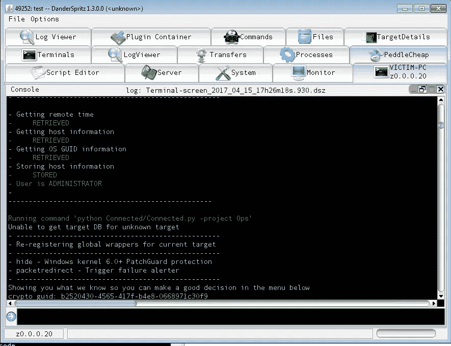
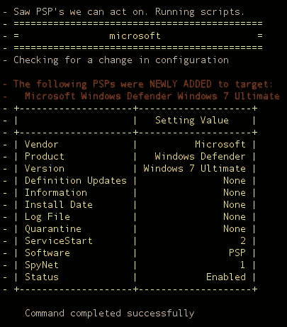
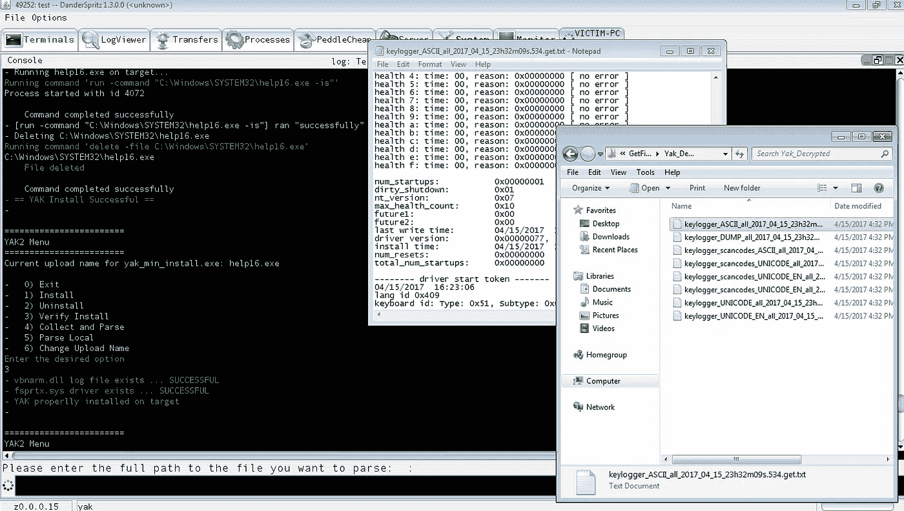
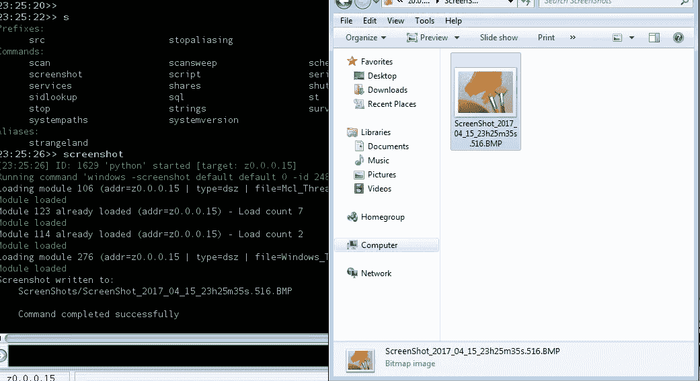

# 快速浏览国家安全局的漏洞& Dander Spiritz 木马

> 原文：<https://medium.com/hackernoon/a-quick-look-at-the-nsa-exploits-dander-spiritz-trojan-1b5428b0ee65>

到那时，你可能已经意识到[影子经纪人](https://medium.com/u/dfdab87f2fd7?source=post_page-----1b5428b0ee65--------------------------------)已经泄露了美国国家安全局的黑客工具。在这篇博文中，我将扮演美国国家安全局特工，向你展示美国国家安全局的黑客行动会是什么样子。我们将利用漏洞接管一台 Windows 7 主机，看看我们可以从那里用 Dander Spritiz 工具做些什么。

如果你想要一个漏洞和工具的列表(需要更新),你可以浏览我的 Github 页面:

 [## misterch0c/影子经纪人

### 影子经纪人-影子经纪人“迷失在翻译”泄漏

github.com](https://github.com/misterch0c/shadowbroker) 

我用两台 Windows 7 机器(32 位，但也应该在 64 位上工作)建立了一个实验室，一台用于攻击者，一台用于受害者。我用的是 leak 上的 FIZZBUNCH 工具，这是一种类似 metasploit 的漏洞利用框架。基本上你用它来运行漏洞。让我们使用永恒之蓝([MS07–10](https://technet.microsoft.com/en-us/library/security/ms07-010.aspx))漏洞来接管受害者的机器

之后我们有几个选择。我们可以在机器上运行外壳代码。在这种情况下，我想尝试一下 Dander Spiritz 工具。它附带了“pc_prep ”,这是另一个为 Dander Spiritz(又名 PEDDLECHEAP)生成有效载荷的实用程序。

complete output [https://gist.github.com/misterch0c/ec4b10cebabd9ba6ec0df8fb21822498](https://gist.github.com/misterch0c/ec4b10cebabd9ba6ec0df8fb21822498)

现在我们有了 dll 有效负载，我们可以在 Dander Spiritz 中启动监听器:

使用 DOUBLEPULSAR 将我们的有效载荷上传到目标:

现在我们有了联系:

[https://gist.github.com/misterch0c/d75509a699ec1f518b6978ab0968af54](https://gist.github.com/misterch0c/d75509a699ec1f518b6978ab0968af54)

就在连接之后，自动“调查”被启动。它基本上收集有关系统的信息，试图破解密码，寻找“PSP”(个人安全产品)等，并将一切保存到日志文件中。

PSP found

连接完成后，你可以在 Dander Spiritz GUI 上选择不同的选项，比如截图、浏览文件、管理进程等。

但是最有趣的部分是“终端”窗口中的插件。

以下是其中的一些:

*   日志编辑:编辑 Windows 事件日志
*   YAK:安装键盘记录器
*   开膛手:从 Skype、Firefox 和 Chrome 窃取信息
*   runassystem:言出必行

这里有一个[所有命令的完整列表](https://gist.github.com/misterch0c/5a002c2daa3f17c84af2a9c2c627740f)

瞧，这只是一个快速的概述。有更多的漏洞和文件可以研究，我相信研究人员将来会发现有趣的东西:

YAK Keylogger in action

Taking a screenshot of the victim’s desktop

> [黑客中午](http://bit.ly/Hackernoon)是黑客如何开始他们的下午。我们是 [@AMI](http://bit.ly/atAMIatAMI) 家庭的一员。我们现在[接受投稿](http://bit.ly/hackernoonsubmission)，并乐意[讨论广告&赞助](mailto:partners@amipublications.com)机会。
> 
> 如果你喜欢这个故事，我们推荐你阅读我们的[最新科技故事](http://bit.ly/hackernoonlatestt)和[趋势科技故事](https://hackernoon.com/trending)。直到下一次，不要把世界的现实想当然！

