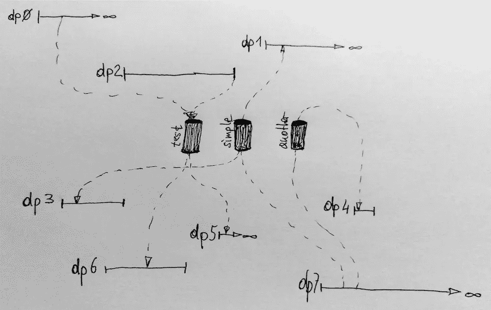

# 关于分布式命名管道的快速说明

> 原文：<https://medium.com/hackernoon/a-quick-note-on-distributed-named-pipes-c0ec9cb1e909>

a bunch of distributed processes communicating via dnpipes

今天我坐下来，终于写下了一个在我脑海中漂浮了很久的想法:分布式命名管道或 T2 dnpipes。

您可以查看 *dnpipes* 规范、Go 中的简单参考[实现](https://hackernoon.com/tagged/implementation)(152 LOC，使用 [Apache Kafka](http://kafka.apache.org/) 和 [DC/OS](https://dcos.io/) )以及 GitHub 上的一些用例讨论:

> [mhausenblas/dnpipes](https://github.com/mhausenblas/dnpipes)

我对你的想法很感兴趣。你也遇到过这种模式吗？这种抽象是有用的还是太简单了？您还看到了哪些其他使用案例？

> [黑客中午](http://bit.ly/Hackernoon)是黑客如何开始他们的下午。我们是阿妹家庭的一员。我们现在[接受投稿](http://bit.ly/hackernoonsubmission)并乐意[讨论广告&赞助](mailto:partners@amipublications.com)的机会。
> 
> 如果你喜欢这个故事，我们推荐你阅读我们的[最新科技故事](http://bit.ly/hackernoonlatestt)和[趋势科技故事](https://hackernoon.com/trending)。直到下一次，不要把世界的现实想当然！

