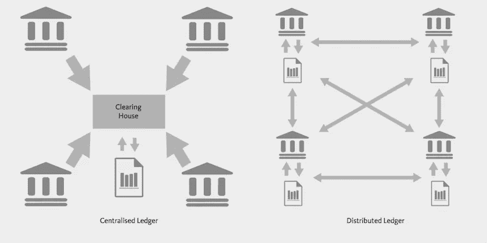
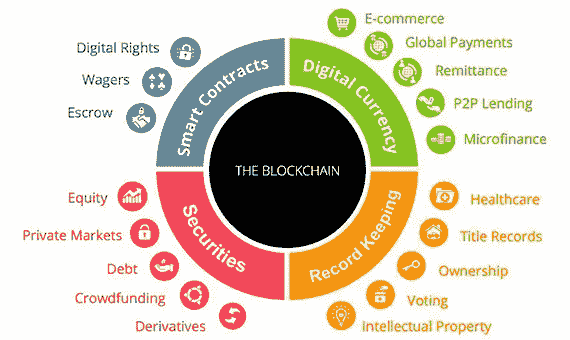
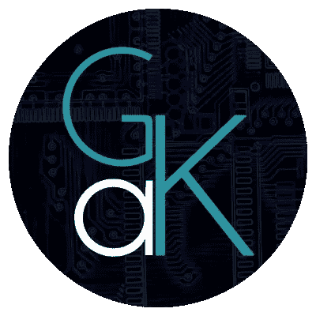

# 对区块链的咆哮

> 原文：<https://medium.com/hackernoon/a-rant-about-blockchains-2235b96d64cf>

如果你参加一个区块链聚会/会议，问 100 个人他们认为区块链是什么，会发生以下情况之一:

1.  80%的人会说他们根本不知道。也许是他们的老板发给他们的，或者他们在《华尔街日报》或《纽约时报》上读到过，他们认为这很酷。他们中的一些人可能对这个主题感兴趣，但是大多数人可能只是在跟踪报道。
2.  20 个会声称他们是专家，他们从 2007 年就开始研究比特币(比特币是在 2008 年底创建的)。当然他们每个人都有不同的定义。

以上为虚构，不要当真。到目前为止，我还没有参加过任何区块链聚会或会议。然而，通过在互联网上看到的不同定义的数量，可以在这些词中找到一些部分真理。当“公共对私人/许可的区块链”的争论升温时，事情变得更加有趣。

**免责声明**:在这篇文章的剩余部分，我们将只提及**公共**区块链。这不是一篇“区块链是如何工作的”的文章，因为网上已经有很多关于这个话题的好文章(也有很多不好的)。

首先，为了描述什么是区块链，我们来定义什么是数据库:

> 一个**数据库**是一个有组织的[数据](https://en.wikipedia.org/wiki/Data_(computing)) — [维基百科](https://en.wikipedia.org/wiki/Database)的集合

我对区块链的定义是:

> 一个**区块链**是一个可以在一组不信任的个体之间共享的数据库，**而不需要一个中心方来维护数据库的状态。**

它也常被称为“分配式**D**L 立辊 **T** 技术”，简称 **DLT** 。

Centralised vs Distributed Ledger, image source: [https://cdn.ripple.com/wp-content/uploads/2015/06/ledgers.png](https://cdn.ripple.com/wp-content/uploads/2015/06/ledgers.png)

# 区块链的属性

*   透明度:任何人都可以检查每一笔交易(关键字: **block explorer** )
*   分散化:维护网络的每个节点都有一份分类帐的副本。这就产生了冗余和容错(即，如果一个节点发生故障或停止工作，其余的节点可以不间断地维持网络)。

去中心化加上适当的机制来确保没有错误的交易被包括在分类账中，产生了数据完整性，也就是大家都在谈论的区块链的所谓的不变性。当一条信息被记录下来，它就被固定下来，不能被重写(例外:**硬分叉，链分裂**)。

将透明度和去中心化结合在一起，你就有了一个 100%正常运行时间的账本，它不会被强大的对手操纵而对自己有利(有争议)，并且在任何时候都是完全可检查的。

区块链的每一个单独的属性听起来可能都不太显著，但是当组合在一起时，新的属性就会出现，这反过来又为新的革命性用例创造了可能性。

在我们进入那个之前，让我们清除一些…

# 常见的误解

## “区块链提供安全”

这是一个棘手的问题，因为安全性经常与机密性混淆。区块链**不**提供保密性(Zcash、Monero、Dash、PIVX 等具有内置隐私功能的区块链除外)。

## “我的生意需要一个区块链！”

肯定不是真的。如果信任和健壮性不成问题，那么区块链就没有什么是常规数据库做不到的。在这种情况下，您最好使用带有适当备份的传统集中式数据库。

## “区块链就是比特币”

比特币是第一种引入我们今天所知的区块链技术的“加密货币”。目前有许多不同的区块链与不同的项目相联系，每一个都在基本的区块链原则之上提供一些独特的东西。

## …以及更多

> 如果信任和健壮性不成问题，那么常规数据库  做不到的事情，区块链也做不到。

# 区块链用例，又名“区块链能做什么”

> “区块链有能力通过消除与信任中央系统相关的政治和经济风险来增强业务流程的可靠性。”维塔利克·布特林

区块链的分权性质使得(除其他外)能够:

*   减少官僚主义和欺诈(数字身份系统)
*   使组织更加民主和透明
*   更好的供应链管理(跟踪产品的质量和位置)
*   保险服务
*   对抗审查

Blockchain use cases, image source: [https://www.bbvaopenmind.com/wp-content/uploads/2017/08/banafa-12-mitos-3.jpg](https://www.bbvaopenmind.com/wp-content/uploads/2017/08/banafa-12-mitos-3.jpg)

对于上述每一个用例，在你最喜欢的搜索引擎上快速搜索，应该会为你提供足够的细节、可能的实现和/或相关的项目。

# “但我可能会错过！我的规模化业务需要区块链，否则我们将失去竞争力！”

我可能会因此被叫出来，但在目前的状态下，区块链无法取代任何规模的基础设施。目前，VISA 每秒可以处理数万笔交易，而比特币和以太坊只能处理十笔交易(不是一个确切的数字，但你明白了)。当然，我们正在积极研究扩展解决方案，但实际上，我们距离区块链产生根本影响并取代当今现代工业巨头所需的扩展还有几年时间。要了解更多细节，我建议您参考 [MultiChain 的](https://www.multichain.com/blog/2015/11/avoiding-pointless-blockchain-project/)博客帖子，虽然该帖子是两年前发布的，但非常相关。

总而言之，我是区块链技术公司的忠实粉丝，我已经围绕以太坊开发了大约 6 个月，现在可以看到它为什么如此具有革命性。一个人不能盲目跟风炒作。总是根据你的需求而不是大众的行为来判断和选择解决方案。

/咆哮

## 无耻的插头

我是一名来自希腊的电子和计算机工程专业的五年级学生。我对信息安全、现代商业中的区块链研究和应用以及自动驾驶汽车感兴趣。了解更多我在 gakonst.com[的工作](https://gakonst.com)

如果你喜欢这篇文章的内容，并想了解我的最新作品，请在 [Medium](/@gakonst) 和 [Twitter](https://twitter.com/gakonst) 上关注我