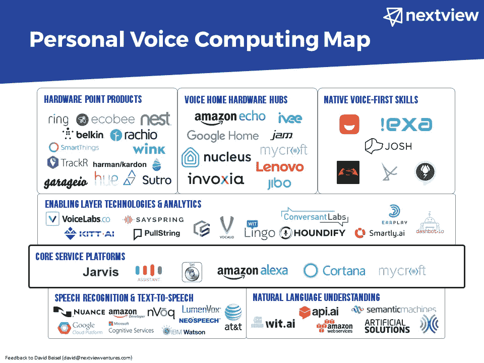

# 公认的开放式选择

> 原文：<https://medium.com/hackernoon/a-recognized-open-alternative-2ef5a1400ec4>

NextView Ventures 的 David Beisel[制作了一张图表](http://genuinevc.com/2017/01/04/personal-voice-computing-map/),展示了构成语音计算市场的所有公司。我不认识大卫(尽管我们下周会联系)，所以看到他将[迈克罗夫特](https://hackernoon.com/tagged/mycroft)定位为硅谷巨头的开源替代物是非常令人兴奋的。

From David Beisel at Nexview VC

如果你仔细观察图表，你会发现 Mycroft 是一个“核心服务平台”,旁边是脸书的 Jarvis、谷歌的助手、苹果的 Siri、亚马逊的 Alexa 和微软的 Cortana。

因为我们有 11 名全职员工，而[谷歌](https://hackernoon.com/tagged/google)有 65000 名员工，和他们被归为一类是令人羞愧的。

迈克罗夫特的团队正在努力工作，不辜负社区的期望。在接下来的几天里，史蒂夫·彭罗德的团队将发布[PiCroft](https://mycroft.ai/mycroft-now-available-raspberry-pi-image/)——一个开发出来可以在 RaspberryPi 3 上运行的 Mycroft 图像。不久之后(在接下来的几周内)，我们将有*。dpkg 和*。rpm 包，这样开发人员可以很容易地在 Linux 桌面上安装 Mycroft。

在这一领域拥有一个开放的替代方案非常重要，我们很自豪能够满足这一需求。

> [黑客中午](http://bit.ly/Hackernoon)是黑客如何开始他们的下午。我们是 [@AMI](http://bit.ly/atAMIatAMI) 家庭的一员。我们现在[接受投稿](http://bit.ly/hackernoonsubmission)并乐意[讨论广告&赞助](mailto:partners@amipublications.com)机会。
> 
> 如果你喜欢这个故事，我们推荐你阅读我们的[最新科技故事](http://bit.ly/hackernoonlatestt)和[趋势科技故事](https://hackernoon.com/trending)。直到下一次，不要把世界的现实想当然！

