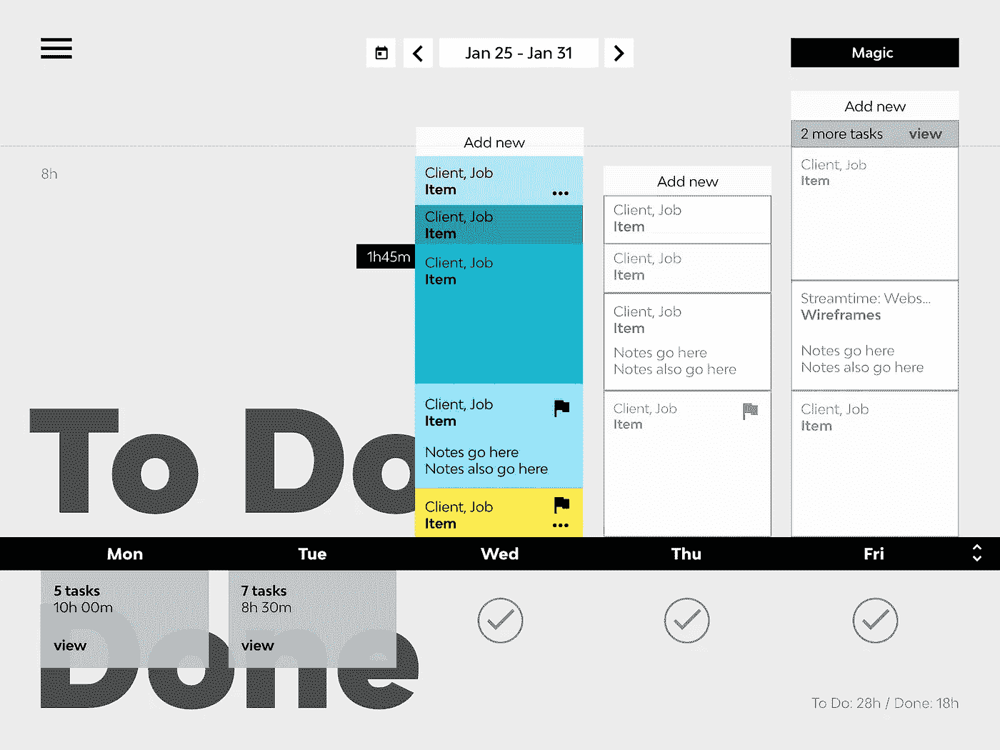
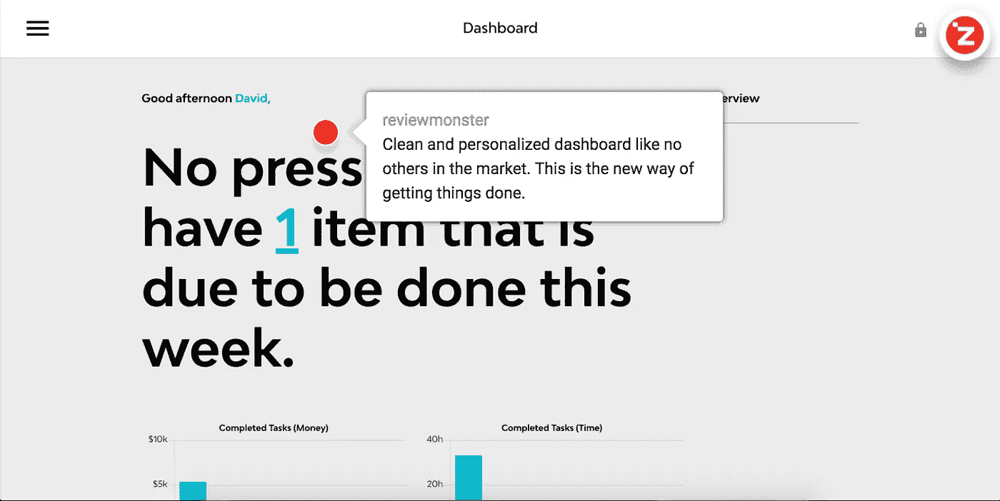
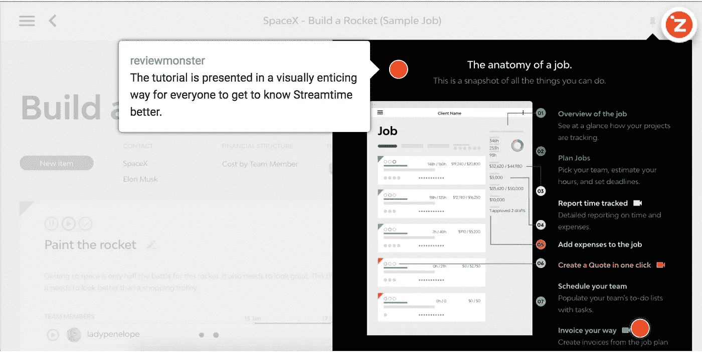
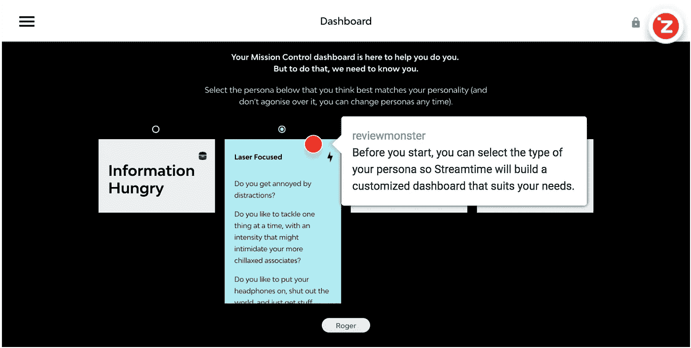
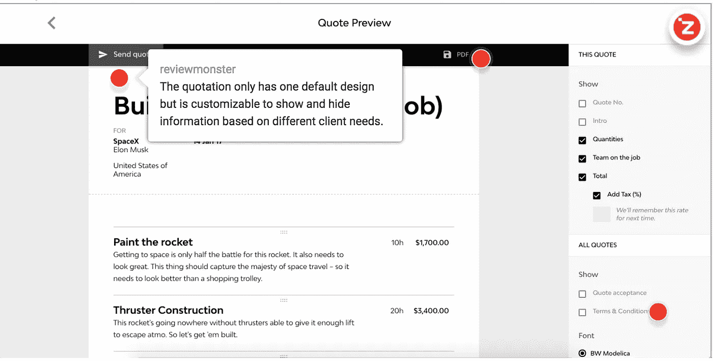
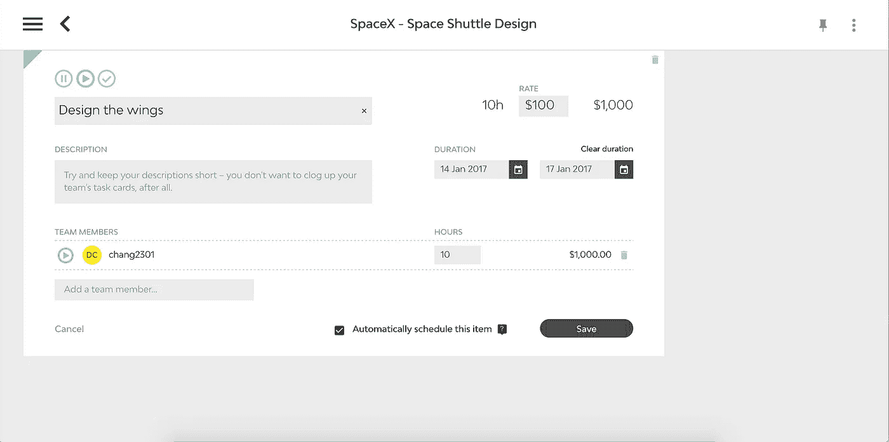
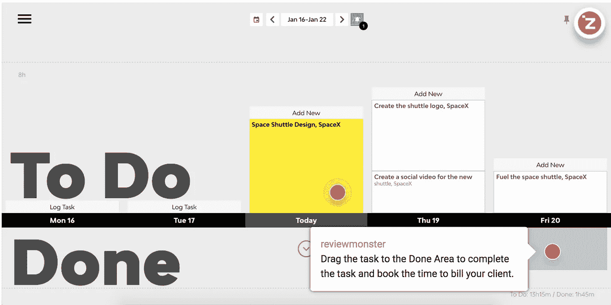
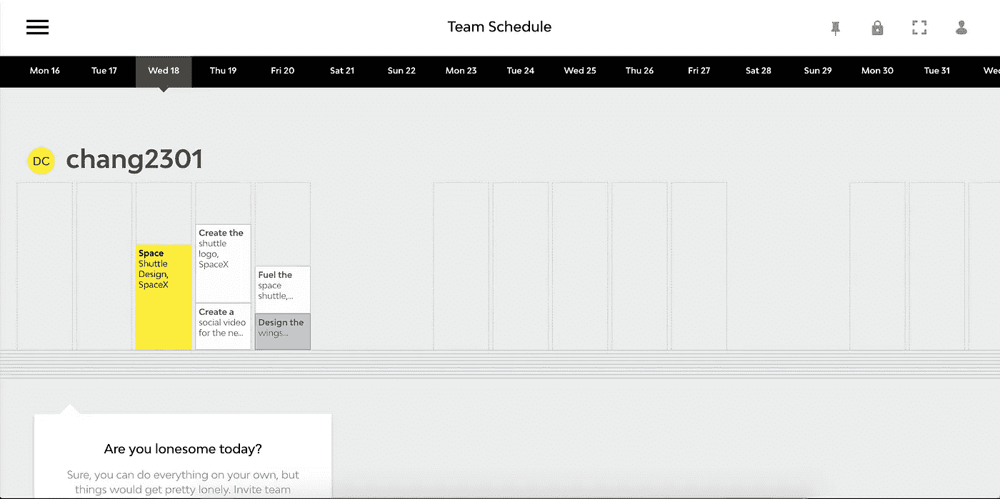

# 直观的项目管理工具 Streamtime 述评

> 原文：<https://medium.com/hackernoon/a-review-of-streamtime-an-intuitive-project-management-tool-14637c8e9af0>

项目[管理](https://hackernoon.com/tagged/management)是一个在我们工作生活中大量出现的关键词。无论你是在一家大型跨国公司，还是一家中型设计工作室，高效地管理项目和控制预算是项目经理需要不断关注的两个关键因素。有了新的[技术](https://hackernoon.com/tagged/technology)，我们有了大量的项目管理工具，从全功能的项目管理怪兽到旨在解决特定领域的简单 zen 产品。由于市场上有如此多的参与者，我们发现 Streamtime 是一个值得谈论的有趣竞争者。

[Streamtime](https://streamtime.net/) 是一个自动化的项目管理软件，管理项目、团队和任务。它是由 Aaron Green 在新西兰创立的，自 2002 年推出以来已经经历了几次产品变更。当涉及到项目管理和工作流程的主题时，易用性、直观的界面和优雅的产品设计提供了一种全新的组织体验。

# 特征

*   根据估计的时间和截止日期自动安排任务
*   快速创建和计划工作:挑选员工，估计工作时间，设定截止日期
*   跟踪项目进度和预算的可视化指标
*   在 e-click 中将项目计划转换为工作报价
*   拖放任务管理器来安排团队时间表中员工之间的待办事项
*   待办事项完成后自动输入时间
*   iOS 和 Android 应用可用

# 定价

Streamtime 的定价模式极其简单:15 美元/用户/月。没有其他定价方案需要你浪费时间去比较和试用。正如他们的产品设计一样，你可以在 Streamtime 上随处发现简约。

# 设计

Streamtime 的界面设计与众不同。它的仪表板干净而没有特色。与当代设计趋势相反，流媒体上的文本是超大的。它干净而简单，但空间排列绝对不是极简设计的最佳典范。然而，在整个 Streamtime 产品中，所有元素都彼此和谐共存。

除了平面设计，Streamtime 的 UX 设计也非常棒。它去掉了许多大多数人从未使用过但已包含在大多数现代项目管理产品中的冗余功能，只关注那些使项目管理简单易用的东西。换句话说，它不与其他竞争对手在功能数量上竞争，而是重新设计流程，使项目管理成为团队中每个人都不难采用的更简单的实践。由于他们努力将 Streamtime 重新设计成更好、更易于使用的项目管理产品，Streamtime 在去年的 AGDA 设计奖中赢得了数字应用的顶峰。(点击查看他们的官方博客文章

# 入门指南

在加入之前，Streamtime 已经为每个用户开发了一个直观的教程流程，以轻松适应其界面和工作流程。

当你第一次登录 Streamtime 时，它会给你一个直观友好的示例项目，你可以开始玩。培训过程不会花费你太多时间来理解 Streamtime 的工作方式，这表明他们关心客户，并希望推广重新设计的 Streamtime 工作流程，让你体验其中的精华。问候页面还包括其核心功能的基本教程，您可以探索和学习。大多数教程都附有视频剪辑，您可以通过更简单的方式观看和学习。

因为 Streamtime 重新设计了它的工作流程，而且它的一般用例不同于普通的项目管理工具，所以教程对于第一次使用 Streamtime 的用户来说是至关重要的，以便他们了解 stream time 是什么，以及它可以为他们提供什么来改变他们的工作流程并提高生产力。Streamtime 在其问候教程中做了大量的工作来解释和展示这种差异，因此每个初学者都可以学习 Streamtime，而不会被他们从未遇到过的数百个用术语编写的功能吓跑。由于设置您的 Streamtime 工作空间以开始您的第一个项目非常容易，您的团队成员采用 Streamtime 的学习曲线会很低，采用时间也会很短。

# 工作流程

作为一名项目经理或设计师，你很可能希望你的工作流程/管理方面尽可能没有麻烦，这样你就可以专注于最重要的任务:把工作做得更好，并开始赚钱！

在传统的工作流程中，当有一个项目请求时，您会与您的客户在几次会议中讨论项目范围和细节。然后，您将向他们发送一封跟进电子邮件，提供项目计划、需要完成的项目列表和报价。Streamtime 已经在一个直观和清晰定义的管道中实现了这个工作流，以便项目经理与他们的团队成员和客户一起工作。首先，您需要在 Streamtime 中创建一个有预算的新作业。然后你需要决定是按团队成员的时薪还是固定价格向你的客户收费。设置好一切后，您可以开始为项目计划列出任务，分配不同的团队成员，估计时间，并为每项任务设置期限。项目和任务都有预算选项，这允许您设置和跟踪每个任务的成本，并保持一切在控制之下。

创建项目和任务后，您可以将项目计划转换成漂亮的报价供客户审阅。您可以直接将报价发送给客户或下载 PDF 文件。幸运的是，如果你的客户同意你的建议，项目启动了，Streamtime 为你提供了清晰的视觉指标来跟踪你的团队的进展，让你知道你的项目是否按时或按预算进行。

# 待办事项

Streamtime 是一款视觉上重点突出的产品，所以他们的待办事项列表一定是一些不同寻常、引人注目的东西？肯定！

Streamtime 有一个创新的待办事项列表:一个拖放式工作日日历视图，由大文本和彩色框丰富。日期线上方是**待办事项区**。任务可以手动添加，也可以根据项目中的估计时间和截止日期自动安排。今天的待办事项是按优先级从下到上着色的，你可以像在 Photoshop 中调整形状一样增加或减少每个任务框的大小，如果你想调整任务的预计时间。

另一方面，日期线下方是**完成区域**。完成任务后，您可以将任务从 todo 区域拖放到 done 区域。当任务完成时，Streamtime 会自动将您在任务上花费的时间记录到项目中，这样您就不需要浪费时间填写单独的时间表。

视觉日历是一种神奇的方式，可以在时间表上规划出每天和每周的任务，并帮助你组织好时间和预算。视图功能允许对作业的现实目标进行管理，而不仅仅是计划而不执行。

至于团队管理，Streamtime 创建了一个拖放团队时间表，让您在一个清晰的视图中看到每个成员的任务。您可以查看您的团队日程并评估产出能力。要管理团队的时间和资源，您可以在成员之间拖放任务以重新分配任务，以及编辑每个任务的新期限。通过可视化方式查看所有成员的日程安排，可以实现更好的工作分配和时间跟踪，从而提高效率和项目管理。

# 综合

Streamtime 与新西兰的会计平台 Xero 整合。只需几个简单的步骤，您就可以将项目计划转化为发票，并向客户开出账单。

Streamtime 重新引入了一种更好的方法来管理工作块，而不是最终可能浪费我们时间的小片段。如果你所在的中小型创意公司一直在寻找一种有效的方式来规划工作、管理进度、团队和任务，并通过分析来发现机会，Streamtime 是一个很好的选择。你可以在这里开始 14 天的试用[。](https://streamtime.net/)

> [黑客中午](http://bit.ly/Hackernoon)是黑客如何开始他们的下午。我们是 [@AMI](http://bit.ly/atAMIatAMI) 家庭的一员。我们现在[接受投稿](http://bit.ly/hackernoonsubmission)并乐意[讨论广告&赞助](mailto:partners@amipublications.com)机会。
> 
> 如果你喜欢这个故事，我们推荐你阅读我们的[最新科技故事](http://bit.ly/hackernoonlatestt)和[趋势科技故事](https://hackernoon.com/trending)。直到下一次，不要把世界的现实想当然！

