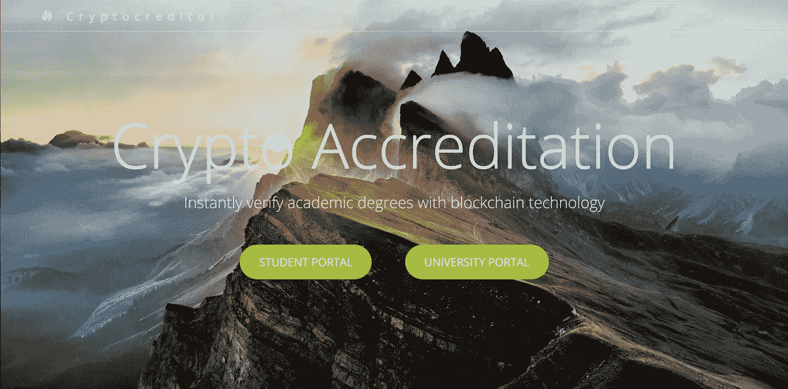
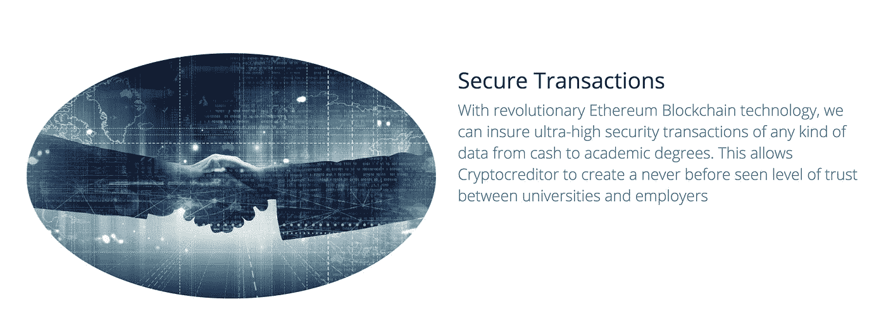
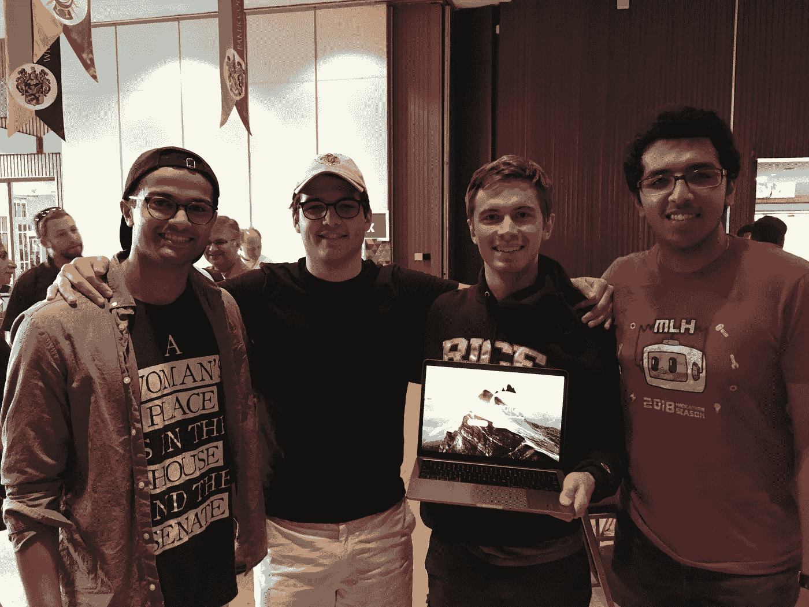

# 使用以太坊进行学术验证的革命性方法

> 原文：<https://medium.com/hackernoon/a-revolutionary-approach-to-academic-validation-using-ethereum-99a8818fc7cf>

*cryptocredential 是 Kunal Shah、Jack Duryea、Shashank Mahesh 和 Yorke Rhodes IV 的一个*[*HackRice*](http://hack.rice.edu/)*2017 项目。通过* [*【区块链】*](https://hackernoon.com/tagged/blockchain) [*技术*](https://hackernoon.com/tagged/technology) *提供了一种快速安全的程度验证解决方案。在我们的*[*github*](https://github.com/Jdduryea/HackRice2017)*上查看源代码。*

莱斯大学和全国各地大学的学生目前正在申请实习和全职职位。就业申请过程中的一个关键步骤是让雇主相信学历证书的有效性。

# 问题是

现有的验证学位完整性的解决方案速度慢、成本高且效率低。问题在于全国各地的学术记录是如何存储和检索的。

大学很少自己分发或核实成绩单。相反，他们将这一职责外包给国家信息交换机构。这减轻了大学在个案基础上管理记录的成本，但创建了一个负责回答所有学术验证查询的中央机构。

由此产生的系统需要中间人进行多余的交易，并在学生、雇主和大学之间创造了一个低效的媒介。

# 我们的解决方案

我们在以太坊网络上构建了一个分散的应用程序，允许对学术证书进行安全和即时的验证。

我们的解决方案使用区块链作为学术证书的分类账。底层技术是一种分布式点对点记录保存解决方案，它围绕学术证书建立了一个信任系统。

# 它是如何工作的

有两个门户:大学门户和学生门户。

通过**大学门户**，用户被要求验证自己是被认证的大学。通过身份验证后，他们将被授予编辑与其名称空间相关联的凭据的权限。当他们的更改被提交时，一个事务被写入以太网，用新的记录更新分类帐。

通过**学生门户** l，用户必须证明自己是经认证的学术机构的注册学生。然后，他们可以指定一个名称空间(如大学名称)来查询他们的凭据。然后，学生们可以准确地指定他们希望将哪份学历证书正式发送到雇主的地址或电子邮件中。该系统限制了教育工作者和学生对通用学术记录保存区块链的直接访问，同时提供了无缝的门户，通过该门户向感兴趣的第三方验证证书。

存储在区块链中的凭证还可以扩展到大学学位之外，以存储和验证高中文凭、标准化考试成绩、专业认证等。

# 为什么更好

以太坊网络和底层的区块链技术提供了分布在众多节点上的单一真理源。这种分布使系统免受单个节点的攻击或故障。它不仅简化了学位认证的中间环节，还抵制了欺骗性的访问和认证。

国家票据交换所声称每年可以为全国 3600 所大学节省 7 . 5 亿美元。我们的解决方案自动化了他们的验证模型，提高了安全性和速度。因此，我们可以说我们对区块链技术的应用有可能破坏一个价值 7 . 5 亿美元的过程。

这种由证书提供者(大学)和证书寻求者(雇主)构成的信任模型可以非常容易地扩展，从而为证书持有者(学生)构建数字证书组合。区块链实现了这种信任模式。

# 更多应用

以太坊网络和底层区块链技术的应用远远超出了学术验证的范围。该技术为任何类型的交易带来了前所未有的安全性和可定制的业务逻辑。我们的应用程序可以定制为金融交易、技能认证、数字身份、对象所有权等等的记录保存平台。

Pictured from left: Kunal Shah, Yorke Rhodes IV, Jack Duryea, and Shashank Mahesh.

# 行动呼吁

我们正在莱斯大学发起一个区块链俱乐部！

## 我们的目标是:

*   进一步了解区块链技术
*   探索它的用例。
*   邀请演讲嘉宾展示他们对区块链理工大学的使用和体验。
*   通过构建更分散的应用程序来实现我们的学习。

如果你想参与其中，请在 ks45@rice.edu*给我写封短信*！