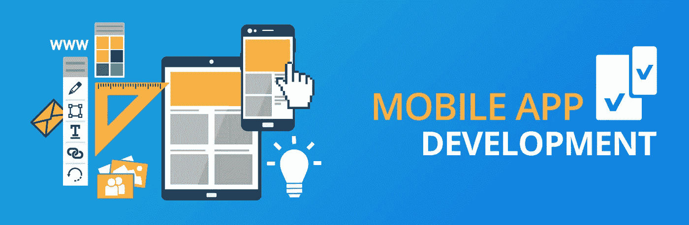
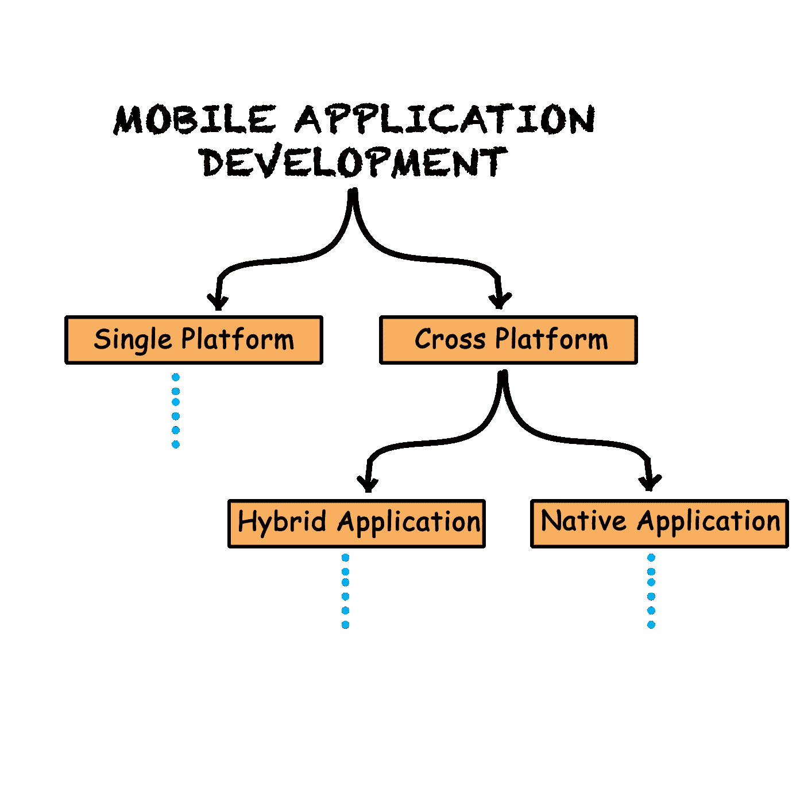
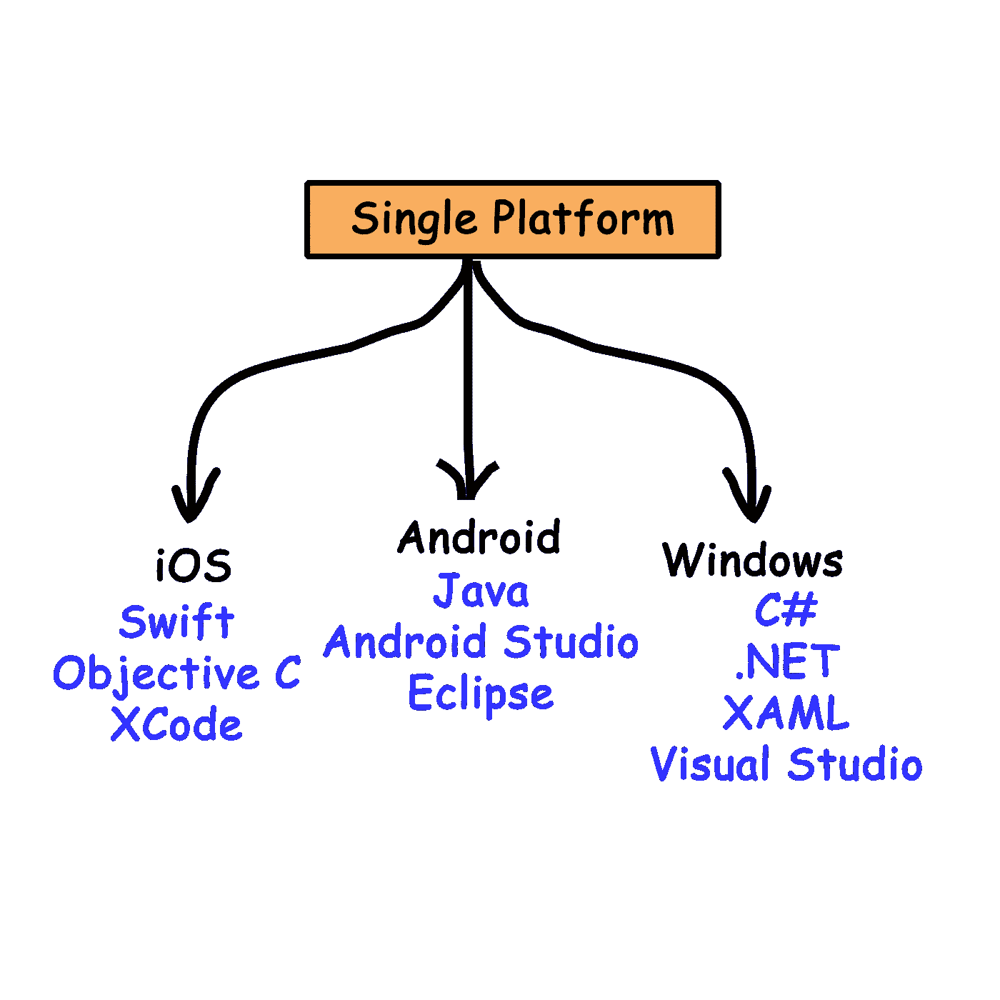
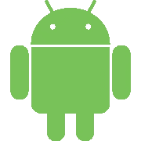
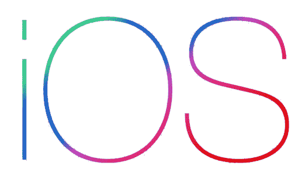
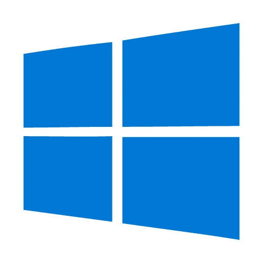
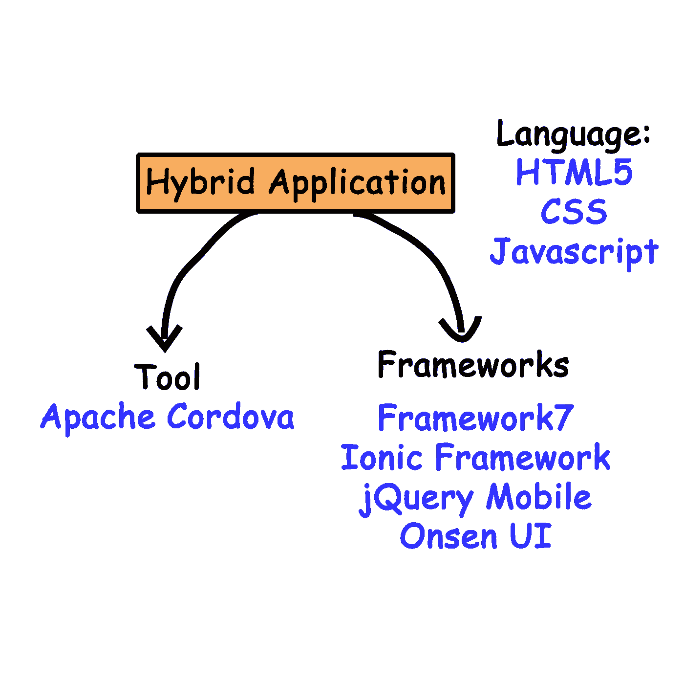
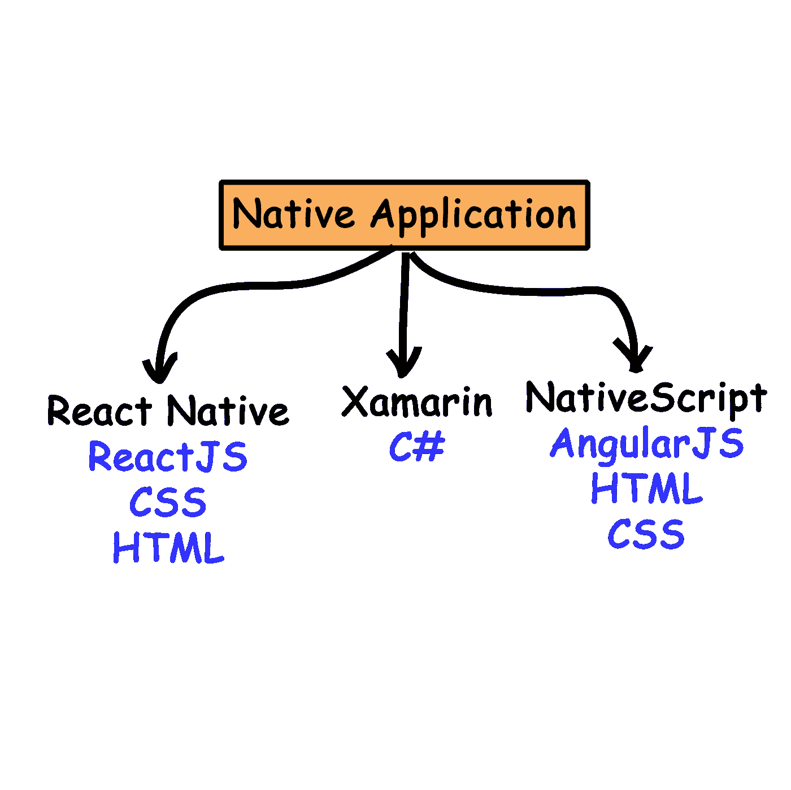
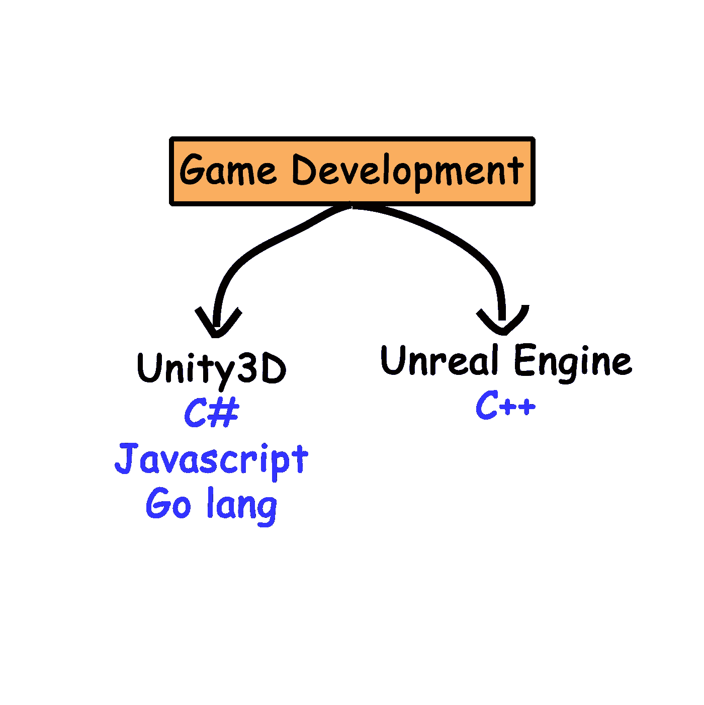

# 应用程序开发路线图

> 原文：<https://medium.com/hackernoon/a-roadmap-to-application-development-bfa2e32fcd82>

嘿，所有人…这篇文章是我上一篇文章“成为一名 Web 开发人员的路线图”的第二阶段。在那里，我们讨论了一个开发人员可以走的三条路，成为一个专业的 web 开发人员。我希望这对你们有些人有教育意义。

这一次我们将关注移动应用程序开发。随着移动用户数量每年呈指数级增长，这一领域的发展也在不断壮大。已经开发了许多应用程序来帮助用户完成不同的任务。

> 甚至像 Whatsapp、脸书和 Gmail 这样的应用已经成为我们生活中不可或缺的一部分，甚至我们都没有意识到这一点。

好了，闲聊够了。让我们上车吧…

# 可供你选择的三条路

The pathways for a developer

> 你要问自己的第一个问题是，“我为什么要开发这个应用程序？它的用例是什么？”。

如果您专注于为单个平台的用户构建应用程序，那么最有效的方法就是使用该平台固有的技术进行开发(我们将在后面讨论)。

需要大量硬件访问的应用程序必须为每个平台单独构建。例如，如果您试图构建一个应用程序来管理设备的 RAM 利用率，那么您必须为每个平台独立开发。您将无法使用跨平台开发工具开发此应用程序。

但是，如果您的移动应用程序要充当用户执行非硬件相关任务的界面，那么您可以使用跨平台开发工具来提高效率。这将大大减少您为每个平台创建应用程序的总开发时间。

开发跨平台应用的工具有两种:**混合应用**和**原生应用。我们稍后会讨论这个问题。**

# 单一平台开发

在这里，我们将讨论使用各自的本机工具为每个移动操作系统单独开发应用程序。

> 无可争议的是，移动设备的主要主流操作系统是: **Android** ，iOS 和 Windows Phone。

还有其他操作系统，如 FireFox Mobile 和 Ubuntu Mobile OS，但它们都没有像前三大巨头那样声名鹊起。

> 根据 2017 年 IDC[的数据，几乎 83.4%的移动用户是 Android，15.4%是 iOS，0.8%是 Windows。](https://www.idc.com/promo/smartphone-market-share/os)

因此，Android 用户主导了市场份额，因此大多数开发者都将他们的技术集中在这个平台上。Android 操作系统，作为谷歌的开源操作系统，是这个平台发展的一个重要因素。然而，苹果的 iOS 操作系统以其稳定性和功能良好的硬件而闻名(更不用说它们飞涨的价格了)。

## 机器人

正如我已经说过的，Android 拥有所有移动操作系统中最大的安装基数，因此为 Android 开发的应用程序数量超过了其他。Android 操作系统使用 Linux 内核和一些用 c 语言编写的高级 API。

然而，在 Android 中开发的大多数原生应用程序都是用 **Java** 编写的，并且运行在 Dalvik 虚拟机之上，使用即时编译和提前编译将 Java 字节码翻译成 Dalvik dex 代码。大多数开发者使用谷歌的 Android Studio IDE 来开发他们的应用程序。然而，你也可以使用 **Eclipse IDE** 来使用 **Android SDK** 进行同样的操作。

然而，自 2017 年初以来，使用 **Kotlin** 编写 Android 应用程序出现了早期上升趋势。对于那些不知道 Kotlin 是什么的人来说，它是一种运行在 JVM(Java 虚拟机)上的静态类型编程语言。甚至谷歌也在敦促开发者改变他们的开发，使用 Kotlin 而不是 Java。

> 我个人推荐:想跟上上升趋势就学 Kotlin，想找强教程就用 Java。

查看[这里](https://github.com/JStumpp/awesome-android)有一个很棒的 android 链接列表

## iOS 移动版

苹果的 iOS 是第二大广泛使用的移动操作系统。不用说作为苹果的产品，这个操作系统并不是开源的。然而，应用程序开发是使用苹果提供的 **iOS SDK** (软件开发工具包)来完成的。

> 您可以使用 Swift 或 Objective-C 语言在 XCODE IDE 上编写本地 iOS 应用程序

Swift 是苹果公司专门为应用程序开发开发的一种编程语言。

> 开发 iOS 应用程序的一个主要限制是，你需要一台 Apple Mac 设备来编译应用程序。

点击[这里](https://github.com/vsouza/awesome-ios)查看 iOS 教程的链接列表

## windows 手机

Windows phone 是被广泛使用的第三大移动操作系统。然而，微软最近声明他们将不再在 Windows Phone 上开发(查看[此处](https://www.theverge.com/2017/10/9/16446280/microsoft-finally-admits-windows-phone-is-dead))。他们改变了策略，从简单的手机转向手持平板电脑，后者不知何故越来越受欢迎。

最新的 Windows 10 有一个被称为通用 Windows 平台(UWP)的功能，它为所有支持该操作系统的设备定义了一个单一的基础平台。因此，我们可以开发同时在 PC、平板电脑、手机和 Xbox 上运行的应用程序。

> Windows 提供 Windows SDK 来开发 Windows 应用程序。我们使用 XAML 来设计应用程序，并在 Visual Studio IDE 中使用 C#语言对其进行编程。

# 跨平台开发

如果你打算开发一个跨两个或更多平台的移动应用，那么跨平台开发工具肯定会对你有所帮助。

> 两种类型的跨平台开发技术是:混合应用程序和本地应用程序

> 我们现在要讨论的所有工具都需要针对平台的特定**SDK，应用程序必须在该平台上编译。**
> 
> 在 iOS 上编译一个应用程序将**严格要求**Macbook 设备。

混合应用程序开发工具实际上是为了帮助现有的 web 开发人员轻松地开发应用程序并将其部署到移动平台上而创建的。混合应用开发其实就是开发一个移动平台的 HTML5 app。

> 混合应用程序使用 HTML5、CSS 和 Javascript 进行编程，并使用一些包装器为每个移动操作系统进行部署。

混合应用程序对于拥有 web 应用程序并希望为其部署本地移动应用程序的公司和初创公司来说非常有用。这些应用程序不能访问设备的很多硬件功能，但可以作为一个简单的用户界面。大多数混合应用程序开发工具只是对开发人员构建的 HTML5 应用程序进行一些包装，并将其部署到移动平台上。

Amazon 的移动应用程序就是一个混合应用程序的例子。你手机里的应用只是它背后 HTML5 应用的一个包装。

让我们讨论一些用于开发混合应用程序的工具和框架

## **T5【阿帕奇】科尔多瓦 **

> 它是一个免费的开源平台，可以用一个代码库为多个移动平台构建应用程序

你可以使用 HTML、CSS 和 Javascript 构建一个应用程序，然后将其部署到 Android、iOS、Windows、FirefoxOS 等等。如果您希望构建一个混合应用程序，它无疑是开发人员的最佳选择。还有许多插件和扩展可以帮助你访问某些硬件功能，如相机、声音等。到一定程度。Adobe 已经将这个项目分叉为自己的版本，称为 [*PhoneGap*](https://phonegap.com/) *。*

## 框架 7

[*Framework7*](https://framework7.io/) —是一个免费的开源移动 HTML 框架，用于开发具有 iOS & Android 原生外观和感觉的混合移动应用或 web 应用。它也是一个不可或缺的原型应用工具，可以在你需要的时候尽快展示应用原型。

Framework7 实际上是一个在 Cordova 之上构建混合应用程序的框架。但其实是 iOS 特有的。它最初是为 iOS 平台创建的，因此更适合它

## 离子框架

[*Ionic Framework*](https://ionicframework.com/)*是一款用于混合移动 app 开发的免费开源软件开发套件(SDK)。它是在 Angular.js 和 Apache Cordova 的基础上开发的，为开发人员提供了使用 HTML5、CSS 和 Sass 等各种 web 语言开发应用程序的一流工具和服务。*

*有许多扩展可以帮助你利用蓝牙，相机等。*

## *jQuery Mobile*

*[*jQuery Mobile*](http://jquerymobile.com/)*是开发跨平台移动应用的健壮框架。它支持广泛的应用程序开发平台，如桌面、智能手机、平板电脑和 Kindle 等电子书阅读设备**

**jQuery 是一个基于模块的框架，它允许您根据需要创建任意多的定制版本**

## **温泉 UI**

**[*Onsen UI*](https://onsen.io/)*是另一个框架，让你使用 Angular.js、React.js、Vue.js 等流行的 javascript 框架构建混合移动应用。***

# ***本机应用程序***

***我们已经看到了什么是混合应用程序:“一个覆盖了一层的 web 应用程序”。然而，还有另一种方法来创建跨平台应用程序。***

> ***本机应用程序编译工具帮助您用一种特定的语言编写应用程序，然后为您提供工具来为每个平台编译应用程序的本机组件。***

***使用这些工具构建的应用程序被发现比混合应用程序硬件效率高得多，因为它本身使用本机组件。混合应用程序有时可能会产生令人不快的错误，并且不能高效地访问硬件特性。***

******

***让我们讨论一下这个领域中的一些主要工具和库:***

## ***反应自然***

***[*React-Native*](https://facebook.github.io/react-native/)*是最著名的跨平台应用开发框架之一，由脸书创建。****

> ***React Native 允许您仅使用 JavaScript 构建移动应用程序。它使用与 React 相同的设计，允许您从声明性组件构建丰富的移动 UI。***

***使用 React Native，您不必构建“移动 web 应用程序”、“HTML5 应用程序”或“混合应用程序”。您构建了一个真正的移动应用程序，它与使用 Objective-C 或 Java 构建的应用程序没有什么区别。React Native 使用与常规 iOS 和 Android 应用相同的基本 UI 构建块。您只需使用 JavaScript 和 React 将这些构件放在一起。***

***如果你观察使用 React-Native 构建的应用程序，你会发现它的潜力。其中一些是脸书应用，Instagram，Airbnb，Flipkart 应用，这样的例子不胜枚举。它是迄今为止最著名的框架之一，在这个领域对开发者的需求也很高。***

## ***Xamarin***

***[*Xamarin*](https://www.xamarin.com/) 让您使用单一代码库为 Android、iOS 和 Windows 构建原生移动应用。***

> **Xamarin 允许您在一个共享的 C#代码库上为多个平台构建本机应用程序。在任何地方都使用相同的 IDE、语言和 API。**

**Xamarin 及其 SDK 为您提供了自己的测试云和教育资源，供您学习。最近 Xamarin 被微软收购了。对于喜欢以 C#为基础编写应用程序的开发人员来说，Xamarin 是一个合适的选择。**

**使用 Xamarin 制作的应用程序的一些著名例子有 Pinterest 应用程序、Slack 应用程序、Cognizent 应用程序、Bosch 应用程序等。**

## **原生脚本**

**[*native script*](https://www.nativescript.org)*是另一个开源平台，可以让你编译使用 Javascript 构建的原生移动应用。根据他们的官方网站，***

> ***“NativeScript 是您在没有 web 视图的情况下构建跨平台、原生 iOS 和 Android 应用的方式。使用 Angular、TypeScript 或 modern JavaScript 获得真正的原生 UI 和性能，同时与 web 共享技能和代码。通过 JavaScript 100%访问原生 API，并重用 NPM、CocoaPods 和 Gradle 的软件包。开源并以进步为后盾。”***

***我知道这很难理解，但谦虚地说，这是你可以尝试的另一个工具。它最近才在网上出名，但不如前两者受欢迎。熟悉 Angular.js 的开发者首选***

# ***特殊考虑——针对游戏开发者***

***一直以来，我都在泛泛地谈论应用程序开发。如果你是一个游戏开发者，想要为移动平台开发游戏，那么这些工具可能不会为你提供最好的解决方案。***

******

## ***我有两个建议给你:***

## ***Unity 游戏引擎:***

***[*Unity3D*](https://unity3d.com/)*是市面上最著名的游戏引擎之一。如果你是一个游戏开发者，你肯定知道这些东西，或者如果你是第一次接触这些东西，我肯定这将是你在这里要去的第一个名字。****

> ***Unity 帮助您设计、构建和部署高度互动的游戏到多个平台，只需一个代码库。你可以用 Javascript、C#或 Go lang 来编写游戏逻辑。***

***一旦你开发了游戏，它会给你提供将游戏导出到你指定的任何平台的选项。可以是 Android，iOS，Windows phone，FirefoxOS 等。它甚至将相同的游戏部署到 Windows PC 或 Linux 上。你也可以用它来构建增强现实和虚拟现实应用。Unity 有很多插件和扩展可以帮助你开发你的游戏。***

***如果你看看用 Unity 创建的游戏列表，你会感到惊讶。我要把这个悬念留给你..***

## ***虚幻引擎***

***[*虚幻引擎*](https://www.unrealengine.com) 是另一个著名的游戏引擎，为你提供最好的功能。根据他们的网站，***

> **虚幻引擎是一套完整的创作工具，旨在满足雄心勃勃的艺术愿景，同时足够灵活，以确保各种规模的团队取得成功。**

**这是一个完整的 C++引擎，可以让你在任何你想要的平台上开发和部署游戏。你现在可以小心使用这个引擎开发的游戏了**

# **该总结了…**

****

**就是这样，伙计们...这需要几天的研究和努力来完成。我希望你发现这信息丰富。我个人有使用上述工具的经验，比如 ReactNative、Android Java 和 Cordova。其余的是基于其他开发者的研究和信息。**

**如果您有任何疑问，请通过[脸书](https://www.facebook.com/abelkuruvilla)、 [Linkedin](https://www.linkedin.com/in/abelkuruvilla/) 或 [Twitter](https://twitter.com/abelkuruvilla) 联系我**