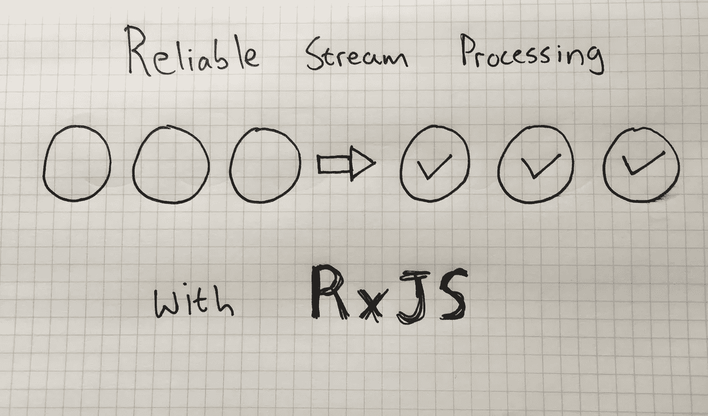

# 使用 RxJS 进行可靠流处理的半快速指南

> 原文：<https://medium.com/hackernoon/a-semi-quick-guide-to-reliable-stream-processing-with-rxjs-77cd8cb47f38>

这篇文章是关于我最近处理的一种方法，在这种情况下，我有一个必须处理的事件流(用户在画布上绘图)(通过 socket.io 发送到服务器)。我希望能够在套接字关闭时暂停同步过程，并在套接字打开时继续同步。我还认为，在允许最大重试次数的同时，能够在两次重试之间有延迟是很重要的。

我没有自大到认为这是最好的解决办法，也不是解决问题的唯一办法。我刚刚很开心地编码了它，并想与你分享结果。

如果你只是想看看最终的[代码](https://hackernoon.com/tagged/code)，那就去 https://github.com/hendrikswan/rxsync[看看吧](https://github.com/hendrikswan/rxsync)。这个库也可以在 npm 上获得。

关于术语，在这篇文章中，我使用了术语**流**而不是可观察的。希望你不要介意，我只是把这些东西当成溪流。

# 承诺只执行一次它的逻辑

如今，当你想用 JavaScript 执行 HTTP 请求时，你可能会使用基于 Promise 的解决方案，比如 [fetch api](https://developer.mozilla.org/en/docs/Web/API/Fetch_API) 。

这个真的很好用。承诺是处理异步交互的好方法。承诺甚至可以很好地与 async/await 一起使用，所以使用它们很有意义。

也就是说，承诺是一次性的概念。当它执行时，它既可以在成功完成任务时解析一个值，也可以在失败时返回一个错误。但是一旦完成了其中任何一个，它就结束了。

看看这个代码示例。不管对`then`的第二次调用发生在第一次调用之后 2 秒，它都返回相同的结果。这是因为结果被缓存，承诺已经被解析，所以它只是再次返回值。

当您想要执行一个操作时，这不是问题，比如一次性的 HTTP 调用来将对象保存到服务，因为您可以手动引入一些重试逻辑来确保消息到达服务。

# 当使用流时

让我们扩大例子的范围。假设您正在处理一个消息/事件流，您需要确保每个消息/事件都被传递给一个服务。

例如，如果您正在进行一个项目，需要根据用户与应用程序的交互将分析事件发送到服务器，只要用户正在使用该应用程序，您就需要将数据发送到服务器。

这就是当我们说它是一个事件流时的意思，它没有上限，就像你有一个数据项数组一样。

顺便说一下，这通常是 websockets 之类的东西出现的地方，但是对于本文的目的来说，与服务的通信通道看起来是什么样子并不重要。唯一重要的是，你现在有一堆堆积如山的消息，你需要为这些消息中的每一条跨越一个异步 IO 边界，在这个例子中是[网络](https://hackernoon.com/tagged/network)。

好了，说够了，让我们来看看一些示例代码。

A promise tied directly to an event stream is difficult to manage

在上面的代码中，`api.syncEvent`会被调用很多次。只要用户移动鼠标，它就会调用 syncEvent 函数并尝试解析承诺。

> 顺便提一下，我目前正在为 pluralsight.com[的](http://www.shareasale.com/r.cfm?b=1022887&u=1184760&m=53701&urllink=&afftrack=)编写一门课程，内容是如何结合 [React](https://facebook.github.io/react/) 、 [socket.io](https://socket.io/) 和 [RethinkDB](https://www.rethinkdb.com/) 来构建一个实时协作白板应用。当 github repo 准备好的时候，我会在这里发布包含源代码和课程链接的 github repo。在这个过程中，我想确保如果在用户绘图时 websocket 的连接断开，它可以处理它，并在 websocket 重新建立时将更改同步到绘图。可以想象，一个协作绘图应用程序会生成大量需要同步到服务器的数据，因此为课程找到一个解决这个问题的好方法是有意义的。

回到我们的例子。您如何确保由事件流中的某个项目生成的承诺在失败时得到重试，或者在放弃之前只重试一定次数？

这个场景怎么样？您有一个活动的事件流，但是您知道您与服务的连接已经中断。你如何暂停你的操作，以确保你没有不必要的尝试发送消息到服务，并通过你想分配给每个项目的重试次数？换句话说，你如何整体管理同步过程？

# 为河流建模

上面代码的问题是，我们将事件处理程序直接绑定到了我们试图立即执行承诺的事件上。如果我们将它编码成一个适当的 RxJS 流，那么将重试、延迟和流程编排等问题作为一个整体来添加会更容易。

在不引入像 RxJS 这样的流库的情况下，处理所有这些问题肯定是可能的，但是使用流库更有表现力。

让我们通过流发布事件，并从流中处理它，而不是像我们在上面的代码中尝试的那样直接处理它。

Handling events through a stream

在上面的代码中，除了不再直接在`syncMouseEvent`事件处理函数中执行逻辑之外，我们并没有添加太多东西。也就是说，现在我们让我们的项目通过一个流，这给了我们一个惯用的方式来添加关注点，如重试、重试之间的延迟以及整个过程的编排。

# 重试项目

现在我们正在处理一个流(RxJS observable ),我们可以添加一些代码来在承诺失败时重试项目。首先，我们将无限期地重试项目。

An indefinite RxJS retry strategy

我们只添加了一行！在第 10 行，`pendingItems.next(item)`代码将再次把它发布到流中，这意味着它将再次通过`subscribe`处理程序。这对于普通的命令式代码来说很容易做到，不需要使用 RxJS，但是请原谅我。当我们开始添加更多的关注点时，很明显 RxJS 是值得的。

# 添加重试限制

现在我们有了一个流，但它有点像一个无限循环。承诺会实现，如果失败了，它会再试一次。如果我们可以有一个最大重试次数，并在达到每个项目的最大重试次数时放弃，那该多好。

要做到这一点，我们必须为每一项存储一些元数据，这样我们就知道我们已经尝试执行它的逻辑多少次了。

Adding a maximum retry limit

唷！好了，这相当多的代码。在上面的代码中，我们没有从`syncMouseEvent`函数直接发布到我们的流。相反，我们引入了一个名为`queue`的新函数，在这里我们用元数据来修饰条目，这样我们就可以跟踪我们尝试执行条目的承诺逻辑的次数。我们还向这个队列函数添加了一些逻辑，以确保如果项目正在排队，但已经超过了最大重试次数，它会向控制台记录一个错误，并在不将项目添加回流的情况下退出。

我们还必须修改订阅队列的逻辑。因为它现在接收一个带有元数据的修饰项，所以我们需要从它那里为我们的业务逻辑 api 提取`item`属性，这构建了承诺。当承诺失败时，subscribe 逻辑也使用`queue`函数，因为这是我们在超过最大重试次数后增加计数器并退出的地方。

# 添加重试之间的延迟

使用 RxJS 使我们的流逻辑更加地道，但是到目前为止，我们还没有真正做任何没有 RxJS 很难做的事情。也就是说，每增加一个概念，而不使用像 RxJS 这样的流库，我们的代码就会变得更加笨拙，直到没有人能够理解它。

假设我们想在不使用 RxJS 的情况下向代码中添加重试逻辑，并使用重试循环。我们需要在代码中使用`setTimeout`..当我们想暂停/恢复整个过程时，怎么办？很快就会变得一团糟。

让我们看看当我们想要为每个项目添加重试之间的延迟时会涉及到什么。

Adding a delay between retries per item

这一次，你会发现我没有完整地分享代码。这是因为它实际上只需要 2 行代码来为每个项目添加重试之间的延迟！

在上面的代码中，看一下第 2-3 行。在第 2 行，我们映射流中的项目，并使用 RxJS 延迟操作符返回一个包含延迟的可观察值。如果这是第一次尝试这个项目，根据它的元数据，我们将使用零延迟。在第 3 行，我们只是使用 mergeAll 操作符将其展平，然后 whala！我们的程序现在有延迟了！

如果我们有一个无限循环来重新处理承诺，并使用`setTimeout`来处理延迟，那么上面的内容会更难理解。我希望你同意这更有表现力和优雅。

# 订阅流处理结果

到目前为止，我们只是在超过项目的最大重试次数或成功处理项目时将错误记录到控制台。

对于我们的应用程序来说，了解流处理的结果，了解项目在用尽重试限制后何时成功同步或何时失败是有意义的。

为此，我们将再次使用 streams，允许我们的代码订阅它，并对结果做任何他们想做的事情。

Publish results to streams

在上面的代码中，我们在第 2 行和第 3 行添加了两个新的 Rx 主题，这允许我们发布和订阅流。我们没有直接处理失败和成功的场景，而是发布到各自的流中。

在第 17 行，我们向`failedItems`流发布一个超过重试次数的项目，在第 33 行，我们向`syncedItems`流发布一个成功处理的项目。

在第 39 行和第 40 行，我们订阅各自的流，并为流中遇到的每个项目输出消息。在这里使用 streams，允许您在这里添加其他关注点。例如，你可以用它在应用程序中向用户展示一些东西。

# 使其通用化

使用 streams 使我们更接近于使这种模式通用化。如果我们只是让 promise 逻辑更动态一点，我们可以将它用于任何我们想要处理的 IO 操作流。

此外，最好添加功能来使这个处理逻辑可暂停，这样，如果我们得到服务连接中断的通知，我们可以停止整个过程，直到网络连接再次恢复。

最后，我们想要的是一个通用 api，它允许我们处理一个操作流，让我们能够订阅结果，配置项目之间的延迟，配置每个项目的最大重试限制，并允许我们暂停/恢复整个处理过程。这就是 api 的使用者的样子:

A generic API to handle the steam processing

以上是可以在[https://github.com/hendrikswan/rxsync](https://github.com/hendrikswan/rxsync)找到的图书馆的例子。它补充了我们在本文中讨论的暂停/恢复的概念，但除此之外，它几乎是相同的。我觉得进入暂停/恢复可能会使这篇文章有点太重，所以如果你有兴趣了解它是如何工作的，去看看源代码吧！

# 结论

溪流令人敬畏，但更重要的是，它们无处不在。你几乎可以在任何地方找到溪流。当用户与应用程序交互时，这些事件实际上是一系列事件。当您有一个光标打开到一个带有实时提要的数据库时，这就是一个流。消息队列？小溪。卡夫卡订户？小溪。

本文中共享的策略可以在任何需要通过异步 IO 边界同步数据流的地方使用，但我认为在前端最有意义，因为在前端，您可以确定连接不可靠。我在 pluralsight.com 的一门课程上需要它，那里的示例应用程序是 socket.io 上的协作绘图应用程序。我认为将 socket.io 和这种方法结合起来很有意义。

我很想听听你的想法。

# 链接

[RxJS](https://github.com/ReactiveX/rxjs)
T5【我在 pluralsight.com 的工作】
[rxsync 库](https://github.com/hendrikswan/rxsync)
[我的一些免费视频](http://tagtree.io/library)

> [黑客午间](http://bit.ly/Hackernoon)是黑客们下午的开始。我们是 [@AMI](http://bit.ly/atAMIatAMI) 家族的一员。我们现在[接受提交](http://bit.ly/hackernoonsubmission)并很高兴[讨论广告&赞助](mailto:partners@amipublications.com)的机会。
> 
> 如果你喜欢这个故事，我们推荐你阅读我们的[最新科技故事](http://bit.ly/hackernoonlatestt)和[趋势科技故事](https://hackernoon.com/trending)。直到下一次，不要把世界的现实想当然！

