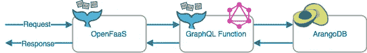

# 使用 OpenFaaS 在 60 秒内完成一个无服务器的 GraphQL 博客

> 原文：<https://medium.com/hackernoon/a-serverless-graphql-blog-in-60-seconds-with-openfaas-aaedd566b1f3>

由于我在上一篇文章([“集成 OpenFaaS 和 GraphQL”](/statuscode/integrating-openfaas-and-graphql-experimental-1870bd22f2a))中已经集成了 GraphQL 和 [OpenFaaS](https://www.openfaas.com/) ，我接下来想做的是将其与数据库集成。所以我想把数据保存到存储器中。数据库可以是任何东西，但是这次我选择了 [ArangoDB](https://www.arangodb.com/) 。这就是建筑的样子。你可以在[kenf dev/open FAAS-graph QL-blog](https://github.com/kenfdev/openfaas-graphql-blog)中找到这个项目的代码。



OpenFaaS + GraphQL + ArangoDB

下面的视频展示了我在这个架构上取得的成就。(有些部分快进)

我希望每个人都能轻松地创建这个环境，所以我选择了 Docker Swarm 作为编排工具。只需点击几个命令，就可以使用 graphql 博客了。当然，你可以选择你自己的编排工具，这里[列出了](https://github.com/alexellis/faas/blob/master/community.md#third-party-integrations--openfaas-providers)，但这与本文的主题无关。

# GraphQL 博客

这项服务的灵感来自于[server less/server less-graph QL-blog](https://github.com/serverless/serverless-graphql-blog)，但它并不依赖于 AWS。此外，它缺少实体之间的一些关系(afaik ),所以我添加了一些。所以这个 graphql 博客可以:

*   创造一个作者
*   为作者创建帖子
*   为帖子创建评论
*   查询作者
*   查询帖子及其评论

我还没有为这个 GraphQL 博客捆绑一个前端，所以你需要一个像`GraphiQL`这样的客户端来查询服务器(你可以在这里找到一个)。

# 试试看！

如果你想尝试这个项目，你可以从这里开始。我假设你了解 Docker，并且已经安装了它。在你克隆了[项目](https://github.com/kenfdev/openfaas-graphql-blog)之后，点击

```
docker swarm init
```

并通过执行`deploy_stack.sh`部署堆栈。部署成功后，arangodb 需要几秒钟时间准备接收请求。投票`http://localhost:8529`直到你看到 arangodb 的登录表单。


然后，您需要准备数据库和集合。可以在项目中找到`arango/setup_database.sh`。执行这个命令，您就可以使用 GraphQL 博客了。顺便可以从 OpenFaaS 的 gateway UI 查看功能。


GraphQL Blog Function via OpenFaaS

# 创造一个作者

您可以通过使用`createAuthor`突变来创建一个作者。

```
mutation {
  createAuthor(name: "Jane") {
    id
    name
  }
}
```

响应应该是这样的(记住`id`，因为您稍后会用到它):

```
{
  "data": {
    "createAuthor": {
      "id": "4350",
      "name": "Jane"
    }
  }
}
```

# 创建帖子

你可以通过使用`createPost`突变来创建一个帖子。

```
mutation {
  createPost(title: "Some Sample Post", bodyContent: "This is a sample post", author: "4350") {
    id
    title
    bodyContent
    author {
      name
    }
    comments {
      id
    }
  }
}
```

回应会是这样的(也记住这个`id`):

```
{
  "data": {
    "createPost": {
      "id": "4849",
      "title": "Some Sample Post",
      "bodyContent": "This is a sample post",
      "author": {
        "name": "Jane"
      },
      "comments": []
    }
  }
}
```

# 给帖子添加评论

你可以通过`createComment`突变给帖子添加评论。为此，你需要一个作者`id`和一个帖子`id`。

```
mutation {
  createComment(content: "This is a comment", author: "4350", post: "4849") {
    id
    content
    author {
      name
    }
  }
}
```

答案是这样的:

```
{
  "data": {
    "createComment": {
      "id": "5018",
      "content": "This is a comment",
      "author": {
        "name": "Jane"
      }
    }
  }
}
```

# 质疑帖子

现在我们有了一篇文章和这篇文章的评论，让我们通过`posts`查询来查询它。

```
query {
  posts(authorId: "4350") {
    id
    title
    bodyContent
    author {
      name
    }
    comments {
      content
      author {
        name
      }
    }
  }
}
```

答案会是:

```
{
  "data": {
    "posts": [
      {
        "id": "4849",
        "title": "Some Sample Post",
        "bodyContent": "This is a sample post",
        "author": {
          "name": "Jane"
        },
        "comments": [
          {
            "content": "This is a comment",
            "author": {
              "name": "Jane"
            }
          }
        ]
      }
    ]
  }
}
```

很酷不是吗？一个无服务器的 GraphQL 博客在近 60 秒内启动！

# 下一步是什么…

我们现在有了一个工作的无服务器 GraphQL 博客。但是我们还没有深入研究 OpenFaaS 的好处。在下一篇文章中，我将研究这个函数在出现请求高峰时是如何伸缩的。

*如果你对 OpenFaaS 感兴趣，请给*[*GitHub repo*](https://github.com/alexellis/faas)*一颗* ***星*** *以示支持！*