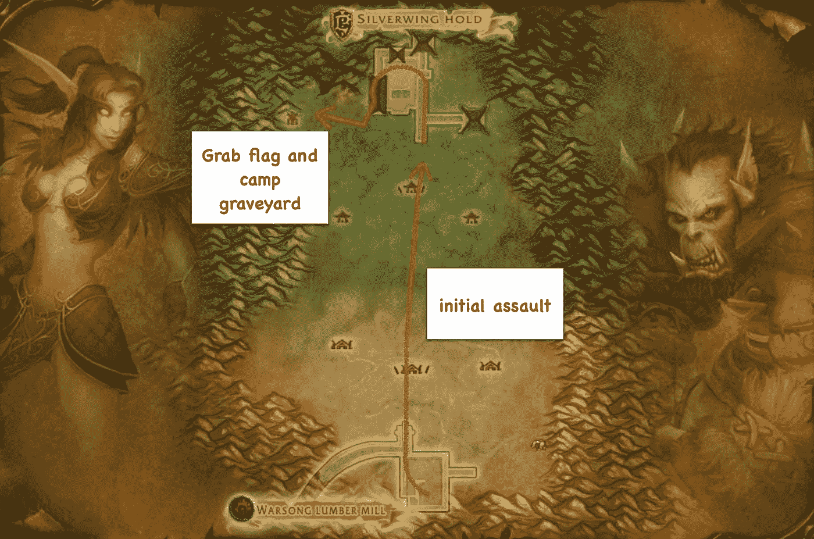

# 一套原则并不能构成一项战略

> 原文：<https://medium.com/hackernoon/a-set-of-principles-does-not-make-a-strategy-6dc6fbd6ecb2>

## …在魔兽世界或商业中。

我经常发现魔兽世界是解释战略基本概念的有用工具。在这个例子中，我想让你想象两个团队——部落和联盟——准备在一个叫做战歌峡谷的战场上第一次战斗。在夺旗比赛开始前，两队都有很短的时间准备。两支队伍都没有去过战歌峡谷，也没有在战场上战斗的经验。仅供参考，当你的角色在战场上被杀死后，它会在你队伍的墓地里复活。

一个团队(联盟)概述了如何赢得这场战斗的战略。它由他们称之为“通用”的五项原则组成，这些原则他们都同意。这些是:-

1)我们要夺旗，赢得比赛！我们不仅仅是和对手战斗。

2)我们要和优秀的人一起做这件事！我们将成为最好的战士(被称为坦克，擅长承受伤害)、法师(伤害处理者)和治疗者。我们不会让任何人加入团队。

3)我们要做好承担风险和快速失败的准备！我们不会为了安全起见。

4)我们相信相互支持的文化！有人要求时，我们会互相帮助。

5)我们乐于接受挑战并提出难题。

团队热情高涨，蓄势待发。面对他们的是部落玩家团队。他们也花了时间准备，但结果有些不同。这支队伍了解地图的重要性，并将它们用于战略战术。他们有一张战歌峡谷的地图，并制定了一个“战略”:

**焦点**:夺取旗帜，赢得游戏

**适用的学说(即普遍原则)**:

1)发展精通(尽你所能扮演你的角色)——坦克承受打击，法师分发，治疗者治疗。

2)作为一个单元(单个单元)行动，例如使用集中火力，一起工作和移动。

**策略(上下文特定播放)**:

1)首先，团队将在最初的全力进攻中充当一个单元。这个小组将快速通过中央隧道向敌人基地移动，干掉干扰的对手。总是先干掉对手的治疗师，然后是伤害经销商，然后是坦克。

2)一旦他们的旗帜被我们的坦克占领，这个团队将会干掉对方的玩家并在他们的墓地扎营(见地图),在对方玩家复活时和他们建立任何形式的团队之前杀死他们。嘲弄对手是被鼓励的。

3)一旦他们的墓地被包含，该细胞将分裂成两个细胞。一个由几个法师组成的小型进攻小组将干掉对方的掉队者，而较大的小组(包括我们的运旗坦克)将继续驻扎在对方的墓地，杀死所有复活的玩家。一旦敌对玩家被控制在墓地中，这个单元将会重组，一个单独的法师将会继续运行这面旗帜。如果计划失败，那么该集团将围绕我们的旗舰航空公司进行改革。

现在，部落团队有了重点、原则和某种形式的策略。这可能不起作用，但部落玩家可以使用他们的地图来改进他们的游戏。我几乎可以保证，当战斗开始时，联盟玩家的第一个问题将是“我们应该进攻还是防守？”以及“我们需要去哪里？”

联盟团队内部的争论将会发生，在他们意识到之前，部落将会攻击他们。你会听到联盟成员的下一声呼喊是“救命！”“为什么没人帮我，我需要帮助！”和“你在哪里？”随之而来的是没完没了的争吵，说这个或那个球员不够好，不能成为球队的一部分，还有很多人大喊“这是怎么回事？”或者“大家都去哪了？”或者“我应该抢他们的旗子吗？”。十有八九，联盟队伍会很快被瓦解成一群惊慌失措的乌合之众。

我想强调的一点是，原则是好的，是的，策略必须适应游戏，但不要混淆这两者。一套原则并不能构成一项战略。尽管有一套原则肯定比没有原则和策略要好。这同样适用于商业。

然而，我希望你考虑最后一件事。想象有部落和联盟玩家组成的队伍。想象一下，联盟玩家不仅没有地图，他们甚至不知道地图的概念。他们所能做的就是尝试一些原则，并作为“成功的秘诀”从一个团队分享给另一个团队。想象部落玩家理解地图的概念，使用它们并在他们之间分享。很快，每一个部落团队都将使用各种各样的战略战术赢得胜利。除非每个玩家都建立了世界的心智模型，否则联盟没有任何机会。每个魔兽世界玩家都会告诉你这个。地图真的很重要。

现在问问你自己，我们在商业中做什么？我们是将[地图](https://medium.com/wardleymaps)用于特定环境的游戏和学习，还是我们的策略更类似于从其他公司复制“成功的秘密”和原则，即我们应该像亚马逊、网飞或 AirBnB 一样？我们玩的是联盟游戏还是部落游戏？

如果你要去—“好吧，你如何规划一个企业？”—这相当容易。为了在你的道路上帮助你，[我正在写一本书](https://medium.com/wardleymaps)，所有知识共享 [**归属共享 4.0 国际**](http://creativecommons.org/licenses/by-sa/4.0/) 关于如何用一种我已经使用了十多年的技术做到这一点。

*原载于 2017 年 1 月 6 日*[*blog.gardeviance.org*](http://blog.gardeviance.org/2017/01/a-set-of-principles-does-not-make.html)*。*

> [黑客中午](http://bit.ly/Hackernoon)是黑客如何开始他们的下午。我们是 AMI 家庭的一员。我们现在[接受投稿](http://bit.ly/hackernoonsubmission)并乐意[讨论广告&赞助](mailto:partners@amipublications.com)机会。
> 
> 如果你喜欢这个故事，我们推荐你阅读我们的[最新科技故事](http://bit.ly/hackernoonlatestt)和[趋势科技故事](https://hackernoon.com/trending)。直到下一次，不要把世界的现实想当然！

