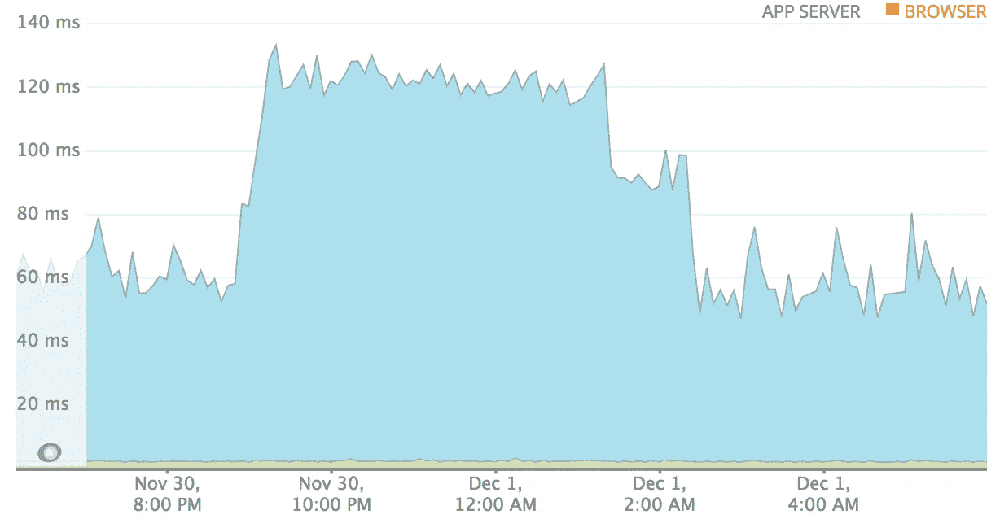
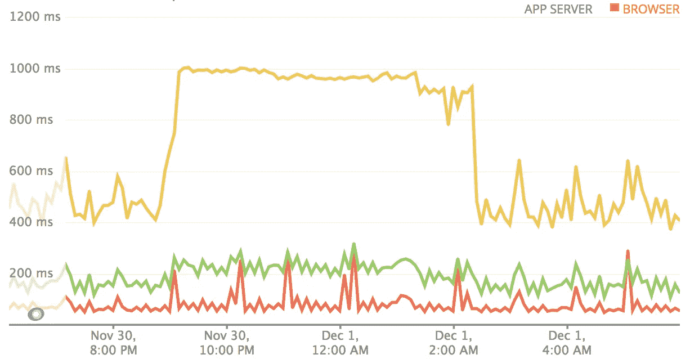
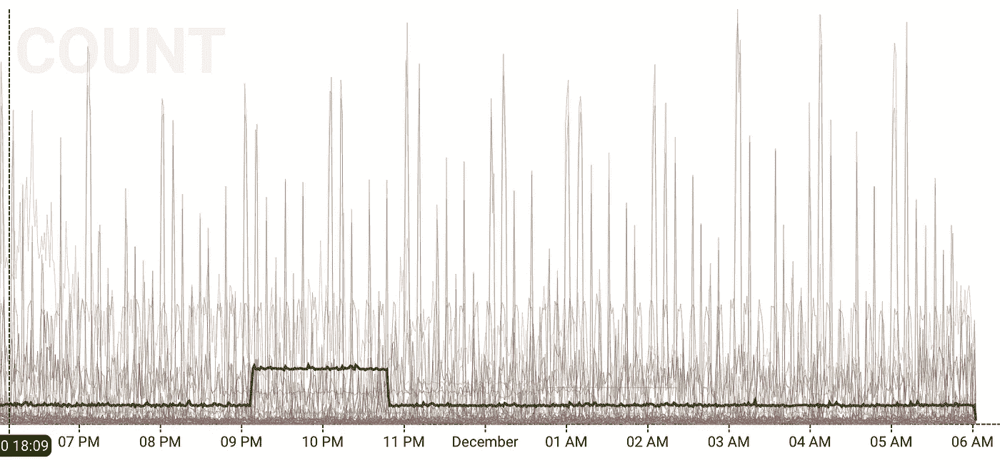
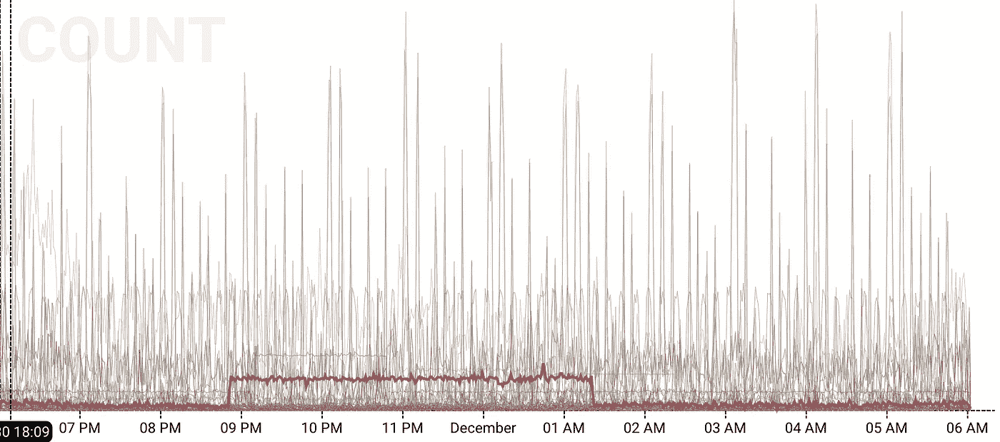
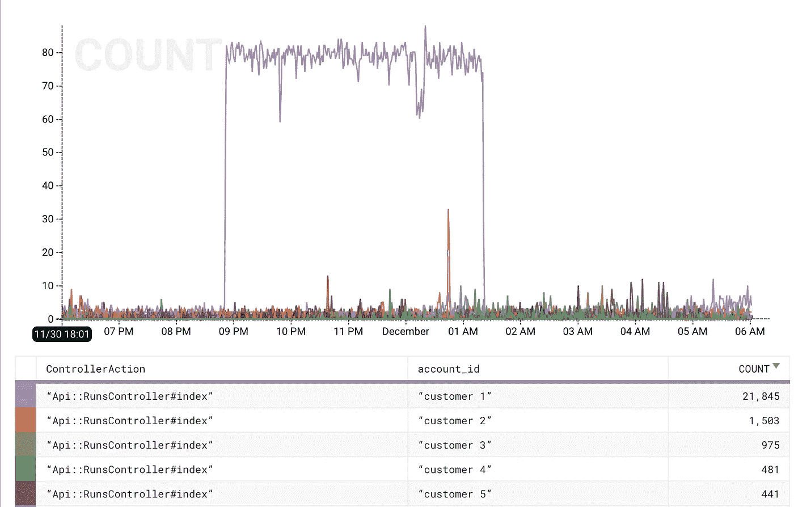

# 一个简短的例子来说明为什么维度非常有价值

> 原文：<https://medium.com/hackernoon/a-short-example-of-why-dimensions-are-suuuuuper-valuable-67e880055eb0>

在[模式分析](https://modeanalytics.com)中，我们使用一系列工具来观察和监控我们的生产系统中发生的事情。我们用的两个是[纽舍利](https://hackernoon.com/tagged/newrelic)和[蜂巢](https://hackernoon.com/tagged/honeycomb)。两者都有自己的位置，我在这里想做的是说明蜂巢带来了什么，以及为什么它如此有价值。

今天早上我打开 NewRelic，看到了下面的图表:

酷，现在我知道从 2100 到 200，花在 Ruby 上的平均时间增加了 2 倍。似乎不太理想，我想知道那里发生了什么？首先，我想指出，我从上面的图表中删除了一些数据。通常包括时间在:*队列、gc、中间件、ruby、数据库、redis、ar 和外部。在这种情况下，这些都是平坦的，表明上面的拐点不在这些组件中的一个。*

太好了，所以我想调查应用程序中的情况。问题似乎就在那里，而不是从依赖的服务传播出来的。NR 对此有更好的现成图表。我想知道真正的影响是什么，平均值隐藏了很多信息。令人高兴的是，有一个% tiles 按钮:

嗯，我在这里学到了一点，没有我想要的那么多，因为 NR 只提供平均值，中值，95 和 99。我想看到从 75 岁、85 岁到 95 岁甚至更高的进步，但是很好。这给了我们更多的信息，但它不是那么可操作的。我知道 95%是大约 500 毫秒，现在是 1000 毫秒，这与第一个图表一致，只是幅度有所变化。

这里我想到了几种可能性:

*   什么东西比以前慢了？
*   流量的总体增长还是具体增长？

通过部署标记，我知道我们没有在事件之前或之后立即部署，因此我们可以忽略这一点。更有可能的情况是，我们要么有更多的总体流量，要么有更多的特定资源流量/来自特定客户的流量。

自然资源使它更容易被看到。我可以在不同的维度上对交易进行分类，但没有什么是真正突出的。在点击了一会儿之后，我发现了一个控制器动作，它的性能计时与上面的图表相匹配。点击的一个意外好处是确认了大多数控制动作没有受到影响。

太棒了，现在我已经找到了控制器动作，我可以看到它变慢了，请求率在窗口期间显著上升，然后在结束时下降。

…这就是我与 NR 的旅程的终点。我不知道在 NR 中有什么好方法可以真正有效地深入研究。我在他们的洞察产品上运气不佳。

相反，我切换到蜂巢。首先，我很好奇我是否能做些什么来简化寻找控制器动作。在 NR 中，我不得不点击和希望，点击和希望。在 Honeycomb 中，我创建了下面的图表，它们有些嘈杂，但我在寻找水平线，它们非常容易发现:

Interesting but this one doesn’t match the timeframe I’m looking for.

… but this one matches perfectly!

在蜂巢里比在天然橡胶里更容易找到这些。除了 IDK，也许在 NR 还有更好的方法。不管怎样，我们现在回到了使用 NewRelic 时的状态:我们知道哪个控制器动作，我们能从这里去哪里？这是蜂巢真正闪耀的地方:高维数据，我们包括的属性之一是帐户标识符。让我们将这一点添加到分解结构中:

Oh look, it’s customer-1

tada，我知道*客户-1* 正在发出比平时更多的 API 请求。在另一个世界中，他们可能发出相同数量的请求，但他们的请求比其他客户花费的时间长，这表明我们的应用程序在执行时存在一些不对称。或者，也许我们会发现这是一个特定的报告，…

关键是，通过将高维数据包含在事件中，您可以深入这些事件。在 Honeycomb 之前，为了得出相同的结论:我会转到 SumoLogic 来查看 App 或 Nginx 日志。通过减少和梳理请求路径，并了解这些路径中的令牌如何映射到游程，然后将游程映射回帐户，我可能已经能够解决这个问题。这很繁琐，很慢，并且需要熟练掌握特定于供应商的查询语言，然后将中间结果从一个系统转移到另一个系统。