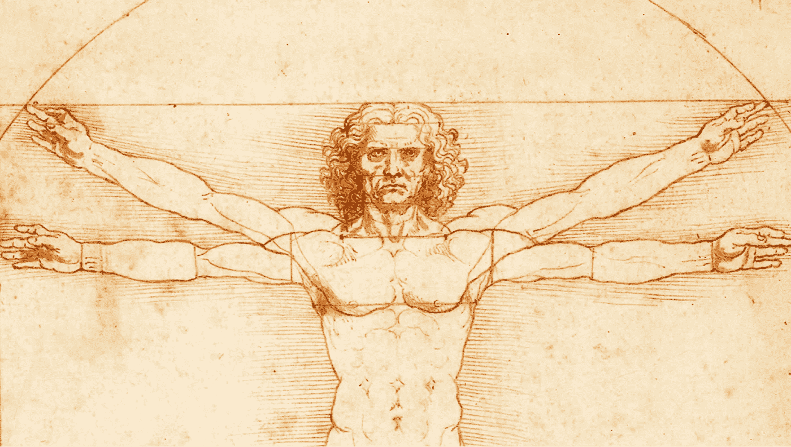
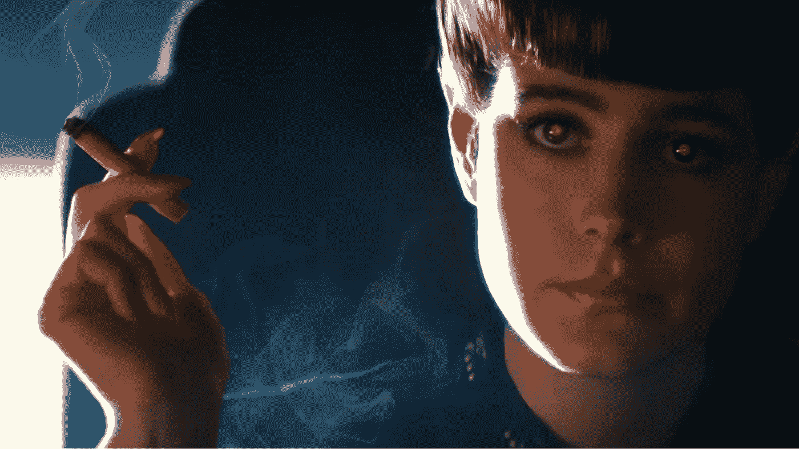
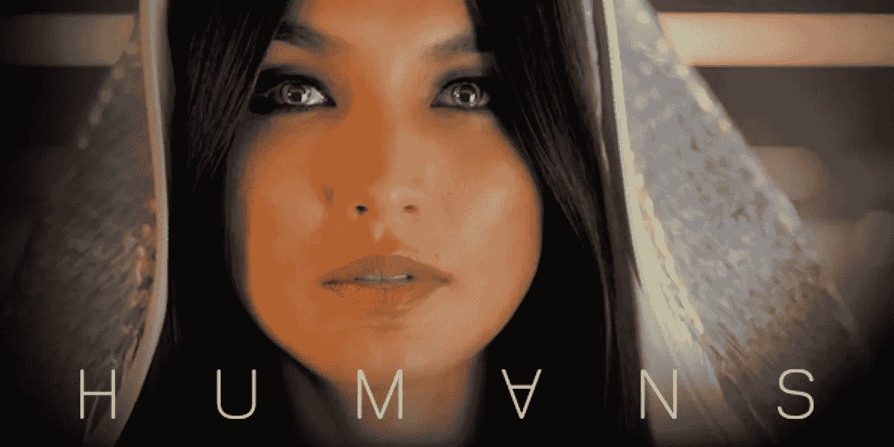
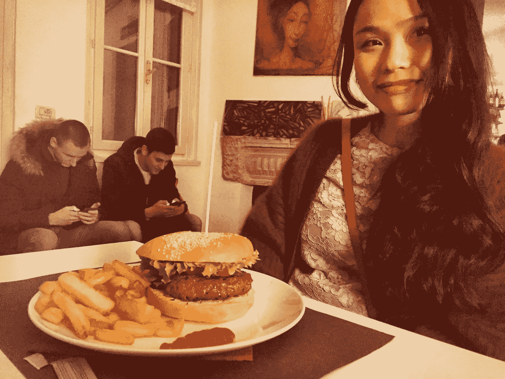
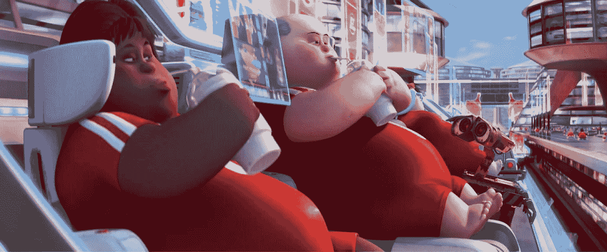

# 近视的动物？

> 原文：<https://medium.com/hackernoon/a-shortsighted-animal-c6f3bcb4b36a>

第一次看《银翼杀手》的时候，我还是一个七岁的男孩。我仍然记得当我还是个孩子的时候，面对一个看起来如此迷人而又如此遥远的未来时的那种奇妙的感觉。我觉得这很有趣，很吸引人。几年后，作为一名青少年，我被复制人四年生命周期注定的死亡和我们自己的死亡之间的相似性所感动，对 14 岁的我来说，我们的死亡看起来还要长得多。

现在我是一个四十岁的成年人。最近，我的妻子向我介绍了英国电视连续剧*人类，*，我觉得这是一个令人不安的梦。事实上，1982 年的复制器和 2015 年的合成器之间没有太大的区别，但这个“新未来”看起来更加熟悉和即将到来。这里的相似之处可以追溯到 80 年代末的偏执狂邪教，如来自卡彭特的*他们生活*或来自尤兹纳的*社会*。

我已经开始依靠技术来满足我的大部分需求。我最好的朋友可能是我的智能手机，即使我试图不滥用，它也总是因为这样或那样的原因在我旁边。在车里，我发现自己大部分时间都在打开全球定位系统:当一台机器可以为我做出努力时，为什么要专注于思考走哪条路回家呢？有一天晚上，我和妻子出去吃汉堡(我已经在 facebook 上收到了邀请)，我给她拍了一张照片:在背景上你可以看到两个男人，应该是两个朋友，他们的头被他们的手机催化着。

在过去的三十年里，我们认为我们正在做一件大事，我们都去了中国。现在我们回来了，有人称之为*重新支撑*，只是为了发现……中国现在在这里。他们确实利用了我们的投资，现在他们正在扩张，收购我们的公司，并开始在我们这里建餐馆、商店和按摩中心。与此同时，在他们自己的国家，他们正计划从工业 2.0 直接跳到 4.0。

今天的趋势是机器人和人工智能。我们需要投资那些生产机器的公司，这些机器将淘汰我们大多数人的工作。竞争造就了速度，而速度需要的表现很可能很快就超出了人类的能力。

> [黑客中午](http://bit.ly/Hackernoon)是黑客如何开始他们的下午。我们是阿妹家庭的一员。我们现在[接受投稿](http://bit.ly/hackernoonsubmission)并乐意[讨论广告&赞助](mailto:partners@amipublications.com)机会。
> 
> 如果你喜欢这个故事，我们推荐你阅读我们的[最新科技故事](http://bit.ly/hackernoonlatestt)和[趋势科技故事](https://hackernoon.com/trending)。直到下一次，不要把世界的现实想当然！

