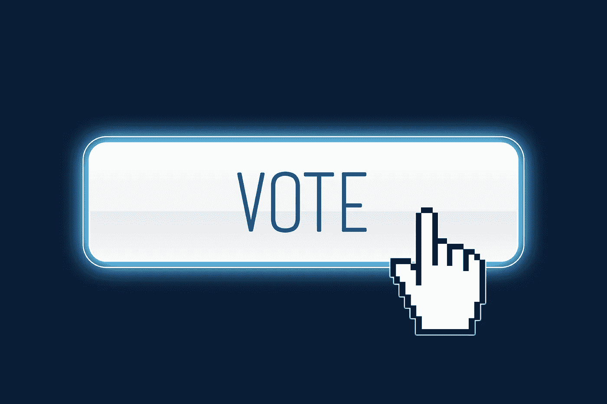
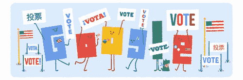
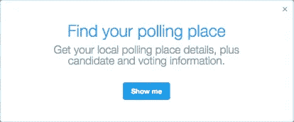
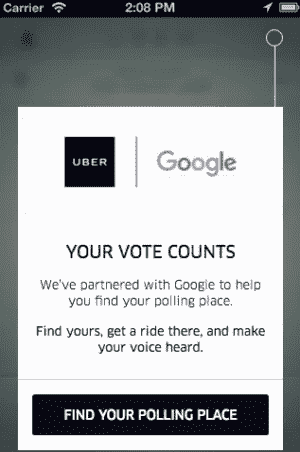
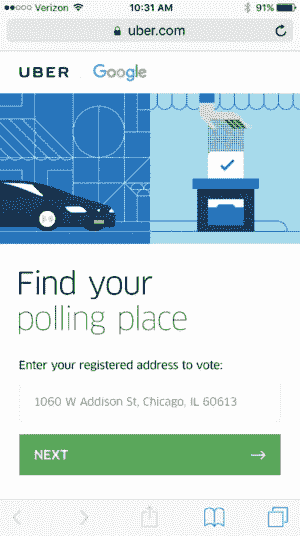
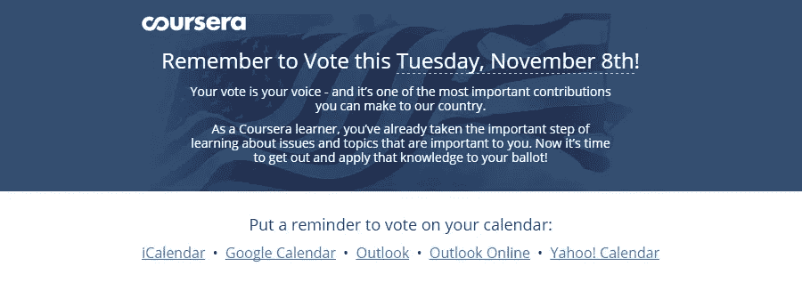
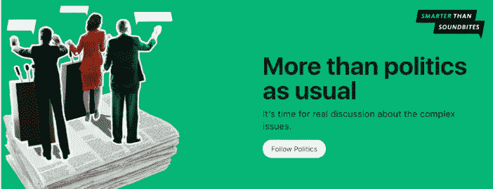

# 硅谷投票指南

> 原文：<https://medium.com/hackernoon/a-silicon-valley-guide-to-vote-900ad9f8f9a3>

## 投票站和更多，感谢脸书、谷歌、优步、推特和其他公司

美国总统大选就在明天，应用程序和社交媒体平台都在提醒他们在美国的用户投票，并帮助他们找到投票站。根据 TargetSmart 的数据，到目前为止，已有超过 4200 万选民提前投票，其中包括内华达州、佛罗里达州和北卡罗来纳州的创纪录人数。

 [## 社交媒体帮助美国千禧一代选民登记，投票率担忧挥之不去

### 随着新千年一代中最年轻的成员达到投票选举今年美国总统的年龄…

www.reuters.com](http://www.reuters.com/article/us-usa-election-registration-idUSKBN1310KJ) 

如果你今天早上在谷歌上搜索什么，今天美国的谷歌涂鸦致力于提醒选民投票。当你点击涂鸦，你可以输入你的地址找到你的投票地点。

谷歌“如何投票”将带你找到本地化的结果，包括投票开始的时间和任何要求，如身份证。您也可以输入您的地址来找到您的投票地点。

脸书的[选举工具](https://www.facebook.com/elections/yourplan)将向你展示你的选票上有什么，以及各个候选人在关键问题上的立场。据美联社报道，这些信息来自无党派团体*科技和公民生活中心*，该中心也为谷歌搜索提供一些数据，如“我的选票上有什么”

“脸书的投票规划器是为你量身定做的。你可以预览你将在选票上看到的竞选和议题，了解更多关于候选人及其立场的信息，然后通过电子邮件给自己发送你的选择供以后参考，”[脸书的一篇博客帖子写道](http://newsroom.fb.com/news/2016/10/preparing-for-the-us-election-2016/)。“你如何投票是个人问题，我们已经采取措施确保你对自己的计划拥有最大的控制权。”

在 Twitter 上，如果你点击“寻找投票地点”，Twitter gov(@ gov)会发出一条 DM 消息，要求美国用户输入地址，找到投票地点。

Twitter 用户“将可以获得各种额外的个性化投票信息，包括投票地点、候选人和提议信息，以及关于缺席投票和州选举规则的额外选举资源，”一篇 Twitter 博客文章写道。

优步还加入了许多致力于让选民在选举日投票的技术公司，并与谷歌合作，允许用户在应用程序中查找投票地点的位置，并请求乘车前往。

“鉴于全国人民将在 11 月 8 日做出重要决定，我们希望让往返投票站变得比以往任何时候都更容易，”该公司联邦事务负责人尼基·克里斯托夫在博客文章中[说。“与谷歌合作，优步很高兴能尽可能地让旅行变得方便、轻松。”](https://newsroom.uber.com/vote/)

美国的 Snapchat 用户将看到他们可以添加到照片上的覆盖图，提醒人们去投票。此外，他们将能够在应用程序上看到“直播故事”——显示投票站的人、选举结果、接受和让步演讲以及选举之夜的庆祝活动。

就连提供大规模开放在线课程(MOOCs)的教育平台 Coursera 也在向其美国用户发送电子邮件，提醒他们去投票。

最后，在[媒体](https://medium.com/u/504c7870fdb6?source=post_page-----900ad9f8f9a3--------------------------------)上，用户可以超越社交媒体的声音片段，通过从移民到教育，从国家安全到性别的精选帖子列表来探索问题和立场……收集了大量有趣的帖子，如[的西蒙·罗杰斯](https://medium.com/u/e093dae6814e?source=post_page-----900ad9f8f9a3--------------------------------)的[谷歌新闻实验室](https://medium.com/u/f226348241d4?source=post_page-----900ad9f8f9a3--------------------------------)；科林·鲍威尔谈[卡内基公司](https://medium.com/u/90fda8bf1435?source=post_page-----900ad9f8f9a3--------------------------------)；[瑞秋霍夫](https://medium.com/u/c1bb16400ba7?source=post_page-----900ad9f8f9a3--------------------------------)在右下；[美国医疗保健行业的 Becca Thimmesch](https://medium.com/u/2d82bb1f8f2f?source=post_page-----900ad9f8f9a3--------------------------------)；詹姆斯·夸克，还有更多。

> [黑客中午](http://bit.ly/Hackernoon)是黑客如何开始他们的下午。我们是 [@AMI](http://bit.ly/atAMIatAMI) 家庭的一员。我们现在[接受投稿](http://bit.ly/hackernoonsubmission)，并乐意[讨论广告&赞助](mailto:partners@amipublications.com)机会。
> 
> 如果你喜欢这个故事，我们推荐你阅读我们的[最新科技故事](http://bit.ly/hackernoonlatestt)和[趋势科技故事](https://hackernoon.com/trending)。直到下一次，不要把世界的现实想当然！

