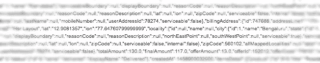

# 大多数程序员都会犯的愚蠢错误

> 原文：<https://medium.com/hackernoon/a-silly-mistake-most-programmers-make-e0f8a8fd1ebf>


我在印度一家著名的食品初创公司发现了这个安全漏洞。他们所有的客户数据，包括居住信息、订单信息和联系方式都很脆弱。



Exposed Customer Data

看看下面的代码。

```
[@app](http://twitter.com/app).route(“/customer/info”)
def customer_info():
  customer_id = requests.args.get(‘customer_id’)
  customer = customers.query.filter(Customer.id==customer_id).one()
  customer_schema.jsonify(customer)
```

id 为 5453 的客户将有以下请求 URL

```
[http://server_ip/customer/info?customer_id=5453](http://server_ip/customer/info?customer_id=5453)
```

现在看网址，id 是一个数字。黑客会尝试将号码从 5453 改为 5454

```
[http://server_ip/customer/info?customer_id=5454](http://server_ip/customer/info?customer_id=5454)
```

这将允许他获取 id 为 5454 的客户的详细信息，这是他不应该看到的。现在，他可以编写一个脚本，循环遍历客户 id 并获取信息；他侵入了一家公司的机密数据。

这可以通过添加身份验证来检查用户是否有权访问数据来防止。唯一的字符串标识符比整数标识符好得多。

如果你对制作云应用感兴趣。做结帐我的书[云易如反掌](http://amzn.to/2n32wJT):)。在这里获得免费章节[。](http://bit.ly/2izUg2h)

[](http://bit.ly/HackernoonFB)[](https://goo.gl/k7XYbx)[](https://goo.gl/4ofytp)

> [黑客中午](http://bit.ly/Hackernoon)是黑客如何开始他们的下午。我们是 [@AMI](http://bit.ly/atAMIatAMI) 家庭的一员。我们现在[接受投稿](http://bit.ly/hackernoonsubmission)并乐意[讨论广告&赞助](mailto:partners@amipublications.com)机会。
> 
> 如果你喜欢这个故事，我们推荐你阅读我们的[最新科技故事](http://bit.ly/hackernoonlatestt)和[趋势科技故事](https://hackernoon.com/trending)。直到下一次，不要把世界的现实想当然！

