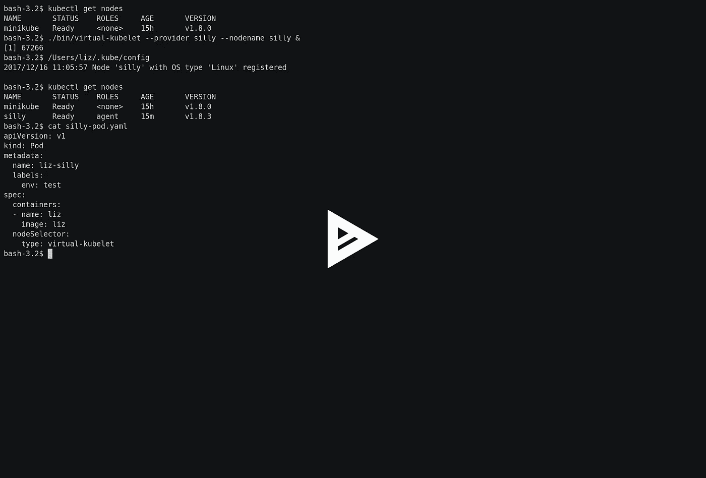

# 一个愚蠢的虚拟库伯莱

> 原文：<https://medium.com/hackernoon/a-silly-virtual-kubelet-71b2ec466bc6>

我刚刚做了一些毫无意义的事情！

我对令人惊叹的微软团队上周在 KubeCon 上宣布的[虚拟 kubelet](https://github.com/virtual-kubelet/virtual-kubelet) 感到兴奋。它让某些东西看起来像是一个运行 kubelet 的节点，而实际上在虚拟的 kubelet 后面可能有任何东西。任何东西，比如容器实例、VM，或者——正如我在这里演示的——实际上什么都没有。

[virtual-kubelet 提供者接口](https://github.com/virtual-kubelet/virtual-kubelet#adding-a-new-provider-via-the-provider-interface)非常简单。也许它做的最重要的事情是接受启动 pod 的请求。我刚刚放在一起的愚蠢的提供者接受这些请求，然后，嗯，它几乎不做任何事情。

不完全没有——它保留了一个它应该负责的 pod 的列表，您可以从本地 web 服务器查询该列表。

Recording of the silly virtual-kubelet in action

# 有什么意义？

我认为,( a)探索界面,( b)思考除了运行容器之外，还可以用 Kubernetes 做什么会很有趣。它将所有关于对象的状态和元数据分布在一个集群中，这本身有用吗？答案可能是否定的，也可能是将 Kubernetes 作为“分布式操作系统”的另一种方式。

# 下一步是什么？

老实说，我不完全确定这将走向何方。一个想法是，用这样的东西来驱动智能灯泡可能会很有趣(如果有更多的灯，就打开更多的灯！使用 pod 定义来设置照明颜色！)

我很想扩展它，这样你就可以添加多个本地运行的虚拟 kubelet 节点(也许每个灯泡都有自己的节点？)

还有什么？接下来你会把它带到哪里？在评论里让我知道？