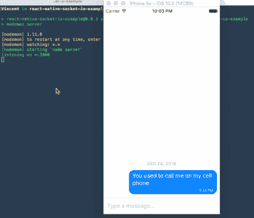

# 带有 React Native 和 Socket.io 的简单消息应用

> 原文：<https://medium.com/hackernoon/a-simple-messaging-app-with-react-native-and-socket-io-e1cae3df7bda>



[Source](https://github.com/vinnyoodles/react-native-socket-io-example)

我从未想过我会写一篇关于媒体的文章，但老实说，我找不到一个合适的指南或例子来说明如何在这个用例中使用 [React Native](https://github.com/facebook/react-native) 和 [Socket.io](http://socket.io/) 。我确实在[找到了一些](/@ekryski/how-to-actually-use-socket-io-in-react-native-39082d8d6172#.qjp8o5hs3) [相关的](https://github.com/badfortrains/wsExample) [示例](https://github.com/skellock/phoenix-react-native-mashup)，但是它们要么不够描述性，要么使用了不同的技术堆栈。所以现在是我贡献知识财富的时候了。

让我们开始吧。首先，需要创建一个服务器和客户机。这个例子将使用一个 Express 服务器和一个普通的 React 本地项目。一旦它们都被创建，它们都必须指向同一个 web 套接字，这就是数据在两者之间传输的方式。

一个服务器和多个客户端之间可以打开多个套接字。Socket.io 使得单个客户端、多个客户端或所有客户端之间的对话变得非常简单。

一旦建立了套接字，两端就可以无延迟地自由通话(比 HTTP 请求更快😊。).

要使用 web 套接字，只需通过指定的通道发送数据/消息。

```
socket.emit('channel-name', 'Hello world!');
```

这对于服务器和客户端都是一样的。另一端只需监听指定的频道。

```
socket.on('channel-name', (message) => ... /* some logic */);
```

简单的数据结构也可以通过套接字发送，所以数组和对象是公平的游戏。

回到我们的用例。当用户输入并发送消息时，它将被发送到服务器，服务器可以执行一些逻辑，然后服务器将消息发送到所有套接字(其他用户)。消息应用程序应该在会话之间存储数据，所以我们只需在消息被转发时将其保存在数据库中。

消息模型可能类似于:

```
{ 
  text: *String*,
  createdAt: *Date*,
  userId: *ObjectId*,
  chatId: *ObjectId* 
}
```

为了跟踪一个任何数量的人都可以加入的开放聊天室，一个*标识符*字段将有助于跟踪消息。对于移动应用程序，每个设备将充当一个用户，对于新用户，他们将被分配一个 *id* 字段，该字段应保存在设备的本地存储中。如果设备上保存有 *id* 字段，我们可以确定用户是否加入了聊天室。为了处理多个聊天室，应该使用某种映射结构，以便我们知道用户在哪个房间(如果存在的话)。

关于我前面提到的持久性，当用户加入一个房间时，我们应该给它任何预先存在的消息，这些消息保存在特定房间的数据库中。

我已经创建了一个[工作消息应用](https://github.com/vinnyoodles/react-native-socket-io-example)的工作示例。非常感谢[法里德·萨菲](https://medium.com/u/fea63d4e28f3?source=post_page-----e1cae3df7bda--------------------------------)的[消息组件](https://github.com/FaridSafi/react-native-gifted-chat)让这变得如此简单。尽情享受吧！

我是弗吉尼亚理工大学计算机科学专业的学生，喜欢写代码和举重💪。 [LinkedIn](https://www.linkedin.com/in/vinnyoodles) [Github](https://github.com/vinnyoodles)

[](http://bit.ly/HackernoonFB)[](https://goo.gl/k7XYbx)[](https://goo.gl/4ofytp)

> [黑客中午](http://bit.ly/Hackernoon)是黑客如何开始他们的下午。我们是阿妹家庭的一员。我们现在[接受投稿](http://bit.ly/hackernoonsubmission)并乐意[讨论广告&赞助](mailto:partners@amipublications.com)机会。
> 
> 如果你喜欢这个故事，我们推荐你阅读我们的[最新科技故事](http://bit.ly/hackernoonlatestt)和[趋势科技故事](https://hackernoon.com/trending)。直到下一次，不要把世界的现实想当然！

