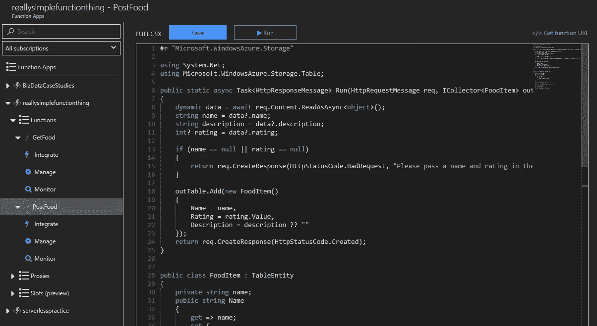
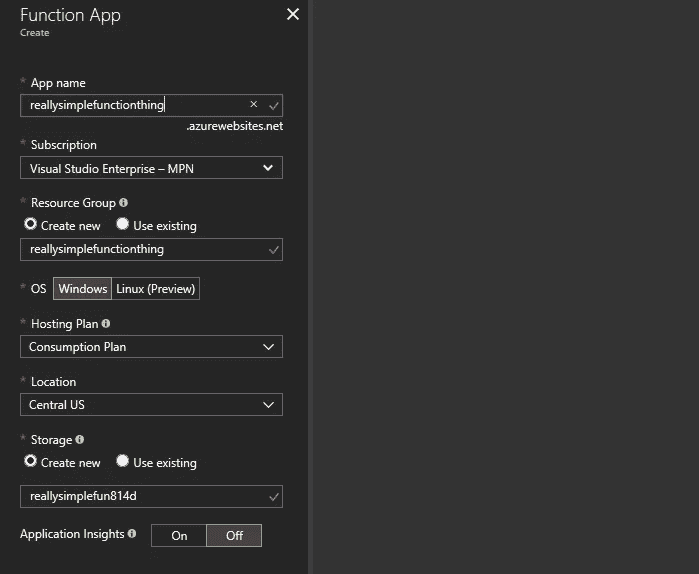
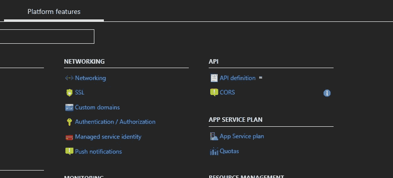
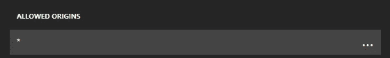
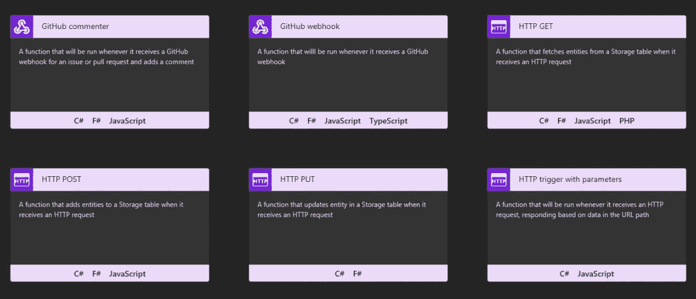
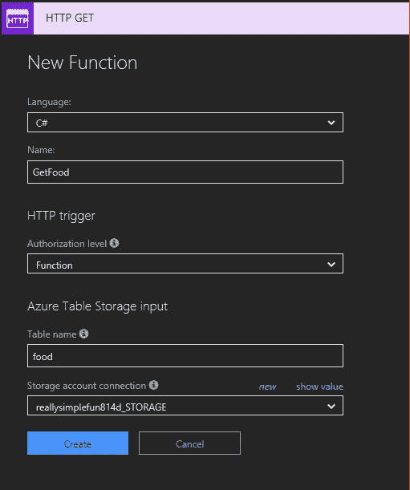
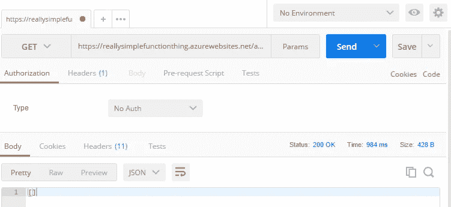
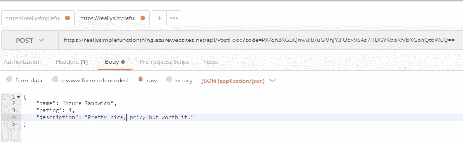
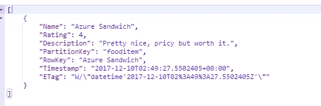

# 一个简单的、无服务器的 API，使用 Azure 表和函数

> 原文：<https://medium.com/hackernoon/a-simple-serverless-api-using-azure-tables-functions-bd7669b4b8cf>

Who would’ve thought developing in a Portal would be so bearable.

虽然无服务器绝不是一项新的技术，但直到最近在准备 T2 532 微软考试时，我才真正享受到 AWS Lambda 和 Azure Functions 等产品的强大功能。无论是可伸缩性、成本还是易于实现；在您的基于云的解决方案中采用无服务器方法是有好处的。这篇文章不一定是如何使用微软 Azure 功能的充实教程，而是一篇探索性的文章，讲述了在 Azure 门户内部创建各种各样的数据库后端*“API”*是多么容易！

**注意，我不一定主张这就是你应该开发 Azure 函数的方式。** [**微软支持使用 Git**](https://docs.microsoft.com/en-us/azure/app-service/app-service-deploy-local-git) **等版本控制系统与 Azure 函数协同工作，并提供一个**[**Azure Functions CLI**](https://github.com/Azure/azure-functions-cli)**用于在本地运行函数。**

## 安装

假设你有 Azure 订阅([如果没有在这里注册，它是免费的](https://azure.microsoft.com/en-us/free/))，在市场中找到*“无服务器功能应用”*资源。虽然我通常建议您分别创建资源组和存储帐户，但为了简化过程，我们将使用函数创建这两个帐户。

对于那些不确定 Azure 行话的人来说，*资源组*本质上就是它的名字所暗示的，是 Azure 资源的集合，这些资源是你在 Azure 上使用的服务。*存储帐户*是一种资源，它在一个资源下提供多种类型的存储解决方案，包括文件、blob、表、队列等等。在本教程中，我们将重点关注使用*表格*，Azure 将其描述为:

> 用于非结构化和半结构化数据的 NoSQL 存储，是 web 应用程序、地址簿和其他用户数据的理想选择。

当创建你的函数应用时，Azure 将在你键入时预填充资源组和存储帐户的名称。对于托管计划，我选择了消费，因为这是一种按使用量而不是正常运行时间计费的方式。位置很大程度上取决于你的位置，所以它对功能本身并没有什么影响。单击“创建”将验证 Azure 函数配置并将其添加到您的函数应用中。

## 让我们写一些函数！

一旦功能应用被部署，你可以在 Azure 门户网站的*“功能应用”*部分找到它。在我们开始创建函数之前，我想修改我的 CORS 原点，以允许所有的(*)，就本文的目的而言，定义我使用的具体原点是不必要的。

点击您的功能应用程序，进入平台功能-> CORS，然后删除所有允许的原点，添加一个原点*。

保存这些更改后，转到函数应用程序的函数部分，然后单击新建函数按钮。这将显示 Azure 提供的所有模板。在本教程中，我们将使用 HTTP GET 和 HTTP POST 模板，因为该模板包含了连接到表存储所需的所有内容。

So many options :O

我们将从 HTTP GET 开始，对于本教程，我将使用 C#,但我承认我在很大程度上依赖于生成的代码，你可以使用任何你想使用的语言。

Let’s go with a food theme for a change.

在本教程中，我们将从食品数据库中添加和检索项目。在很大程度上，函数的命名取决于您，需要更改的是表名和存储帐户连接。表格名称可以是任何名称，因为如果表格不存在，Azure 将创建一个表格，并且要检索您之前创建的存储帐户，请单击*“新建”*按钮并从选项列表中选择它。对 HTTP POST 重复这个过程。

首先，我们将编辑 GET 函数，使它更像我们自己的函数。在 Azure 门户中打开该功能将打开一个 [monaco 编辑器](https://github.com/Microsoft/monaco-editor)，其中包含我们的功能。如果你的函数使用 C#这样的强类型语言，Azure 会为你的函数生成一个`TableEntity`(默认为 person)。让我们稍微编辑一下，让它更独特一些…

如你所见，除了`RowKey` 和`PartitionKey`，TableEntity 是一个非常普通的 C#对象。虽然这不是 Azure Functions 的概念，更像是 Azure Tables 的一条信息，但总而言之,`RowKey`可以被认为是表中的主键。我们可以使用它来惟一地标识和轻松地检索表中的条目。`PartitionKey` 稍微复杂一点，它定义了 Azure 将如何在你的存储中分发条目。可以假设具有相同分区键的元素保存在存储的同一个分区中，因此可以很容易地一起查询和批处理。

正如你可能猜到的，在这个例子中，我将使用`FoodItem` 的名字作为`RowKey`，所有的条目都被相同的分区。

我还需要重构`HttpResponseMessage`的函数，以便它能够处理正确的数据类型。

有了这些改变，我们的 GET 端点就完成了！所有的实现都是在 Azure 门户编辑器中实现的。为了测试这个函数，我们可以从右上角的 *Get Function URL* 按钮复制 URL，并用 Postman 查询，得到的响应是一个预期的空数组。

导航到 POST 函数，对于我的函数，我写了下面的代码；

虽然模型保持不变，但函数本身还是有一些需要注意的地方。

*   强调可空数据类型，尤其是`int?`这样的例子。
*   我的验证基本上是确保`name`和`rating`存在。
*   不需要像在最初生成的代码中那样显式地设置一个`PartitionKey`和一个`RowKey`，因为我们在构造函数和`Name`设置器中会处理这些。

一旦实现，保存您的 post 函数并确保您的日志中没有错误。如果一切顺利，祝贺你！您刚刚利用 Azure 表存储支持的 Azure 函数实现了 GET 和 POST 端点。为了测试它，让我们打开 postman 并向 POST 端点发送一些数据；

Nothing was more satisfying than the 201 I received for this

GET Endpoint works as expected.

虽然 Azure 函数还有很多值得探索的地方，但我希望这是一个很好的入门书，让你知道开始使用它们有多容易。

如果你喜欢这篇文章，请给我们一个掌声，因为它膨胀了我的自我，激发了我写更多作品的需要。

**PS:只想推荐 Scott Duffy 的 Udemy 课程**[**《70-532 开发微软 Azure 解决方案认证》**](https://www.udemy.com/70532-azure/learn/v4/overview) **作为我想写这篇文章的理由。绝对值得一试，因为它非常深入，是最新的，并且是围绕微软的同名考试设计的。**