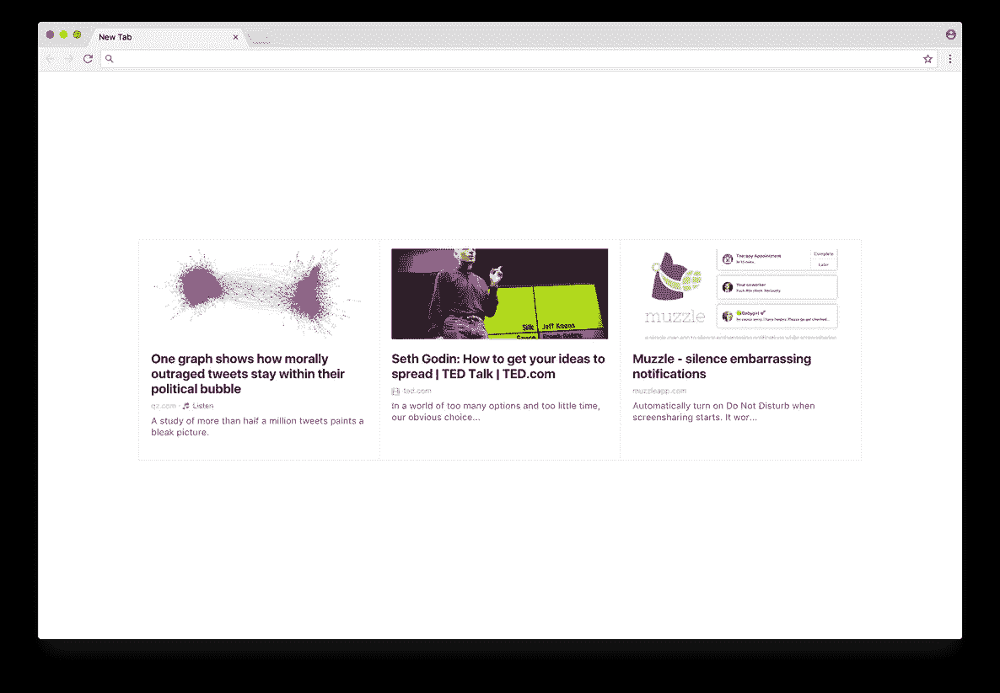

# 更简单的 Chrome 新标签

> 原文：<https://medium.com/hackernoon/a-simpler-chrome-new-tab-7ec8f025b89e>

Top new links from the people and interests you follow.

我们简化了 Chrome 新标签扩展。它向您展示了来自您关注的人和兴趣的 2–4 个新链接。当你滚动的时候，链接会被标记为可见，你就可以进入完整的体验了。

# 为什么要改变？

当你打开一个新的标签页时，你通常想导航到一个网站，而不是被一堆事情分心。然而，我们的新标签扩展非常方便您随时了解新链接，并在休息或一天结束时浏览您的订阅源。

许多人喜欢它原来的样子，但有时我们会被要求一个更简单的版本。昨天我们收到了另一个这样的请求，所以我们实现了一个快速原型:它只显示了一行链接，带有一个按钮去 refind.com 的。我们自己测试了几个小时，并询问[我们的大使](https://refind.com/?open=enjoying)他们更喜欢哪个版本。结果是:

*   66%的人更喜欢经典版，
*   33%的人喜欢简单的版本，
*   1%的人想要混合。

所以，我们选择了混合:只有一行链接(没有菜单，等等。)，但当你滚动时，链接会被标记为“已查看”,你可以深入了解完整的体验。

# **标注如图**

*   当你*悬停*和/或*滚动*时，会显示更多链接
*   当你滚动*到*时，第一行链接**被标记为可见**
*   当您滚动经过所有其他行时，它们会被标记为可见(顶部的彩色进度条)

# 旋转一下

获取我们的 Chrome 新标签扩展并尝试一下:

 [## 设为新标签- Refind

### 每当你在 Chrome 中打开一个新标签时，从你关注的人和兴趣中发现最好的链接。

refind.com](https://refind.com/about/newtab)