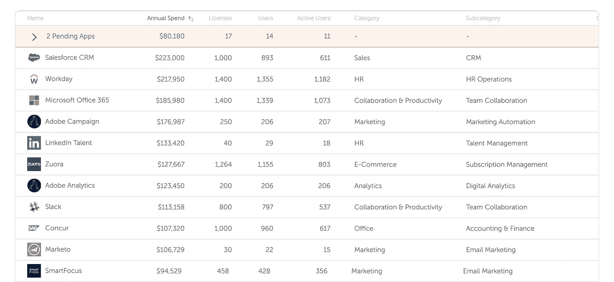
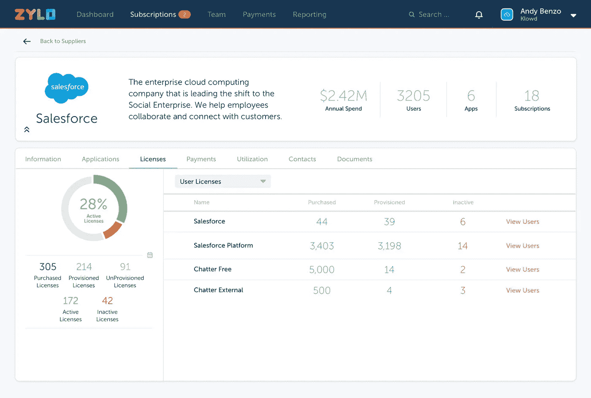

# 单一的 SaaS 记录系统为销售收入运营团队创造了可见性并提高了效率

> 原文：<https://medium.com/hackernoon/a-single-saas-system-of-record-creates-visibility-and-increased-efficiency-for-the-salesloft-712aa805ddb4>

现代销售互动平台的创造者 saleloft 是一家成立 6 年的公司，总部位于佐治亚州亚特兰大。SalesLoft 的收入年增长率超过 100%,员工数量在去年翻了一番。随着如此快速的成功和增长，不同的挑战也随之而来。在云与 [SaaS](https://hackernoon.com/tagged/saas) 的新世界中，一切都基于并授权员工使用尽可能最好的资源来完成工作，**对于一个组织来说，准确了解整个企业购买和使用的软件比以往任何时候都更难。**

SalesLoft 的收入系统经理 Cynthia Hancock 负责营销、销售和客户成功团队的运营。她的部分工作是跟踪购买的技术是否正在使用，确保新团队成员能够获得他们需要的东西，并最终跟踪一切，从购买的新软件到需要软件解决的新挑战，以及每个应用程序的 ROI。

有了 Zylo，Cynthia 和她的团队有了一个单一的 SaaS 记录系统来解决 SalesLoft 的重大挑战，包括:SaaS 支出和供应商管理、SaaS 利用率测量和 SaaS 许可证优化。

# SaaS 支出和供应商管理

**sales loft 团队不再使用复杂的电子表格和共享文件夹进行 SaaS 合同和续约管理**。Zylo 发现了通过应付账款和员工费用交易在整个组织中购买的所有云和 SaaS 应用程序。Zylo 将每个 SaaS 应用程序与其类别和功能相关联，以丰富超过 6，000 个 SaaS 应用程序目录中的数据。

Zylo discovers all of the Cloud and SaaS applications purchased across the organization from a catalog of over 6,000 SaaS applications.

过去，跟踪和管理来自各个部门的 SaaS 供应商合同，以及跟踪由于快速增长而在合同期限中途添加新用户的时间是一项挑战。**现在，Salesloft 使用 Zylo 的礼宾服务来收集重要的合同细节，并将合同存储在 Zylo 中以备将来参考。**根据这些信息，为主动续订管理配置警报。

Hancock 解释说:“有了一个包括我们 SaaS 应用程序的所有支出、合同和利用率数据的 SaaS 记录系统，我们的团队不再需要搜索合同或管理静态电子表格中的详细信息。”。

# SaaS 利用率测量

SalesLoft 使用 Okta 的单点登录和身份管理解决方案，但收入运营团队无法访问这些数据，也无法以可行的方式查看这些数据。有了 Zylo，现在 Okta 的利用率数据与 Zylo 中的支出和合同数据结合在一起，清晰地展现了每个 SaaS 应用程序为 SalesLoft 提供的价值。SalesLoft 正在扩展 Okta 背后的应用数量，以获取丰富的数据集，用于未来的 ROI 分析和决策。

“SalesLoft 是一家数据驱动的公司，因此能够确定我们 SaaS 应用程序的投资回报率对我们的团队来说是一个巨大的胜利，”Hancock 评论道。

# SaaS 许可证优化

在一家发展如此迅速的公司中，团队每个季度都在扩大，新的团队成员需要获得 SalesLoft 用于经营业务的技术。需要时，添加更多许可证或调整合同会在部门级别进行。当 SaaS 应用出现新费用时，Zylo 会提醒收入运营团队，因此现在可以调整订阅条款并维护最新的单一 SaaS 记录系统。

Powered by direct integrations into SaaS applications like Salesforce, Zylo provides the intelligence needed to manage and optimize SaaS applications throughout the year.

此外，如果用户没有主动登录他们的应用程序，Zylo 可以轻松确定哪些员工可能不再需要某些应用程序的许可证，或者确定某个应用程序是否不再被任何人使用。围绕未使用的许可证与部门领导合作**允许销售团队实时调整他们的 SaaS 订阅。**

“我们已经利用 Zylo 的数据创造了节省成本的机会。我们的客户成功团队向我们提出了一个挑战，他们希望通过软件解决，但没有预算，我们意识到我们已经拥有三个 SaaS 应用程序，可以完成所需的工作。我们评估了每个解决方案，其中一个非常适合做这项工作，我们意识到我们不需要三个应用程序中的任何一个，”Hancock 解释道。SalesLoft 团队通过在第一个月发现的速赢项目以及正在进行的其他更大规模的机会，实现了 100%的 Zylo 投资回报率。

# SalesLoft 的未来

随着 SalesLoft 继续其正在经历的火箭式增长，它使用的技术堆栈将继续增长，但也是一种竞争优势。分析高绩效销售代表正在使用的 SaaS 应用程序，并使用该蓝图培训其他销售代表，这只是 Zylo 影响团队效率的方式之一。

“Zylo 为我们提供数据和平台，向我们的高管团队展示 SaaS 应用的价值，并证明支持我们世界级团队所需的预算是合理的，”Bush 补充道。