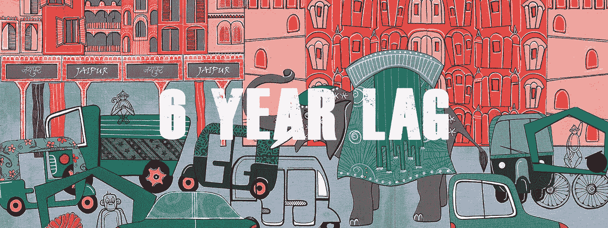

# 六年的滞后:为什么切换到一个古老的智能手机教我世界是不平等的。

> 原文：<https://medium.com/hackernoon/a-six-year-lag-why-switching-to-an-ancient-smartphone-taught-me-world-isnt-equal-8f62b94996dd>

从第一部分开始，讲述我是如何做到这一点的……谢谢。现在我们可以继续了。

所以你正在读这个故事。也许你在咖啡店，也许在办公室。不过，我敢打赌，你过着一种特权生活。你是在笔记本电脑还是智能手机上阅读？是的，告诉过你——特权。

一天前，我把我的老款 iPhone 6 Plus 白换了，意识到我至少需要一部临时手机，所以我找到了一部——2012 年初的型号，谷歌 Nexus。

正如你可能猜到的，使用 5 年以上的手机并不好玩。很慢。该死的。太慢了。是的，你现在明白了。尽管它支持 Wi-Fi 802.11n 标准，但该芯片可能太慢，无法像我预期的那样加载。因此，从 Google Play 加载应用程序——至少需要 5 分钟的体验。打开 Google Chrome 并加载页面——又是几分钟。当我终于能够下载 Spotify 时，音乐无法流畅播放——尽管后台没有其他应用程序，但它每 30 秒左右就会跳过一秒。

感觉真的很糟糕。但后来我查了一下规格:

*   1.2 GHz 双核处理器
*   1 GB 内存
*   16/32 GB 存储空间
*   4.65 英寸显示屏 1280x720
*   500 万像素后置摄像头和 130 万像素前置摄像头

是的，很慢。今年毕竟要满 6 岁了。它不是为“现代应用”设计的，坦率地说，把它用于文本之外的任何东西都是一种温和的折磨。

但有意思的是:**在印度，这代表*一种新的手机规格*** *。*虽然你可能会为 iPhone 7 连续三年保持相同的设计而感到难过，并且没有人们想要的那么性感，但印度的一位普通消费者现在正前往商店，购买*一部全新的手机*，其规格如下:

*   1.3 Ghz 处理器
*   1 GB 内存
*   8 GB 存储空间
*   4 英寸显示屏 800x400
*   500 万像素后置摄像头和 200 万像素前置摄像头

这是消费者在 2017 年 5 月可以买到的东西。它的售价为 75 美元，而去年印度新手机的平均售价徘徊在 100 美元左右，直到现在，随着小米、Oppo 和 Vivo 的扩张，新手机的平均售价才开始接近 150 美元。

如果你在一家希望为新兴市场制造产品的公司工作，去给你的团队购买 2011 年的 Android 手机——这将相当准确地代表他们在 2017 年必须制造的产品。如果你想知道你的应用在这些设备上的外观和工作方式，让我直截了当地告诉你，它非常糟糕。

PS:如果你认为这是一个笑话，苹果[重新开始生产一款三年前的手机](https://www.theverge.com/circuitbreaker/2017/3/23/15041572/apple-manufacturing-iphones-india-wistron-corp)，以更低的价格将它带到印度。有传言称，它的价格将低于 400 美元(或接近 400 美元)，这对于大多数印度人来说仍然难以企及。