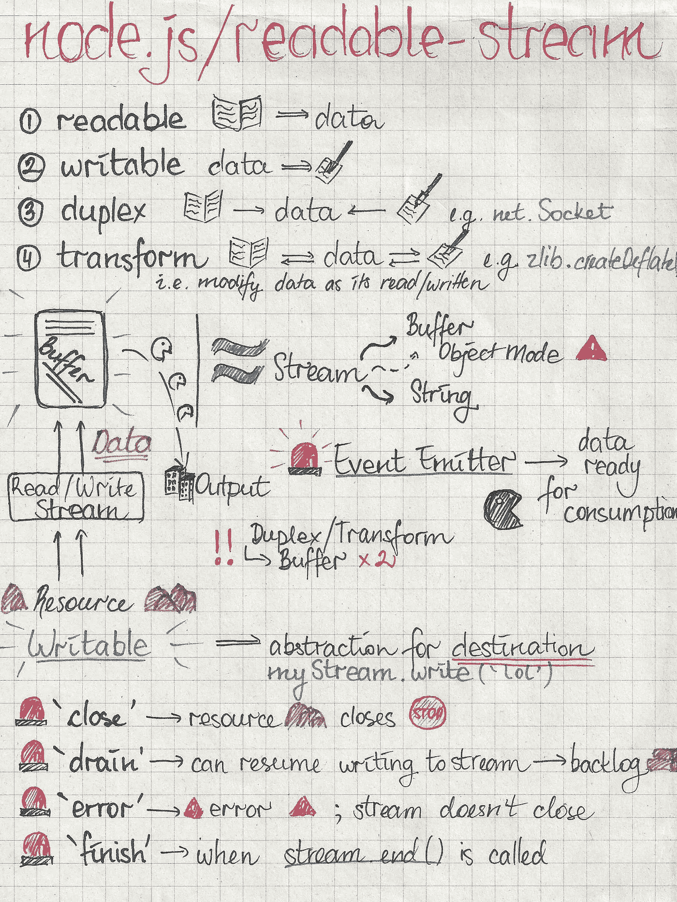
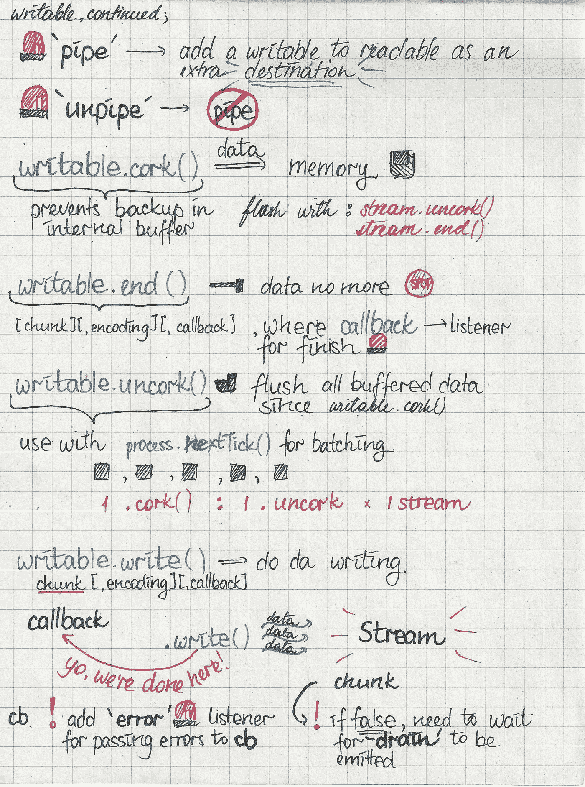
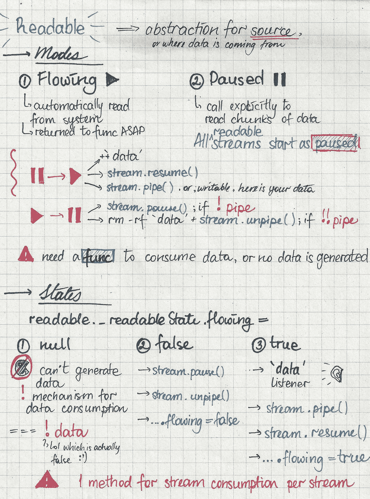
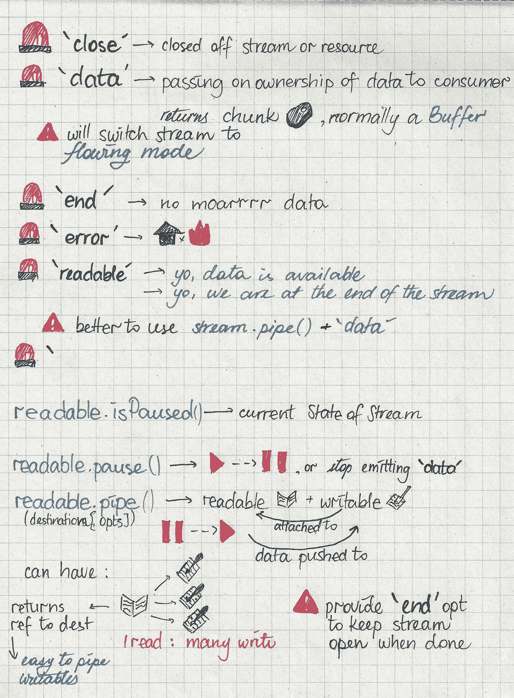
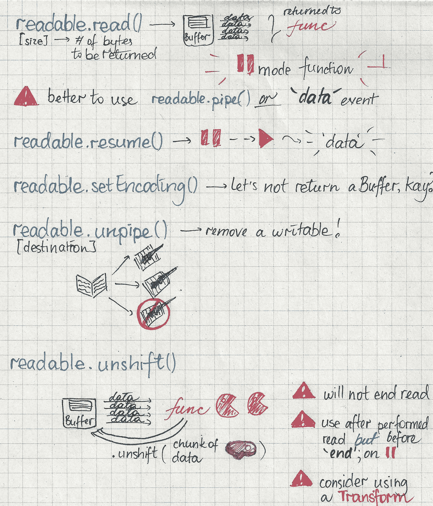

# node.js 流的草图注释指南；第 1 部分

> 原文：<https://medium.com/hackernoon/a-sketch-note-guide-to-node-js-streams-part-1-6db88e32623a>

*编辑:* [*第 2 部分*](/@_lrlna/a-sketch-note-guide-to-node-js-streams-part-2-bb6119595a40#.hfqaume12) *也已出版*🙈 🙉 🙊。

我向大家介绍 [node.js](https://hackernoon.com/tagged/node-js) streams。在素描笔记中。在中型网站上。

所以，上周末的某个时候，我在阅读[节点的流文档](https://github.com/nodejs/readable-stream/blob/master/doc/stream.md)时，开始将所有的知识都写下来，瞧，这条推特诞生了:

正如你可以肯定地告诉，我的 4 岁的手机相机不是为拍摄我们的主在 2016 年的任何类型的照片(但它是伟大的在 2012 年，我发誓)。这篇文章包含了上述文档的扫描版本(哇，你说扫描仪还是一个东西，\o/)。

作为本系列的第 1 部分，我将介绍可写和可写的基本知识，以及它们各自的 API。请继续关注关于实现这些小事情的笔记！

*编辑:*您现在也可以通读这些笔记的[第二部分。](/@_lrlna/a-sketch-note-guide-to-node-js-streams-part-2-bb6119595a40#.5ao2lhnln)

what are streams even; and a lil’ intro to writables

writables writables writables writables; i did say writables, right?

wowowoow readables got modes

readable API and Events!

readables! Continued!

作为友好的挥手，我想提醒你这些是*草图注释*，所以我建议你查看[文档](https://github.com/nodejs/readable-stream/blob/master/doc/stream.md)以获得某个方法工作方式的更详细的例子。

谢谢你通读，哟；你是笨蛋💯。

> [黑客中午](http://bit.ly/Hackernoon)是黑客们开始他们下午生活的方式。我们是 [@AMI](http://bit.ly/atAMIatAMI) 家族的一员。我们现在[接受提交](http://bit.ly/hackernoonsubmission)并很高兴[讨论广告&赞助](mailto:partners@amipublications.com)的机会。
> 
> 如果您喜欢这个故事，我们建议您阅读我们的[最新科技故事](http://bit.ly/hackernoonlatestt)和[热门科技故事](https://hackernoon.com/trending)。直到下一次，不要把世界的现实视为理所当然！

