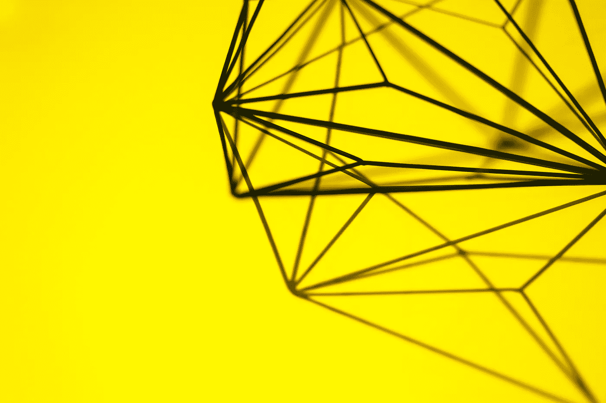

# 为你的第一个网站列出一个很棒的设计资产清单

> 原文：<https://medium.com/hackernoon/a-small-list-of-awesome-design-assets-for-your-first-website-2ecdcd6b673>

有源源不断的[设计](https://hackernoon.com/tagged/design)资产，图书馆，网站和 [Github](https://hackernoon.com/tagged/github) 带有设计资产的回购。当我开始创建网站时，最困难的部分之一是为网站上的图形元素寻找灵感。

我已经创建了一个很小的列表，列出了我在建网站时会继续使用的很棒的资源。简单的谷歌搜索很难找到最好的新资源。这些解决方案都提供了代码示例，这将允许您在自己的网站上实现它们。

1.  【Codyhouse.co 

这些家伙继续在他们所有的帖子中创造美丽的设计。我强烈推荐注册他们的时事通讯。你不能在你的项目中使用大部分的设计，但是极简风格仍然是一个灵感。此外，他们还提供所有设计的源代码和示例。

[2。独特的梯度发生器](http://gradient.quasi.ink/)

获得正确的背景可能很棘手。库存图像并不总是提供想要的效果和特定的颜色。这就是渐变派上用场的地方。它非常适合作为行动号召组件的背景。

[3。Littlesnippets.net 寻求灵感](http://littlesnippets.net/)

我没有看到一篇文章提到 Littlesnippets.net。它为你的造型提供了大量的资源。为小型企业创建登录页面时，这是为单个组件查找资源的好地方。所有示例都提供了源代码。

[4。一个令人敬畏的图像网格](https://github.com/brunjo/rowGrid.js)

图像网格有很多种变化。我已经开始喜欢上这款了，因为它简单且易于造型。它已经被用来创建[Pexels.com](https://www.pexels.com/)，并产生了一个漂亮的结果。我个人用它做过一个蘑菇网站( [Shroomi](http://www.shroomi.dk/) )。

[5。标题文本动画的简单代码笔](http://codepen.io/rachsmith/pen/BNKJme)

这支笔被评为 2015 年最受欢迎的笔之一。它展示了如何为网站上的文本创建一个非常简单却非常漂亮的动画。动画应该在正确的地方少量使用，这绝对是我自己在未来项目中使用的一个。

[6。简单悬停动画](http://codepen.io/chrisdothtml/pen/OVmgwK)

与之前的动画类似，这一个是顶级代码列表中的特性。这一次是关于图像的，Chris Deacy 创建了一个简单而美丽的悬停效果和图像。

[7。漂亮按钮的灵感](http://codepen.io/chrisdothtml/pen/waKBdM)

这种按钮样式在互联网上的网站上越来越流行。我发现这些方式比框架中使用的大多数按钮更漂亮。这个 codepen 使用 SCSS，我强烈推荐开始使用它。我很久没用它了，但是它让维护我的网站变得容易多了。

[8。简单的色彩灵感](http://codepen.io/devi8/pen/lvIeh)

每一个网站都会用到颜色和图像，它们可以在展示上产生巨大的差异。我喜欢不太引人注目的颜色，这是这里的特色。

[9。社交图标](http://codepen.io/minimalmonkey/pen/Ecpla)

在大多数网站上是必要的，并且在任何地方都容易找到。我包括了一个带有几个酷图标的小代码笔。记住在你的页面上包含字体-awesome 来使用这些图标。

[10。有趣的图片](http://bennettfeely.com/clippy/)

图像不必局限于规则的正方形和圆形。使用 Bennett Feely 制作的工具，你可以轻松地将它们变成各种形状。这有助于你的网站与众不同。

## 创造你自己的风格

在创建网站的时候，我不建议试图从零开始想出一个完整的风格。搜索网页，寻找单个组件的灵感。最好的方法通常是“窃取”这些组件的风格，并将它们与您自己的网站风格相结合。这也是一种将你自己的网站与 framworks 提供的风格拉开距离的方式，比如 Bootstrap 和 MaterializeCSS。

我将继续创建关于网页开发和网页设计的帖子。如果您感兴趣，请关注我，接收未来的更新。

> [黑客中午](http://bit.ly/Hackernoon)是黑客如何开始他们的下午。我们是 [@AMI](http://bit.ly/atAMIatAMI) 家庭的一员。我们现在[接受投稿](http://bit.ly/hackernoonsubmission)，并乐意[讨论广告&赞助](mailto:partners@amipublications.com)机会。
> 
> 如果你喜欢这个故事，我们推荐你阅读我们的[最新科技故事](http://bit.ly/hackernoonlatestt)和[趋势科技故事](https://hackernoon.com/trending)。直到下一次，不要把世界的现实想当然！

