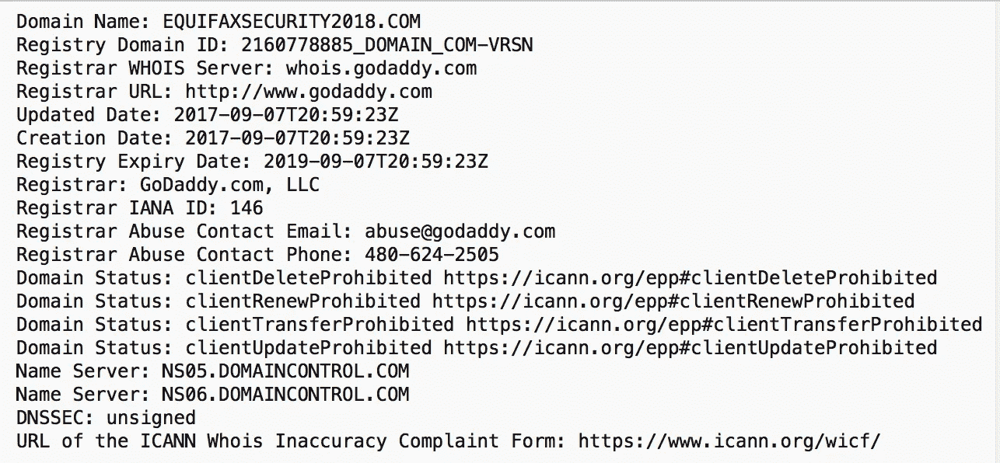
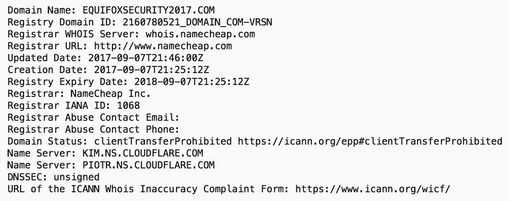
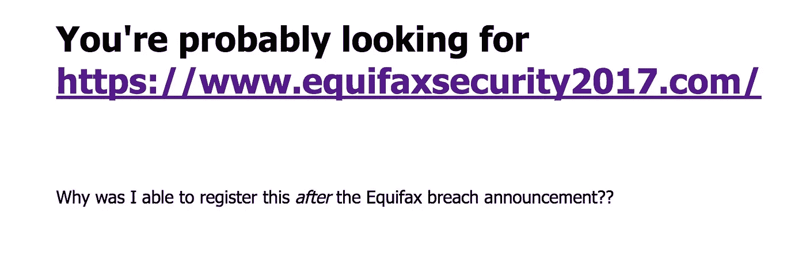
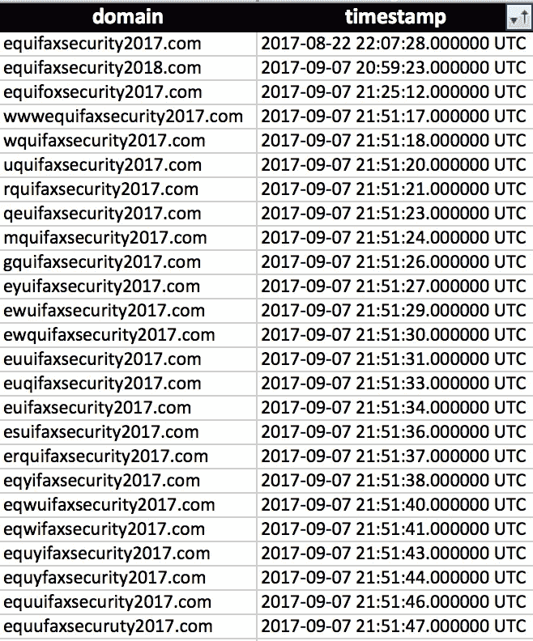

# Equifax 在大规模数据泄露中的一个小疏忽

> 原文：<https://medium.com/hackernoon/a-small-oversight-by-equifax-in-the-middle-of-a-massive-data-breach-1f5e4c6c4408>

显然，Equifax 宣布的数据泄露事件可能会影响 1 . 43 亿美国消费者，这是一件大事。如果你想了解更多关于这一漏洞的背景，我最近为我们在 Dark Cubed 的客户写了一份关于这一漏洞的快速更新，你可以在这里找到:[https://Dark Cubed . com/blog/2017/9/7/a-notice-to-Dark-Cubed-customers-on-the-equifax-data-breach](https://darkcubed.com/blog/2017/9/7/a-notice-to-dark-cubed-customers-on-the-equifax-data-breach)。

在写这篇更新的时候，我无意中发现了 Equifax 在发布我们这个时代最大的数据泄露事件之一时犯的一个小疏忽。虽然在我为我们的客户写的更新中包含信息的细节没有什么帮助，但我确实想分享它以确保其他人不会犯同样的错误，因此我单独发布了这篇文章。

那么，这是什么疏忽？嗯，很有可能管理 https://www.equifaxsecurity2017.com/[网站推广的人忘记了考虑骗子会很快注册非常相似的域名来欺骗他们的受害者。幸运的是，他们很快发现了这个错误，并采取了纠正措施。以下是这一论断背后的事实。](https://www.equifaxsecurity2017.com/)

他们主站点的域名是在世界协调时 2017 年 8 月 22 日 22:07 左右注册的。该域名通过 MarkMonitor，Inc .和 points [Cloudflare](https://hackernoon.com/tagged/cloudflare) 域名服务器注册。所有标准的东西。

然而，当我在做研究的时候，我用 URL crazy([https://www.morningstarsecurity.com/research/urlcrazy](https://www.morningstarsecurity.com/research/urlcrazy))工具进行了快速查找，这个工具处理了 251 个不同版本的原始域名，我开始看到一些有趣的结果。首先，很明显，该域名的许多变体实际上都已注册，但不一定直接指向 CloudFlare，而是指向“SoftLayer Technologies”此外，在这个数据集中有两个异常值。一个域(" equifaxsecurity2018[。]com ")通过 GoDaddy 注册，另一个域名(" equifoxsecurity2017[。]com ")是通过 Namecheap 注册的。

对照原始域名注册和违规公告来观察这些注册的时间，会发现一个非常有趣的发现。Equifax 在 2017 年 9 月 7 日收盘后不久宣布了这一违规行为，这意味着在美国东部时间 16:30 或世界协调时 20:30 左右。该公告发布 30 分钟后，世界协调时 20:59:23，域名 equifaxsecurity2018[。]com 是通过 GoDaddy 注册的。鉴于 Equifax 通过 MarkMonitor 注册了原始域名，此注册可能是由与 Equifax 无关的人执行的。

WHOIS Data for equifaxsecurity2018[.]com

当域 equifoxsecurity2017[.]com 是在大约 25 分钟后的 21:24:12 UTC 通过一个完全不同的服务注册的，名为 cheap。

WHOIS Data for equifoxsecurity2017[.]com

域名 equifaxsecurity2018[。]com 只是重定向到适当的 Equifax 网站，但是第二个域 equifoxsecurity2017[。]com，在网站上显示以下文本。

The Website at equifoxsecurity2017[.]com

令我惊讶的是，在这个对 Equifax 极其重要的网站公开发布近一个小时后，两个独立的(可能的)个人能够注册如此相似的域名。这发生在公开宣布可能是最大、最昂贵的数据泄露事件之一之后。这发生在数据泄露的公开声明之后，Equifax 在宣布之前已经花费了令人难以置信的大量时间和金钱。这显然是一个令人震惊的疏忽，有人在 Equifax 离开这些域名未注册。

现在，还记得我说过许多域名的变体被注册了吗？显然，Equifax 的某个人很快就明白了，可能是在注册了前两个域名中的一个的那个人通知了他之后(纯属猜测)。从世界协调时 21:51:17 开始，我们看到 Name.com 出现了大量域名注册，并指向 SoftLayer Technologies 的 IP 地址。这些域名似乎都会自动将用户重定向到主网站。

如果你对我为这次分析收集的数据感兴趣，就在这里:[https://pastebin.com/D3fs70ub](https://pastebin.com/D3fs70ub)

**底线:**如果你或你认识的任何人在 2017 年创建网站，从公众那里收集敏感信息，请确保你考虑注册你将使用的域名的变体。不这样做将使您的网站成为骗子的一个容易的标记，他们可以简单地复制您的网站并欺骗用户将他们的信息提供给错误的人。在 Equifax 的例子中，看起来他们能够足够快地从这个错误中恢复过来…或者至少对于我分析的 251 个变体来说。