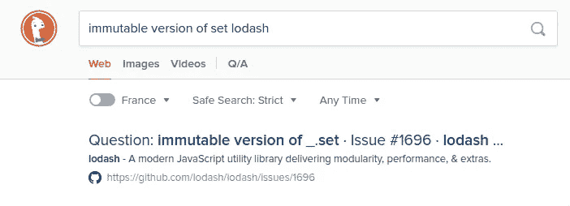
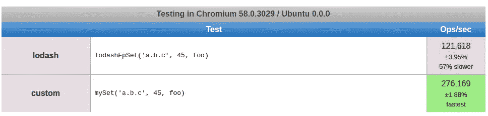

# 编写干净的 reducers 的小技巧

> 原文：<https://medium.com/hackernoon/a-small-trick-to-write-clean-reducers-a0b1b1eff3d2>

编写 react-redux reducer 有时可能会很痛苦。具体来说，您可能不得不编写大量样板代码来更改嵌套对象中的一个值或标志。我们将看到一个小技巧如何帮助我们减少这些代码。

> TLDR:你可以使用 lodash/fp/set 以不可变的方式修改你的存储中的深层属性。比如用`import set from 'lodash/fp/set'`然后用`set(path,*value*, state)`比如用`*s*et(`manufacturers.${manufacturer}.models.${model}.options.colors.${color}`, true)(state)`

# 现状

当您编写 react-redux reducer 时，必须小心不要改变存储中的对象。在一个简单的 react 应用程序中，这不是 100%正确的，但是因为你可能在你的应用程序中的某个地方使用了一些肤浅的道具比较，这是正确的。如果您使用 come kind 的 [*PureComponent*](https://facebook.github.io/react/docs/react-api.html#react.purecomponent) ，或者使用*react-redux*connect with[*mapStateToProps*](https://github.com/reactjs/react-redux/blob/master/docs/api.md#connectmapstatetoprops-mapdispatchtoprops-mergeprops-options)函数，或者任何其他您可以使用 [*reselect*](https://github.com/reactjs/reselect) 插入到您的商店的方式，就会出现这种情况。如果你不是，你可能应该。

有些人喜欢在他们的存储中使用 [*不可变的. js*](https://github.com/facebook/immutable-js) 对象。如果这就是你的情况，并且你对此感到满意，那么你真的不需要在这篇文章中继续深入。就我个人而言，我更喜欢在我的存储中处理常规 JS 对象。我确实发现在计划对象 JS 对象和不可变对象之间进行转换很麻烦。

因此，为了编写我的 reducer，使它们不会在存储中改变对象，并使用常规的 JS 对象，下面是我如何编写我的 reducer。

你或许可以找到其他你更喜欢的方式来写，或者甚至认为我的 *redux* 商店的形状可以被改变以更好地适应这个操作，但是仍然有时间你必须修改你的商店中的深层属性。

我想在这一点上，你明白为什么我想得到一个更好的解决方案。我会提出一个，但如果你有其他选择，我会很高兴在评论中看到它；)

# 寻找解决方案

既然我们的问题已经被正确地陈述了，作为一个优秀的懒惰的程序员，您一定想知道是否有针对这个特定需求的解决方案。据我所知没有。同样，请随时纠正我，或者基于这篇文章创建一个。实际上，在这种情况下，最后一部分对你来说也应该是有趣的。

长话短说，我一直在寻找这个问题的解决方案，因为我的同事都是超级粉丝，所以我想这里可能会有解决方案。我已经知道了 [*set*](https://lodash.com/docs/4.17.4#set) 方法，这个方法对设置嵌套对象中的属性值很有用。常规版本的 set 方法的问题是，它会改变我们设置属性的对象。正如我们在引言中所说，这不是我们想要的。基本上，我要找的是 set 的不可变版本。

我很高兴我不是唯一的一个。

The first result of this quick search was the trace to follow

正如你在上面的截图中看到的，我现在的英雄 [Rico Sta。克鲁兹](https://medium.com/u/ff5ebab653a9?source=post_page-----a0b1b1eff3d2--------------------------------)，两年前作为 *lodash* 问题问过[这个问题](https://github.com/lodash/lodash/issues/1696)。[约翰-大卫·道尔顿](https://medium.com/u/c9acea0bae6e?source=post_page-----a0b1b1eff3d2--------------------------------)立即回答说，它将在*l*[*odash/*](https://github.com/lodash/lodash/wiki/FP-Guide)*FP*中出现，并且[凯尔·凯利](https://medium.com/u/783da0379221?source=post_page-----a0b1b1eff3d2--------------------------------)最近证实了这一点，甚至给出了我们可以用于" *Redux 风格状态设置"*的语法

之后，我想检查这个解决方案是否在 react 社区中得到使用和推荐。我做了一个非常快速的检查，但没有找到太多的参考。尽管如此，我还是找到了一个例子，是由现在著名的[丹·阿布拉莫夫](https://medium.com/u/a3a8af6addc1?source=post_page-----a0b1b1eff3d2--------------------------------)在[这个 stackoverflow 帖子](https://stackoverflow.com/a/37266130)中写的。

Extract from [Dan Abramov post on stackoverflow](https://stackoverflow.com/a/37266130), available as gist [here](https://gist.github.com/maxired/53c18a9796bd3b0ec61441a171895f00)

我想我们现在有了答案:你可以使用 *lodash/fp/set* 函数作为 *react-redux* reducer 中的助手，以避免无用的代码。这甚至是由社区中的某个人来完成的，他的才华得到了很多人的认可。

# 更进一步？

我不会在这里详述如何使用 set 来修改数组中的对象。事实上，在前面的示例中已经完成了。如果你想同时修改几个属性，我相信你也可以使用 *lodash/fp/merge* 或者 *lodash/fp/defaultsDeep* 来实现。

另外，我之前告诉过你 *lodash/fp/set* 能够以不可变的方式修改对象。情况是这样的。您还需要确定的是，它将只复制需要的对象，但会保留对未受影响的对象的引用。事实也是这样:你是安全的，使用 *lodash/fp/set* 不会导致无用渲染。

这里需要强调的另一个主题是性能。总的来说， *lodash* 的表现非常出色。然而，如果这对你来说真的很重要，我相信有比这里更快的方法。围绕 *lodash/fp* 的不变性是作为围绕 *lodash* 方法的初始实现的一个层来完成的，这里是 *lodash set* 。这导致对象遍历被执行多次:运行时的复杂性比它需要的要大。实际上，我创建了这样一个不可变集合函数的极简实现，它只需一次迭代就能工作

我将这个实现与 *lodash/fp/set* 进行了比较，尽管非常幼稚，但如果我相信[这个 jsPerf 测试](https://jsperf.com/lodash-fp-set-vs-custom)的话，它似乎胜过它。

jsPerf results of lodash/fp/set vs the naive implementation shown previously, transpiled with babel

这让我想到了为这个用例以及更多用例创建一个专用库的空间。目前为止我找到的最接近的是 [*reduceless*](https://github.com/nosovsh/reduceless) ，它更多的是一个绕店的包装器，这样你就不用写 reducer 了，但是出于不同的原因，我不会推荐它。